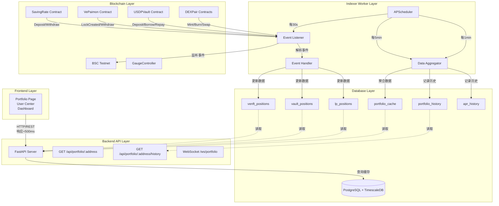
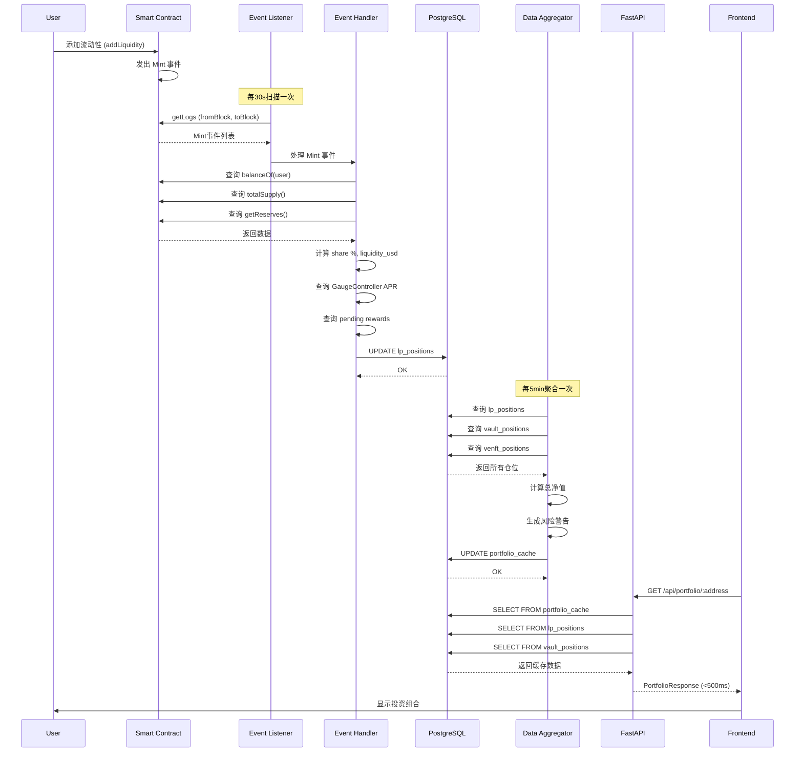
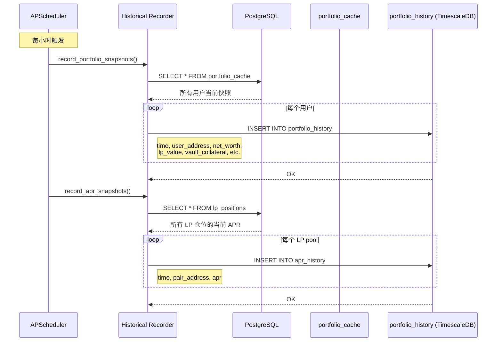
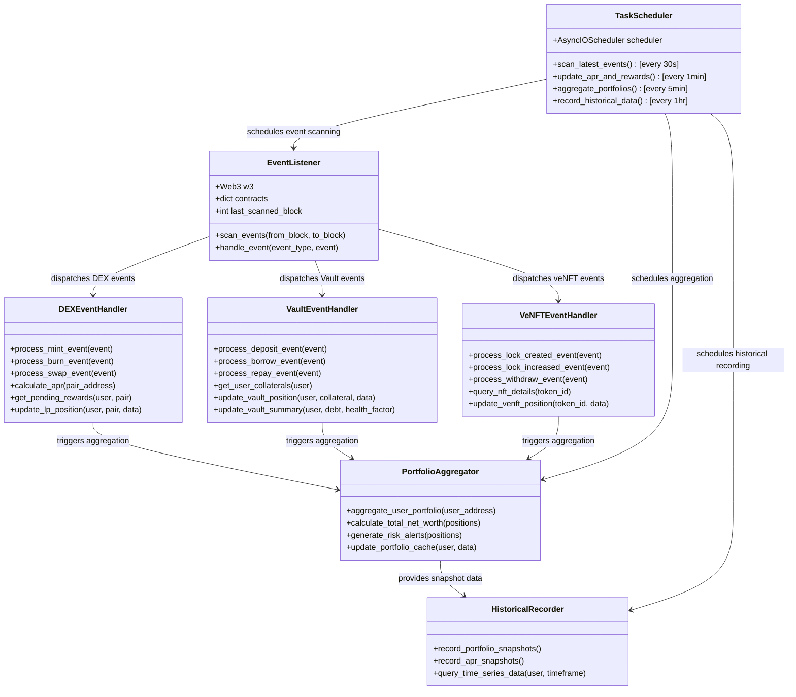
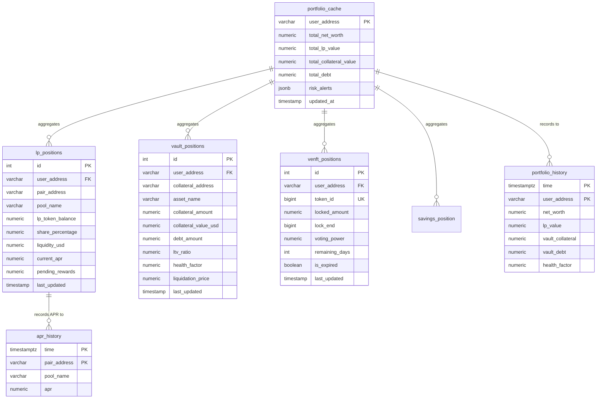
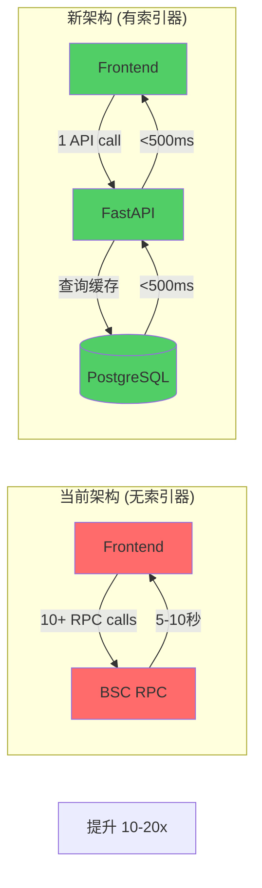

# 链上数据索引器架构图

## 系统架构总览

## 数据流详细图

### 用户操作 → 数据更新流程

### 历史数据记录流程

## 核心组件关系图

## 数据库 ER 图

## 性能对比图

---

**性能提升总结**：

| 指标 | 当前架构 | 新架构（索引器） | 提升 |
|------|---------|----------------|------|
| **响应时间** | 5-10秒 | <500ms | **10-20x** |
| **RPC 调用次数** | 10+ 次/请求 | 0 次（查缓存） | **100%减少** |
| **数据完整性** | 部分 (TODO) | 完整 | **100%覆盖** |
| **历史数据** | 无 | 有 (TimescaleDB) | **新增功能** |
| **实时更新** | 手动刷新 | 自动（30s延迟） | **新增功能** |
| **并发能力** | 受限于 RPC | 数据库查询 | **10x+** |
