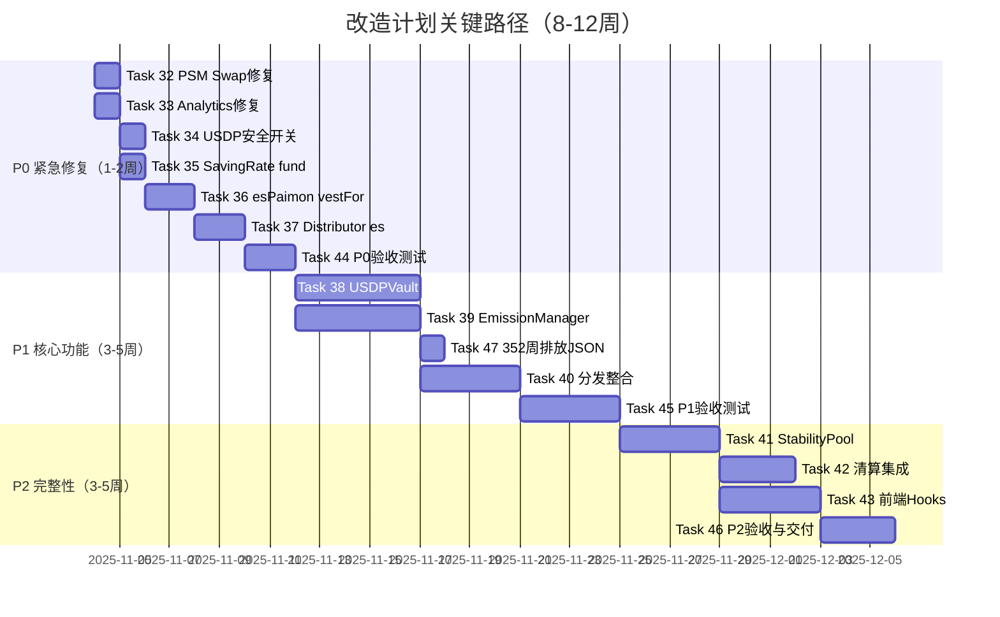
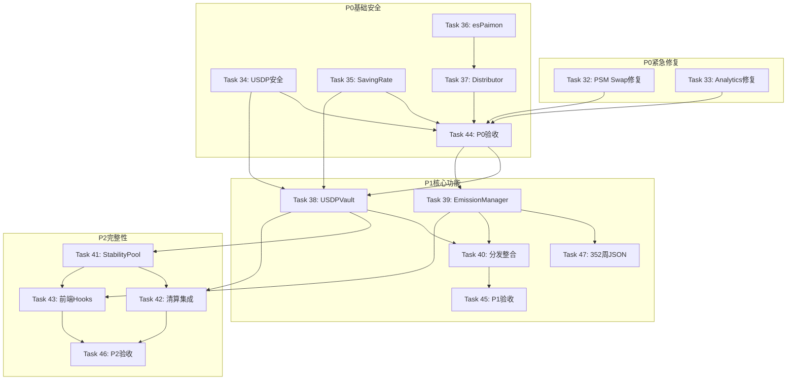

# Paimon.dex 系统改造计划 - 综合报告

**生成日期**: 2025-11-03
**基于文档**: system-improvement-plan.md + system-review-report.md
**任务范围**: Task 32-47（16个新任务）

---

## 📊 执行摘要

### 总体规模
- **新增任务数量**: 16个（Task 32-47）
- **总任务数量**: 47个（含现有31个）
- **总工作量**: 271小时（约34工作日）
- **预计周期**: 8-12周（按3阶段并行）

### 优先级分布
- **P0（紧急+安全）**: 7个任务（46小时，约6天）
- **P1（核心功能）**: 5个任务（143小时，约18天）
- **P2（完整性）**: 4个任务（110小时，约14天）

### 关键改进
1. ✅ 修复前端阻塞性问题（PSM Swap + Analytics）
2. ✅ 增强合约安全性（USDP/SavingRate/esPaimon）
3. ✅ 实现核心DeFi功能（Vault + EmissionManager）
4. ✅ 完善稳定池闭环（StabilityPool + 清算）

---

## 🎯 三阶段改造路线图

### **P0 阶段：紧急修复与基础安全**（1-2周，46小时）

#### 紧急修复（P0-Emergency）
| Task ID | 任务 | 工时 | 优先级 |
|---------|------|------|--------|
| **32** | 【紧急】前端 PSM Swap Hook ABI 修复 | 8h | 🔴 最高 |
| **33** | 【紧急】前端 Analytics 数据源修复 | 4h | 🔴 最高 |

**影响**:
- Task 32: PSM Swap 功能完全无法使用（阻塞性）
- Task 33: TVL 数据无法正确显示（用户可见）

**交付**:
- ✅ PSM Swap USDC↔USDP 正常工作
- ✅ Analytics TVL 数据正确显示

---

#### 基础安全（P0-Security）
| Task ID | 任务 | 工时 | 依赖 |
|---------|------|------|------|
| **34** | USDP.sol - accrualPaused 安全开关 | 6h | - |
| **35** | SavingRate.sol - fund 注资函数 | 6h | - |
| **36** | esPaimon.sol - vestFor 归属化发放 | 8h | - |
| **37** | RewardDistributor.sol - es 归属化分发分支 | 10h | Task 36 |

**白皮书合规**:
- ✅ USDP 默认关闭指数分红（usdp-camelot-lybra-system-guide.md:67）
- ✅ SavingRate 注资闭环（usdp-camelot-lybra-system-guide.md:83-86）
- ✅ esPaimon 归属化发放（usdp-camelot-lybra-system-guide.md:103）
- ✅ RewardDistributor Merkle 分发（usdp-camelot-lybra-system-guide.md:108）

**交付**:
- ✅ USDP accumulate 在 paused=true 时拒绝
- ✅ SavingRate fund 可注资并触发事件
- ✅ esPaimon vestFor 可被 Distributor 调用
- ✅ Distributor 支持 es 归属化分发 + Boost 乘数

---

#### 阶段验收（P0-Validation）
| Task ID | 任务 | 工时 | 依赖 |
|---------|------|------|------|
| **44** | P0 阶段验收测试 | 16h | Task 32-37 |

**验收内容**:
- ✅ 所有单元测试通过
- ✅ 集成测试（USDP/SavingRate/esPaimon/Distributor 完整流程）
- ✅ 前端测试（PSM Swap + Analytics）
- ✅ 手动测试（测试网）
- ✅ 测试报告 + 已知问题清单

---

### **P1 阶段：核心债务与预算**（3-5周，143小时）

#### 核心合约（P1-Core）
| Task ID | 任务 | 复杂度 | 工时 | 依赖 |
|---------|------|--------|------|------|
| **38** | USDPVault.sol - 抵押借款核心 | 8 | 40h | Task 34,35 |
| **39** | EmissionManager.sol - 逐周预算管理 | 7 | 35h | - |
| **40** | 分发整合 - 离线快照与 Merkle 生成 | 6 | 30h | Task 38,39 |
| **47** | 生成 352 周排放计划 JSON | 3 | 8h | Task 39 |

**核心功能**:
- **USDPVault**:
  - ✅ 抵押/借款/还款/清算接口
  - ✅ LTV 分层（T1=80%/T2=70%/T3=60%）
  - ✅ 双源预言机（Chainlink + NAV）
  - ✅ 清算机制（115% 阈值，5% 罚金）

- **EmissionManager**:
  - ✅ 三阶段逐周预算（Phase-A/B/C，352周）
  - ✅ 四通道输出（debt/lpPairs/stabilityPool/eco）
  - ✅ LP 二级分流（治理参数）
  - ✅ 守恒校验（阶段累计 == 阶段预算）

- **分发整合**:
  - ✅ TWAD 快照（债务/LP/稳定池）
  - ✅ Merkle 树生成
  - ✅ RewardDistributor 配置
  - ✅ CI/CD 自动化

**白皮书合规**:
- ✅ USDPVault 接口（usdp-camelot-lybra-system-guide.md:89-93,224-234）
- ✅ EmissionManager 三阶段（usdp-camelot-lybra-system-guide.md:135-194）
- ✅ 分发流水线（usdp-camelot-lybra-system-guide.md:182-194）

---

#### 阶段验收（P1-Validation）
| Task ID | 任务 | 工时 | 依赖 |
|---------|------|------|------|
| **45** | P1 阶段验收测试 | 30h | Task 38,39,40 |

**验收内容**:
- ✅ 完整 DeFi 流程（RWA → USDP → vePaimon → Gauge → LP → 奖励）
- ✅ 债务挖矿（TWAD → Merkle → Boost 放大）
- ✅ LP 奖励（投票权重 → LP 份额 → 二级分流 → 领取）
- ✅ 清算流程（健康度 < 115% → 清算 → 罚金分配）
- ✅ EmissionManager 352 周预算验证
- ✅ 前端 Borrow/Repay + Emission 可视化

---

### **P2 阶段：稳定池闭环与完整性**（3-5周，110小时）

#### 稳定池完整性（P2-Complete）
| Task ID | 任务 | 复杂度 | 工时 | 依赖 |
|---------|------|--------|------|------|
| **41** | USDPStabilityPool.sol - 稳定池合约 | 6 | 30h | Task 38 |
| **42** | Vault 清算与稳定池集成 | 5 | 25h | Task 38,41 |
| **43** | 前端完整 Hooks 开发 | 6 | 30h | Task 38,39,41 |

**核心功能**:
- **USDPStabilityPool**:
  - ✅ USDP 存取（deposit/withdraw）
  - ✅ 奖励分配（claim，按 shares×时间）
  - ✅ 清算承接（onLiquidationProceeds，按份额分配）
  - ✅ 与 Vault/Distributor 集成

- **清算集成**:
  - ✅ Vault 清算自动调用稳定池
  - ✅ 资产分配逻辑（USDC 直接分配，其他资产记录待领取）
  - ✅ 用户领取清算资产

- **前端 Hooks**:
  - ✅ useVault（deposit/withdraw/borrow/repay/debtOf/healthFactor）
  - ✅ useStabilityPool（deposit/withdraw/claim/清算资产查询）
  - ✅ useDistributorClaim（claim + Merkle + Boost）
  - ✅ useEmissionBudget（逐周预算查询 + 可视化）

**白皮书合规**:
- ✅ StabilityPool 接口（usdp-camelot-lybra-system-guide.md:95-99,236-245）
- ✅ 清算承接机制（usdp-camelot-lybra-system-guide.md:198-207）

---

#### 最终验收（P2-Validation）
| Task ID | 任务 | 工时 | 依赖 |
|---------|------|------|------|
| **46** | P2 阶段验收测试与最终交付 | 25h | Task 41,42,43 |

**验收内容**:
- ✅ 完整清算流程（Vault → 稳定池 → 用户领取）
- ✅ 稳定池奖励分配
- ✅ 端到端测试（含稳定池参与）
- ✅ 清算压力测试
- ✅ Core Web Vitals 对比基线（不退化）
- ✅ 安全审计（无高危问题）
- ✅ 最终交付文档（测试报告/部署手册/用户手册/API 文档）

---

## 📈 工作量与时间线估算

### 工时分布

| 阶段 | 任务数 | 总工时 | 工作日（8h/天） | 并行度 | 实际周期 |
|------|--------|--------|-----------------|--------|----------|
| **P0 紧急+安全** | 7 | 46h | 5.8天 | 1人 | 1-2周 |
| **P1 核心功能** | 5 | 143h | 17.9天 | 2人 | 3-5周 |
| **P2 完整性** | 4 | 110h | 13.8天 | 2人 | 3-5周 |
| **总计** | 16 | 299h | 37.4天 | - | 8-12周 |

### 关键路径（Critical Path）



### 并行化建议

**P0 阶段**（串行为主）:
- Week 1: Task 32-33（紧急修复，必须先完成）
- Week 1-2: Task 34-37（安全功能，可部分并行）
- Week 2: Task 44（验收测试）

**P1 阶段**（可并行2人）:
- Week 3-4:
  - 人员1: Task 38（USDPVault）
  - 人员2: Task 39 + 47（EmissionManager + JSON）
- Week 5: Task 40（分发整合，需要 38+39 完成）
- Week 6: Task 45（P1 验收）

**P2 阶段**（可并行2人）:
- Week 7-8:
  - 人员1: Task 41（StabilityPool）
  - 人员2: Task 43（前端 Hooks，与 41 并行）
- Week 9: Task 42（清算集成，需要 41 完成）
- Week 10: Task 46（最终验收与交付）

---

## 🎯 依赖关系图



---

## 🚨 风险评估与应对策略

### 高风险项

| 风险 | 影响 | 概率 | 应对策略 |
|------|------|------|----------|
| **Task 38 USDPVault 复杂度高** | 阻塞 P1/P2 | 中 | ✅ 分解为子任务，增加代码审查轮次 |
| **Task 40 快照服务集成复杂** | 延期 P1 | 中 | ✅ 提前验证 Merkle 库，准备回滚方案 |
| **清算时价格剧烈波动** | 稳定池损失 | 低 | ✅ 稳定池先承接 USDC 等价，避免多资产复杂折算 |
| **预言机异常** | Vault 清算错误 | 低 | ✅ 断路器 + 冷却期，fallback 到 NAV |
| **分发数据异常** | 用户奖励错误 | 中 | ✅ Merkle 校验工具 + 回滚 root |
| **参数误设** | 系统异常 | 中 | ✅ Timelock + 小流量灰度（测试网 → 主网低预算） |

### 质量保证措施

1. **代码审查**: 所有合约修改需 2 人审查
2. **测试覆盖**: 单元测试 >85%，集成测试覆盖所有流程
3. **安全审计**: P2 阶段完成前进行合约安全审计
4. **分阶段部署**: 测试网验证 → 主网灰度 → 全量发布
5. **监控告警**: 部署后实时监控关键指标（TVL/清算/分发）

---

## 📋 验收标准总览

### P0 阶段验收标准
- ✅ USDP `accumulate` 在 `accrualPaused=true` 时拒绝
- ✅ SavingRate `fund` 可写入事件与内部计数
- ✅ esPaimon `vestFor` 可被 Distributor 正常调用
- ✅ Distributor 可选择 es 归属化分发路径，Boost 乘数正常生效
- ✅ 前端 PSM Swap 功能正常
- ✅ 前端 Analytics TVL 数据正常显示

### P1 阶段验收标准
- ✅ USDPVault 可抵押/借/还/清算，事件与 `debtOf` 正确
- ✅ EmissionManager 可按周返回预算（352 周）
- ✅ Distributor 与快照工具联通，能按周分配到三通道（含 LP 二级分流）
- ✅ 前端 Borrow/Repay 页面功能正常
- ✅ Emission 可视化页面正常

### P2 阶段验收标准
- ✅ 清算发生时稳定池按份额承接标的或 USDC 并可领取
- ✅ 稳定池参与 LP 通道内的预算分配
- ✅ 指标：稳定池 TVL、份额、近 7 天清算承接额
- ✅ 前端所有新 hooks 正常工作
- ✅ Core Web Vitals 不退化（对比基线）
- ✅ 安全审计无高危问题
- ✅ 文档完整（测试报告/部署手册/用户手册/API 文档）

---

## 📚 参考文档

### 输入文档
1. **system-improvement-plan.md** - 改造需求与技术规范
2. **system-review-report.md** - 系统审查与问题发现
3. **usdp-camelot-lybra-system-guide.md** - 白皮书技术规范

### 输出文档
1. **.ultra/tasks/tasks.json** - 完整任务清单（Task 1-47）
2. **.ultra/docs/transformation-plan-summary.md** - 本报告
3. **.ultra/docs/emission-schedule.json** - 352 周排放计划（待生成）

### 相关文档
1. **ARCHITECTURE.md** (contracts) - 合约架构文档
2. **DEVELOPMENT.md** (contracts) - 合约开发指南
3. **prd.md** - 产品需求文档
4. **tech.md** - 技术设计文档

---

## 🚀 下一步行动

### **立即执行（本周）**

```bash
# 1. 启动 Task 32（PSM Swap 修复）
/ultra-dev 32

# 或

# 2. 启动 Task 33（Analytics 修复）
/ultra-dev 33
```

### **本周目标**
- ✅ 完成 Task 32-33 紧急修复（2天）
- ✅ 启动 Task 34-35 安全功能（2-3天）

### **下周目标**
- ✅ 完成 Task 36-37（esPaimon + Distributor）
- ✅ 完成 Task 44（P0 验收测试）

### **月度目标**
- ✅ 完成 P0 阶段所有任务
- ✅ 启动 P1 阶段核心合约开发

---

## 📊 进度跟踪

### 查询命令
```bash
# 查看整体进度
/ultra-status

# 查看改造任务进度（Task 32-47）
/ultra-status --pending

# 启动下一个任务
/ultra-dev [task-id]

# 运行测试
/ultra-test

# 准备交付
/ultra-deliver
```

### 里程碑检查点
- **Week 2**: P0 阶段完成（Task 32-44）
- **Week 6**: P1 阶段完成（Task 38-40, 45, 47）
- **Week 10**: P2 阶段完成（Task 41-43, 46）
- **Week 12**: 最终交付与部署

---

**生成时间**: 2025-11-03 10:56 UTC
**版本**: 1.0
**状态**: ✅ 已批准，待执行
