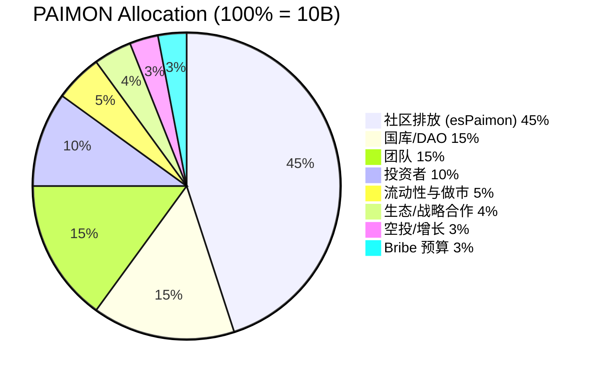
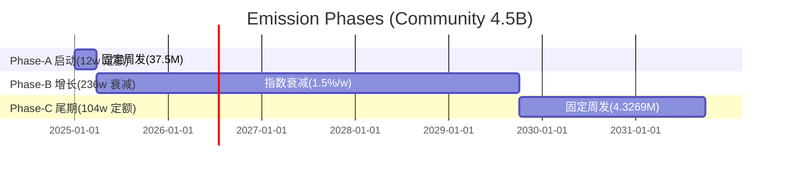
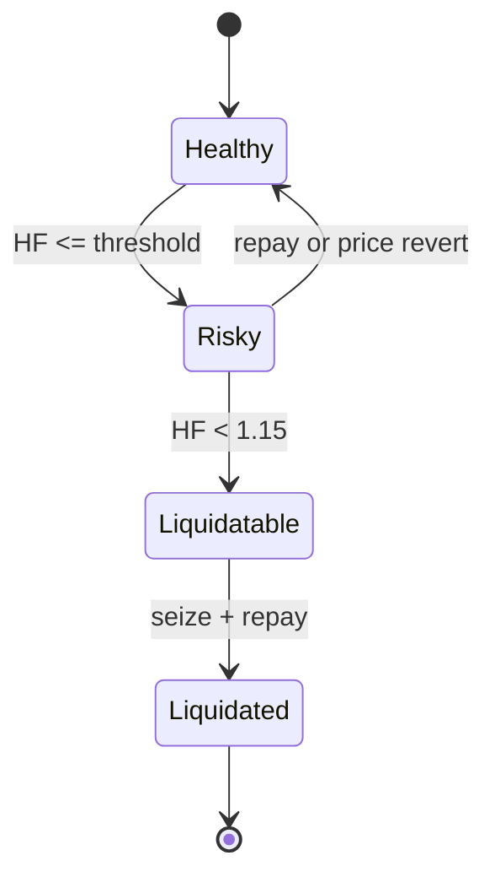

# USDP × Camelot × Lybra — 系统与工程实现白皮书（全面版）

本文件给出 Launchpad + veDEX + 稳定币 + RWA 的完整工程实现蓝图：架构、组件职责、代币经济学、排放规则（逐周）、投票与分配流水线、清算与稳定池、接口规范与不变量。仅包含系统与工程细节，不包含运营流程与文案。

## 1. 目标与边界
- 目标：以 Lybra 的“抵押生息资产→铸稳币→债务挖矿”为内核，叠加 Camelot 的“ve 投票→Gauge→Bribe→LP 深度”外环，形成围绕 RWA 的可持续流动性飞轮。
- 边界与原则：
  - USDP 本体默认不被动生息（关闭指数分红）；储蓄收益统一由 SavingRate 承接（由国库注资覆盖）。
  - PSM 仅负责 USDC↔USDP 1:1 锚定与出入金；不外拨 USDC 储备。
  - 排放（PAIMON→esPaimon 归属化）绑定“债务/LP/生态”贡献；与 USDP 来源无关。
  - 逐周排放预算上链（EmissionManager），投票仅决定相对权重（GaugeController）。

## 2. 架构总览（Mermaid）
```mermaid
flowchart LR
  subgraph L[Launchpad]
    IC[IssuanceController\nUSDT/USDC 募集]
    SR[SettlementRouter\n到期结算]
  end
  subgraph RWA[RWA & Treasury]
    RWA1[Whitelisted RWA Token/HYD]
    TR[Treasury]
    OR[Oracle\nChainlink + NAV]
  end
  subgraph ST[Stablecoin Stack]
    USDP[USDP]
    PSM[PSM USDC↔USDP]
    SRt[SavingRate]
    V[USDPVault]
    SP[Stability Pool\nUSDP 稳定池]
  end
  subgraph GOV[veDEX & 激励]
    AMM[AMM Pairs\nUSDP/USDC, PAIMON/USDP]
    GC[GaugeController]
    BR[BribeMarketplace]
    RD[RewardDistributor]
    BS[BoostStaking\n(PAIMON 质押)]
    VE[vePAIMON]
    ESP[esPaimon]
    PM[PAIMON]
  end
  USDC((USDC))

  USDC --> IC --> RWA1
  SR -->|maturity| TR
  RWA1 -->|deposit| V
  V -->|mint| USDP
  USDC <-->|1:1| PSM <-->|swap| USDP
  USDP --> AMM
  USDP --> SP
  PM --> BS --> RD
  PM --> VE --> GC --> AMM
  BR --> GC
  RD -->|es 归属| ESP
  TR -->|USDC| PSM -->|USDP| SRt
```

## 3. 组件与职责
- USDP（稳定币，份额×指数模型）
  - 默认不启用指数累积（不设置 distributor 或 `accrualPaused=true`）。
  - Minter：USDPVault/Treasury/PSM；赎回路径由 PSM 销毁。
- PSM（Peg Stability Module）
  - USDC↔USDP 1:1，feeIn/out（建议 in 5–10bp，out 10–20bp，可动态）。
  - 仅持有 USDC 储备，不外拨（增强刚兑缓冲）。
- SavingRate（USDP 储蓄率）
  - 用户存入 USDP 按 APR 线性计息；利息由国库注资（USDC→PSM→USDP→`fund()`）。
- USDPVault（抵押借款）
  - 抵押白名单 RWA 资产，借/还 USDP，支持清算；对外暴露 `debtOf(user)`。
- Stability Pool（USDP 稳定池）
  - 存入 USDP 获得份额；清算发生时按份额比例承接折价资产或优先获 USDC；参与 LP 通道的二级配额激励。
- PAIMON（平台代币，cap=10B）
  - 由 EmissionManager/Distributor/Treasury 按权限铸造；所有长期份额走 Vesting/Timelock/Locker 管控。
- esPaimon（归属化激励）
  - 365 天线性归属，支持 `vestFor(user, amount)`（Distributor/Treasury）；`claim()` 领取，`earlyExit()` 提前退出罚则；不可自由转移。
- vePAIMON（治理票/NFT，可转让）
  - 锁仓期 1 周 ~ 4 年，线性衰减；参与 Gauge 投票与 Launchpad 准入等治理流程。
- GaugeController（投票控制器）
  - 每周输出各 Gauge 相对权重；可包含只读 Gauge（不产排放，用于治理统计）。
- RewardDistributor（奖励分发）
  - Merkle 领取；领取时读取 Boost 乘数；默认走 `esPaimon.vestFor()` 归属化发放。
- BribeMarketplace（贿选市场）
  - 聚合白名单代币（esPaimon/USDC/USDP/合作代币）贿选，按投票权比例分发。
- NitroPool（外部激励插件）
  - 外部项目追加激励（不改变基础排放）。
- EmissionManager（排放管理）
  - 三阶段逐周预算查表；提供四通道额度（debt、lpPairs、stabilityPool、eco），LP 内部分流由治理设置。

## 4. 代币经济学（Tokenomics）
- 总量：`PAIMON.totalCap = 10,000,000,000`（18 decimals，合约硬顶）。
- 分配（100%）：



- 归属与锁仓（强约束）：
  - 团队：1y Cliff + 36m 线性；投资者：6m Cliff + 18m 线性；生态：12–24m 线性；
  - Bribe 预算：36m 线性到 BribeTreasury；
  - 初始 LP 头寸：LPVestingLocker 锁 12m；
  - 社区排放 100% 以 esPaimon 归属化发放（默认）。
- 代币不变量：`铸造总量 ≤ 10B`；`Σ(已归属 + 已分发 + 国库 + LP锁 + Bribe预算) == 已铸造`。

## 5. 排放（Emission）
### 5.1 Epoch 与三阶段
- Epoch=7 天；社区排放总额 4.5B，分三阶段（逐周上链）：



- Phase-A（w=1..12）：每周 `E_A = 37,500,000`。
- Phase-B（w=13..248）：`E_B(t)=E0_B×r^(t-1)`，`E0_B≈55,584,000`，`r=0.985`（1.5% 衰减），t=1..236。
- Phase-C（w=249..352）：每周 `E_C = 450,000,000/104 ≈ 4,326,923.076923`。

### 5.2 通道与分流系数（按阶段）
- 阶段内通道系数：
  - Phase-A：Debt 30% / LP 60% / Eco 10%
  - Phase-B：Debt 50% / LP 37.5% / Eco 12.5%
  - Phase-C：Debt 55% / LP 35% / Eco 10%
- LP 通道的二级分流（示例 Phase-B）：`{lpPairsBps=6000, stabilityPoolBps=4000}`，由治理设置（Timelock 保护）。

### 5.3 逐周规则（确定性、可上链）
- 周编号：`w ∈ [1,352]`；`w = floor((now - epochStart)/7d) + 1`。
- 周预算：
  - 若 `1≤w≤12`：`E(w)=37,500,000e18`，`α={0.30, 0.60, 0.10}`；
  - 若 `13≤w≤248`：`t=w-12`，`E(w)=E0_B×0.985^(t-1)`，`α={0.50, 0.375, 0.125}`；
  - 若 `249≤w≤352`：`E(w)=4,326,923.076923e18`，`α={0.55, 0.35, 0.10}`。
- 舍入与守恒：
  - 每周按 wei 取整（floor）；阶段维护 `rem = budget_phase - Σ(weekly_emitted)`；阶段最后一周将 rem 注入 Eco（或指定通道），确保阶段预算精确用尽；可选分通道 remainder 以提升配比精度。
- 伪代码：
```solidity
function weeklyEmission(uint256 w) returns (uint256 eDebt, uint256 eLpPairs, uint256 eStability, uint256 eEco) {
  uint256 E; uint16 aDebt; uint16 aLp; uint16 aEco;
  if (w<=12) { E=37_500_000e18; aDebt=3000; aLp=6000; aEco=1000; }
  else if (w<=248) { uint256 t=w-12; E=E0_B * pow985(t-1) / 1e6; aDebt=5000; aLp=3750; aEco=1250; }
  else { E=4_326_923_076_923e12; aDebt=5500; aLp=3500; aEco=1000; }
  uint256 eDebtBase = E * aDebt / 10000;
  uint256 eLpBase   = E * aLp   / 10000;
  eEco = E - eDebtBase - eLpBase;
  // LP 二级分流
  eLpPairs   = eLpBase * lpPairsBps / 10000;
  eStability = eLpBase - eLpPairs;
  eDebt = eDebtBase;
}
```

### 5.4 权重计算与分发流水线
- 债务挖矿：`debtWeight_u = TWAD(debtOf(u), epochWindow)`；`reward_u = E_debt × debtWeight_u / Σ(debtWeight)`。
- LP：池级 `poolShare_i = votes_i/Σ(votes)`；池内按 LP 份额×时间分配；LP 通道内二级拆分（AMM vs Stability Pool）。
- Boost：`actual = base × multiplier/10000`，`multiplier = BoostStaking.getBoostMultiplier(u)`（1.0x–1.5x）；可扩展 `IBoostSource` 聚合 esPaimon 权重（总上限建议 ≤1.8x）。

```mermaid
flowchart LR
  S[TWAD & LP Snapshot] --> Agg[Aggregator]
  GC[GaugeController] -->|weights| Agg
  EM[EmissionManager] -->|E(w) & splits| Agg
  Agg -->|Merkle Root| RD[RewardDistributor]
  BS[BoostStaking] -->|multiplier| RD
  RD -->|claim & vestFor| ESP[esPaimon]
```

## 6. 清算与稳定池
- 健康度状态机：

- 稳定池对接：Vault 发生清算时调用 `USDPStabilityPool.onLiquidationProceeds(asset, amount)`，按 `userShares/totalShares` 比例分配资产或 USDC；用户可 `claim()` 提取。

## 7. Camelot 投票机制（工程差异）
- 传统 ve(3,3)：ve 锁仓→每周投票→直接按权重分配排放到各 Gauge；Bribe 按投票权比例派发；池=Gauge 常一一映射。
- Camelot 风格（本方案）：
  - 预算/权重解耦：EmissionManager 生成逐周预算，GaugeController 仅给相对权重。
  - 插件化：Boost（PAIMON 质押）、Bribe 市场、Nitro 外部激励独立；
  - Gauge 分层：可有只读 Gauge（不产排放，服务 Launchpad 治理统计）；
  - LP 二级分流：LP 通道内部再拆分 AMM 与 Stability Pool；
  - Bribe 白名单：多资产 bribe 通过 BribeMarketplace 归集，独立于基础排放。

## 8. 接口概要（Solidity 片段）
- USDPVault：
```solidity
interface IUSDPVault {
  function deposit(address asset, uint256 amount) external;
  function withdraw(address asset, uint256 amount) external;
  function borrow(uint256 usdpAmount) external;
  function repay(uint256 usdpAmount) external;
  function liquidate(address user, address asset, uint256 repayAmount) external;
  function debtOf(address user) external view returns (uint256);
  event Borrow(address indexed user, uint256 usdpAmount);
  event Repay(address indexed user, uint256 usdpAmount);
  event DebtUpdated(address indexed user, uint256 normalizedDebt);
}
```
- USDPStabilityPool：
```solidity
interface IUSDPStabilityPool {
  function deposit(uint256 usdp) external;
  function withdraw(uint256 shares) external;
  function claim() external;
  function onLiquidationProceeds(address asset, uint256 amount) external; // onlyVault
  event Deposited(address indexed user, uint256 usdp);
  event Withdrawn(address indexed user, uint256 shares);
  event RewardClaimed(address indexed user, uint256 amount);
  event LiquidationProceeds(address indexed asset, uint256 amount);
}
```
- esPaimon 归属化：
```solidity
function vestFor(address user, uint256 amount) external onlyRole(DISTRIBUTOR_OR_TREASURY);
```
- SavingRate 注资：
```solidity
function fund(uint256 amount) external onlyOwner; // assumes USDP pre-transferred
```
- EmissionManager：
```solidity
function getWeeklyBudget(uint256 w)
  external view
  returns (uint256 debt, uint256 lpPairs, uint256 stabilityPool, uint256 eco);
```

## 9. 不变量与安全
- Peg：`PSM.USDC_balance / USDP_circulating ≥ bufferBps`（建议 25%–40%）。
- 代币会计：`USDP.totalSupply == totalShares * accrualIndex / 1e18`。
- 分配守恒：`Σ(通道发放) ≤ 周预算 E(w)`，Merkle 叶总和 ≤ Root；阶段末 rem 补差后 `Σ阶段周发 == 阶段预算`。
- 资格约束：仅“未偿债务”参与债务挖矿；PSM 与 SavingRate 不产资格。
- Bribe 白名单与最小金额阈值；
- 所有参数（阶段预算、通道/二级系数、白名单）由 Timelock/多签治理。

## 10. 参数参考（默认）
- Epoch：7 天；Phase-B 衰减：`DECAY_BPS = 150`（1.5%/周）。
- LP 内部分流（Phase-B 示例）：`lpPairsBps=6000, stabilityPoolBps=4000`。
- PSM：`feeIn=5–10bp, feeOut=10–20bp`；
- SavingRate APR：2–3%；
- LTV：T1=80% / T2=70% / T3=60%；清算罚金 5%（4% 清算人 / 1% 协议）。

---
（完，本版为全面整合版，所有更新与对比内容已收敛为单一权威规范。）
