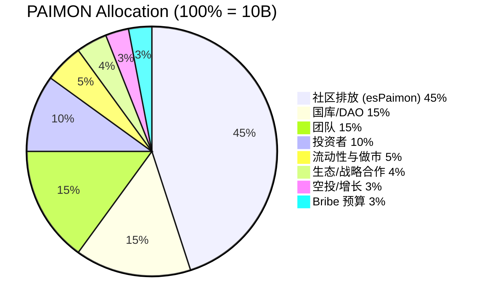
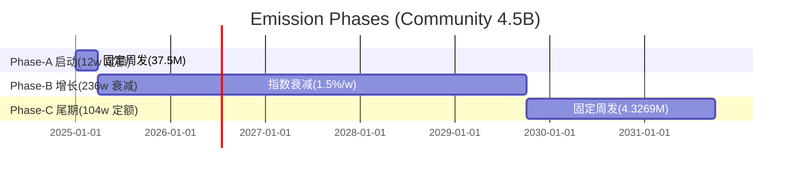
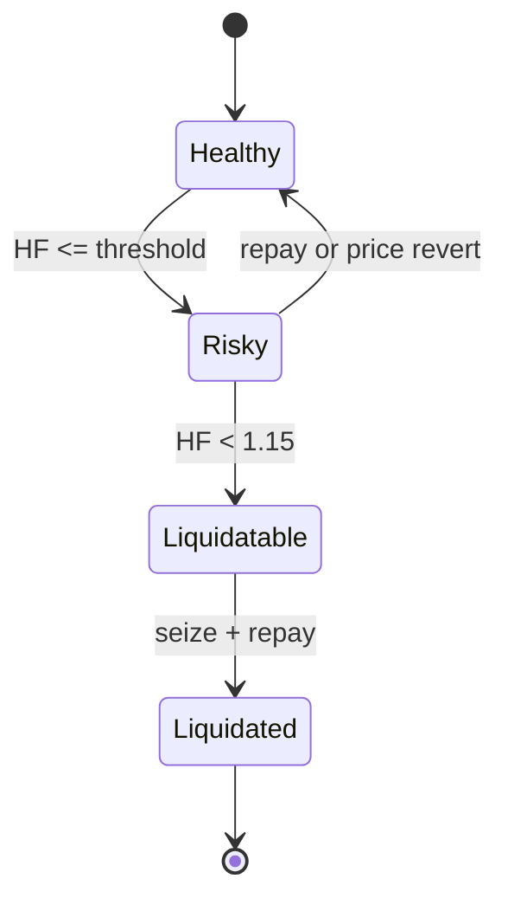

# USDP × Camelot × Lybra — 系统与工程实现白皮书（全面版）

本白皮书面向工程实现，提供 Launchpad + veDEX + 稳定币 + RWA 的完整技术规范：总体架构、组件职责、精确代币经济学、逐周排放与分配算法、清算与稳定池、接口与事件、权限与不变量、测试与安全，以及可视化图表（Mermaid）。本文件不包含运营流程与文案。

----------------------------------------

## 1. 目标与边界
- 目标：以 Lybra 的“抵押生息资产→铸稳币→债务挖矿”为内核，叠加 Camelot 的“ve 投票→Gauge→Bribe→LP 深度”外环，构建围绕 RWA 的可持续流动性飞轮。
- 边界与原则：
  - USDP 稳定币默认不被动生息（关闭指数分红）；储蓄收益由 SavingRate 独立承接（国库注资覆盖）。
  - PSM 仅负责 USDC↔USDP 1:1 锚定与出入金；不外拨 USDC 储备。
  - 排放（PAIMON→esPaimon 归属化）绑定“债务 / LP（含稳定池） / 生态”贡献；与 USDP 来源无关。
  - 逐周排放预算上链（EmissionManager）；投票仅决定相对权重（GaugeController）。

----------------------------------------

## 2. 架构总览（Mermaid）
```mermaid
flowchart LR
  subgraph L[Launchpad]
    IC[IssuanceController\nUSDT/USDC 募集]
    SR[SettlementRouter\n到期结算]
  end
  subgraph RWA[RWA & Treasury]
    RWA1[Whitelisted RWA Token/HYD]
    TR[Treasury]
    OR[Oracle\nChainlink + NAV]
  end
  subgraph ST[Stablecoin Stack]
    USDP[USDP]
    PSM[PSM USDC↔USDP]
    SRt[SavingRate]
    V[USDPVault]
    SP[Stability Pool\nUSDP 稳定池]
  end
  subgraph GOV[veDEX & 激励]
    AMM[AMM Pairs\nUSDP/USDC, PAIMON/USDP]
    GC[GaugeController]
    BR[BribeMarketplace]
    RD[RewardDistributor]
    BS[BoostStaking\n(PAIMON 质押)]
    VE[vePAIMON]
    ESP[esPaimon]
    PM[PAIMON]
  end
  USDC((USDC))

  USDC --> IC --> RWA1
  SR -->|maturity| TR
  RWA1 -->|deposit| V
  V -->|mint| USDP
  USDC <-->|1:1| PSM <-->|swap| USDP
  USDP --> AMM
  USDP --> SP
  PM --> BS --> RD
  PM --> VE --> GC --> AMM
  BR --> GC
  RD -->|es 归属| ESP
  TR -->|USDC| PSM -->|USDP| SRt
```

----------------------------------------

## 3. 组件职责与精确规范

### 3.1 USDP（稳定币，18 decimals）
- 会计：份额×指数（shares×accrualIndex / 1e18）。默认关闭 `accumulate()`（不设置 distributor 或 `accrualPaused=true`）。
- 授权：`setAuthorizedMinter(minter,bool)`；建议仅 USDPVault、Treasury、PSM 持有。
- 小数转换：与 USDC(6) 之间以 1e12 为换算因子。
- 事件：`Transfer`；管理：`MinterAdded/MinterRemoved/DistributorUpdated/IndexAccumulated`（如启用）。
- 不变量：`totalSupply == totalShares * accrualIndex / 1e18`。

### 3.2 PSM（USDC↔USDP，锚定模块）
- 精度：USDC(6) ↔ USDP(18)，换算 `usdp = usdc * 1e12`。
- 费用：`feeIn`/`feeOut`（bp）；建议初始 in=5–10bp，out=10–20bp，可治理调整。
- 公式：
  - USDC→USDP：`feeUSDC = usdcIn * feeIn/10000`；`usdpOut = (usdcIn - feeUSDC) * 1e12`。
  - USDP→USDC：`feeUSDP = usdpIn * feeOut/10000`；`usdcOut = (usdpIn - feeUSDP) / 1e12`；需 `USDC.balanceOf(this) ≥ usdcOut`。
- 事件：`SwapUSDCForUSDP(user, usdcIn, usdpOut, fee)`、`SwapUSDPForUSDC(user, usdpIn, usdcOut, fee)`。
- 不变量：USDC 储备仅入不出（除赎回），增强刚兑缓冲。

### 3.3 SavingRate（USDP 储蓄率）
- 功能：`deposit(usdp)` / `withdraw(usdp)` / `claimInterest()`；
- 注资：`fund(amount)`（仅 Owner），要求先由国库将 USDP 转入后调用；
- 计息：`interest = principal * annualRate * elapsed / YEAR / 10000`（线性、按秒）；
- 不变量：利息支付仅来自注资（禁止自增发）。

### 3.4 USDPVault（抵押借款）
- 接口：`deposit(asset,amount)`、`borrow(usdp)`、`repay(usdp)`、`withdraw(asset,amount)`、`debtOf(user)`、`liquidate(user,asset,repayAmount)`；
- LTV：T1=80%/T2=70%/T3=60%，清算阈 115%，罚金 5%（4% 清算人/1% 协议）。
- 健康度：`HF = collateralUSD / (debtUSD * threshold)`；
- 预言机：双源（Chainlink + NAV），偏差阈 + 冷却 + 断路器。
- 事件：`Borrow/Repay/DebtUpdated/Liquidated`。

### 3.5 Stability Pool（USDP 稳定池）
- 存取：`deposit(usdp)`、`withdraw(shares)`；奖励领取：`claim()`；
- 清算承接：`onLiquidationProceeds(asset,amount)`（仅 Vault 调用），按 `userShares/totalShares` 比例分配折价标的或 USDC；
- 激励：参与 LP 通道的二级配额（见 §5.2）；
- 事件：`Deposited/Withdrawn/RewardClaimed/LiquidationProceeds`。

### 3.6 PAIMON / esPaimon / vePAIMON
- PAIMON：cap=10B；`MINTER_ROLE` 仅 EmissionManager/Distributor/Treasury；
- esPaimon：受限 ERC20（或仓位型），365 天线性；新增 `vestFor(user, amount)` 用于归属化发放；`claim()`、`earlyExit()`（罚则可配置）。
- vePAIMON：锁仓 1 周~4 年（可转让 veNFT），每周投票；用于 Gauge 权重与 Launchpad 准入等治理流程。

### 3.7 GaugeController / RewardDistributor / Bribe / Nitro / EmissionManager
- GaugeController：输出各 Gauge 相对权重（含只读 Gauge）。
- RewardDistributor：Merkle 分发，领取时读取 Boost（`BoostStaking.getBoostMultiplier`）；默认 `esPaimon.vestFor`。
- BribeMarketplace：白名单资产（esPaimon/USDC/USDP/合作代币）按投票份额派发。
- NitroPool：外部追加激励插件。
- EmissionManager：逐周预算查表（debt、lpPairs、stabilityPool、eco），LP 内部分流参数可治理。

----------------------------------------

## 4. 代币经济学（Tokenomics）
- 总量：`PAIMON.totalCap = 10,000,000,000`（18 decimals）。
- 分配（100%）：

- 归属与锁仓：团队 1y cliff+36m 线性；投资 6m cliff+18m 线性；生态 12–24m 线性；Bribe 36m 线性；LP 锁 12m；社区排放 100% 归属化（esPaimon）。
- 不变量：`铸造总量 ≤ 10B`；`Σ(已归属 + 已分发 + 国库 + LP锁 + Bribe预算) == 已铸造`。

----------------------------------------

## 5. 排放（Emission）
### 5.1 三阶段（Epoch=7 天）

- Phase-A（w=1..12）：`E_A = 37,500,000`/周。
- Phase-B（w=13..248）：`E_B(t)=E0_B×r^(t-1)`，`E0_B≈55,584,000`，`r=0.985`（1.5%/周），t=1..236。
- Phase-C（w=249..352）：`E_C = 450,000,000/104 ≈ 4,326,923.076923`/周。

### 5.2 通道与 LP 二级分流（按阶段）
- 通道系数：
  - Phase-A：Debt 30% / LP 60% / Eco 10%
  - Phase-B：Debt 50% / LP 37.5% / Eco 12.5%
  - Phase-C：Debt 55% / LP 35% / Eco 10%
- LP 内部分流（示例 Phase-B）：`{lpPairsBps=6000, stabilityPoolBps=4000}`（治理可调，Timelock 保护）。

### 5.3 逐周规则（确定性与守恒）
- w ∈ [1,352]；`w = floor((now - epochStart)/7d) + 1`。
- 预算：
  - w∈[1,12]：`E=37,500,000e18`，`α={0.30,0.60,0.10}`；
  - w∈[13,248]：`t=w-12`，`E=E0_B×0.985^(t-1)`，`α={0.50,0.375,0.125}`；
  - w∈[249,352]：`E=4,326,923.076923e18`，`α={0.55,0.35,0.10}`。
- 舍入与守恒：每周按 wei 取整；阶段维护 `rem = budget_phase - Σ(weekly_emitted)`；阶段末将 rem 注入 Eco（或指定通道），保证阶段预算精确用尽；可选分通道 remainder。
- 伪代码：
```solidity
function weeklyEmission(uint256 w) returns (uint256 eDebt, uint256 eLpPairs, uint256 eStability, uint256 eEco) {
  uint256 E; uint16 aDebt; uint16 aLp; uint16 aEco;
  if (w<=12) { E=37_500_000e18; aDebt=3000; aLp=6000; aEco=1000; }
  else if (w<=248) { uint256 t=w-12; E=E0_B * pow985(t-1) / 1e6; aDebt=5000; aLp=3750; aEco=1250; }
  else { E=4_326_923_076_923e12; aDebt=5500; aLp=3500; aEco=1000; }
  uint256 eDebtBase = E * aDebt / 10000;
  uint256 eLpBase   = E * aLp   / 10000;
  eEco = E - eDebtBase - eLpBase;
  eLpPairs   = eLpBase * lpPairsBps / 10000;
  eStability = eLpBase - eLpPairs;
  eDebt = eDebtBase;
}
```

### 5.4 权重计算与分发流水线
- 债务挖矿：`debtWeight_u = TWAD(debtOf(u))`；`reward_u = E_debt × debtWeight_u / Σ(debtWeight)`。
- LP：池级 `poolShare_i = votes_i/Σ(votes)`；池内按 LP 份额×时间；LP 内二级拆分（AMM vs Stability Pool）。
- Boost：`actual = base × multiplier/10000`；`multiplier = BoostStaking.getBoostMultiplier(u)`（1.0x–1.5x）；可扩展 `IBoostSource` 聚合 esPaimon 权重（总上限 ≤1.8x）。
```mermaid
flowchart LR
  S[TWAD & LP Snapshot] --> Agg[Aggregator]
  GC[GaugeController] -->|weights| Agg
  EM[EmissionManager] -->|E(w) & splits| Agg
  Agg -->|Merkle Root| RD[RewardDistributor]
  BS[BoostStaking] -->|multiplier| RD
  RD -->|claim & vestFor| ESP[esPaimon]
```

----------------------------------------

## 6. 清算与稳定池

- Vault 清算时调用 `USDPStabilityPool.onLiquidationProceeds(asset, amount)`，按 `userShares/totalShares` 比例分配资产或 USDC；用户 `claim()` 提取。

----------------------------------------

## 7. Camelot 投票机制（工程差异）
- 传统 ve(3,3)：ve 锁仓→每周投票→按权重直接分配排放；Bribe 按投票权比例派发；池=Gauge 常一一映射。
- Camelot 风格（本方案）：
  - 预算/权重解耦：EmissionManager 逐周预算，GaugeController 仅输出相对权重。
  - 插件化：Boost（PAIMON 质押）、Bribe 市场、Nitro 外部激励互相独立；
  - Gauge 分层：可有只读 Gauge（无排放，用于 Launchpad 治理统计）；
  - LP 内部细分：LP 通道再拆分 AMM 与 Stability Pool；
  - Bribe 白名单：多资产 bribe 通过 BribeMarketplace 归集，独立于基础排放。

----------------------------------------

## 8. 接口概要（Solidity 片段）
```solidity
interface IUSDPVault {
  function deposit(address asset, uint256 amount) external;
  function withdraw(address asset, uint256 amount) external;
  function borrow(uint256 usdpAmount) external;
  function repay(uint256 usdpAmount) external;
  function liquidate(address user, address asset, uint256 repayAmount) external;
  function debtOf(address user) external view returns (uint256); // 18 decimals
  event Borrow(address indexed user, uint256 usdpAmount);
  event Repay(address indexed user, uint256 usdpAmount);
  event DebtUpdated(address indexed user, uint256 normalizedDebt);
}

interface IUSDPStabilityPool {
  function deposit(uint256 usdp) external;
  function withdraw(uint256 shares) external;
  function claim() external;
  function onLiquidationProceeds(address asset, uint256 amount) external; // onlyVault
  event Deposited(address indexed user, uint256 usdp);
  event Withdrawn(address indexed user, uint256 shares);
  event RewardClaimed(address indexed user, uint256 amount);
  event LiquidationProceeds(address indexed asset, uint256 amount);
}

// esPaimon 归属化
function vestFor(address user, uint256 amount) external onlyRole(DISTRIBUTOR_OR_TREASURY);

// SavingRate 注资
function fund(uint256 amount) external onlyOwner; // assumes USDP pre-transferred

// EmissionManager 逐周预算
function getWeeklyBudget(uint256 w)
  external view
  returns (uint256 debt, uint256 lpPairs, uint256 stabilityPool, uint256 eco);
```

----------------------------------------

## 9. 不变量与安全
- Peg：`PSM.USDC_balance / USDP_circulating ≥ bufferBps`（建议 25%–40%）。
- 会计：`USDP.totalSupply == totalShares * accrualIndex / 1e18`。
- 守恒：`Σ(通道发放) ≤ 周预算 E(w)`；Merkle 叶总和 ≤ Root；阶段末 rem 补差后 `Σ阶段周发 == 阶段预算`。
- 资格：仅“未偿债务”参与债务挖矿；PSM 与 SavingRate 不产资格。
- 权限：所有参数（阶段预算、通道/二级系数、白名单）由 Timelock/多签治理。
- 安全：ReentrancyGuard；USDC/USDP 小数换算统一（1e12）。

----------------------------------------

## 10. 参数参考（默认）
- Epoch：7 天；Phase-B 衰减：`DECAY_BPS = 150`（1.5%/周）。
- LP 内部分流（Phase-B 示例）：`lpPairsBps=6000, stabilityPoolBps=4000`。
- PSM：`feeIn=5–10bp, feeOut=10–20bp`；
- SavingRate APR：2–3%；
- LTV：T1=80% / T2=70% / T3=60%；清算罚金 5%（4%/1%）。

---
（完）
