# USDP × Camelot × Lybra — RWA 协议体系化工程指南（仅系统与实现）

本指南为 Launchpad + DEX 协议的工程实现蓝图，给出完整的系统循环、代币经济学分配与排放细节、合约与数据流、算法与不变量、以及可视化序列/结构图。刻意排除运营流程/文案，仅保留系统与工程实现内容。

## 1. 目标与边界
- 目标：以 Lybra 的“抵押生息资产→铸稳币→债务挖矿”为内核，叠加 Camelot 的“ve 投票→Gauge→Bribe→LP 深度”外环，驱动 RWA 购入、抵押、借稳与做市的正反馈飞轮。
- 边界：
  - USDP 作为稳定币本体默认不被动分红（不启用指数累积），储蓄收益由 SavingRate 承接；
  - PSM 仅做锚定与出入金，不产激励；
  - 排放绑定“债务与 LP 贡献”，与 USDP 来源解耦；
  - Launchpad 与 ve 治理、Bribe、Nitro 等组件工程可组合、接口明确。

## 2. 全局结构与主数据流（Mermaid）
```mermaid
flowchart LR
  subgraph L[Launchpad]
    IC[IssuanceController]
    SR[SettlementRouter]
  end

  subgraph RWA[RWA & Treasury]
    RWA1[Whitelisted RWA Token/HYD]
    TR[Treasury]
    OR[Oracle (Chainlink + NAV)]
  end

  subgraph Stable[Stablecoin Stack]
    USDP[USDP]
    PSM[PSM USDC↔USDP]
    SRt[SavingRate]
    V[USDPVault]
  end

  subgraph DEX[DEX + ve 体系]
    AMM[AMM Pairs (USDP/USDC, PAIMON/USDP...)]
    GC[GaugeController]
    BR[BribeMarketplace]
    RD[RewardDistributor]
    BS[BoostStaking (stake PAIMON)]
    VE[vePAIMON]
    ESP[esPaimon]
    PM[PAIMON]
  end

  USDC((USDC))

  %% Launchpad → RWA 获取
  USDC --> IC --> RWA1
  SR -->|maturity| TR

  %% 抵押 → 借稳
  RWA1 -->|deposit| V
  V -->|mint| USDP

  %% 出入金 & 锚定
  USDC <-->|1:1| PSM <-->|swap| USDP

  %% 做市与治理
  USDP --> AMM
  PM --> BS --> RD
  PM --> VE --> GC --> AMM
  BR --> GC
  RD -->|emissions/vest| ESP

  %% 储蓄收益注资闭环
  TR -->|USDC| PSM -->|USDP| SRt
```

## 3. 代币集合与经济学（工程视角）
- `PAIMON`（平台代币，cap=10,000,000,000）
  - 铸造权限：`MINTER_ROLE` 仅授予 Gauge/Distributor/Treasury（按治理通过）。
  - 用途：
    - 经归属化发放为 `esPaimon`（主激励介质）；
    - ve 锁仓获取 `vePAIMON`（治理投票/权重）；
    - 质押至 `BoostStaking` 获取奖励乘数（1.0x–1.5x）。
  - 排放预算：以“每周 Epoch”释放，支持指数/线性衰减（见 §5 排放模型）。

- `esPaimon`（归属化激励）
  - 线性归属（默认 365 天）、提前退出罚则；不可转移；
  - 需新增 `vestFor(user, amount)`（仅 Distributor/Treasury），用于“归属化发放”；
  - 后续可作为 Boost 来源之一（`getBoostWeight` 已提供衰减权重，1%/周）。

- `vePAIMON`（治理票/NFT，可转让）
  - 锁仓期：1 周 ~ 4 年，线性衰减；
  - 用于 `GaugeController` 投票，决定池子排放配额与 Nitro/Launchpad 准入；
  - 票权快照周期：7 天（与 Epoch 对齐）。

- `USDP`（稳定币）
  - 份额×指数模型（关闭被动指数）：默认不设置 Distributor 或新增 `accrualPaused=true`；
  - Minter：`USDPVault`/Treasury/PSM；Burn：`PSM` 赎回路径；
  - 储蓄收益由 `SavingRate` 承接，非本体指数。

## 4. 主循环（系统态）
### 4.1 Borrow → Earn（Lybra 内核）
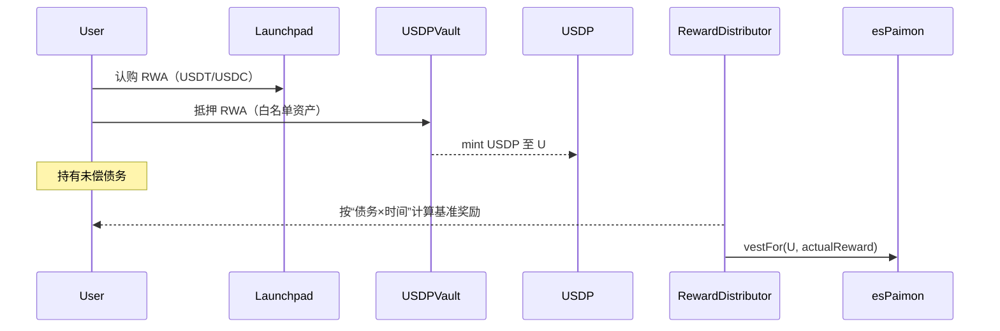

要点：
- 债务挖矿无需质押 USDP；资格源于 `debtOf(user)` 的时间加权（TWAD）。

### 4.2 Liquidity → Earn（Camelot 外环）
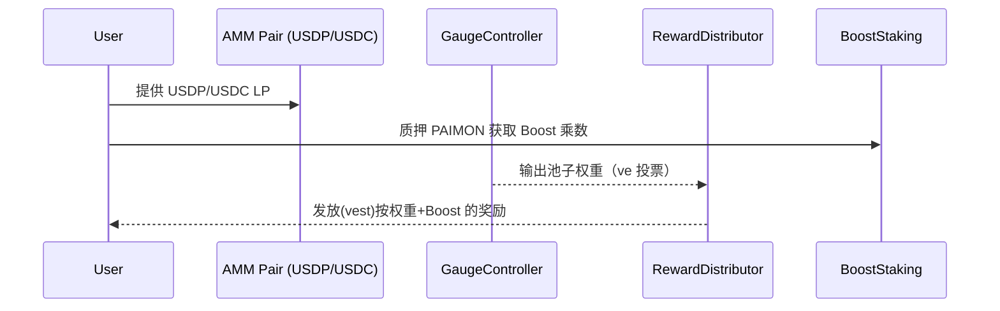

### 4.3 Peg & Saving（锚定与储蓄）
- PSM：USDC↔USDP 1:1（in 5–10bp / out 10–20bp，参数化），仅持有 USDC 储备，不外拨；
- SavingRate：国库用 RWA 收益 USDC 经 PSM 换 USDP 注资 `fund()`，按 APR 线性记息；与挖矿路径分离。

## 5. 排放模型（Epoch = 7 天）
### 5.1 基础排放曲线
- 设初始周排放 `E0`，衰减系数 `DECAY_BPS`（例：每周 1%–2%）。
- 第 t 个 Epoch 排放：`E(t) = E0 * (1 - DECAY_BPS/10000)^t`。

### 5.2 配额切分（按治理）
- `E_debt = E(t) * α_debt`（40–50%）→ 债务挖矿（esPaimon 归属化）
- `E_lp   = E(t) * α_lp`（30–40%）→ LP Gauges（esPaimon/PAIMON 归属化，二选一）
- `E_eco  = E(t) * α_eco`（10–20%）→ 生态池/Nitro 配合（按需）
- 约束：`α_debt + α_lp + α_eco = 1`。

### 5.3 权重计算
- 债务挖矿：
  - `debtWeight_u = TWAD(debtOf(u), epochWindow)`；
  - `reward_u = E_debt * debtWeight_u / Σ(debtWeight)`。
- LP 挖矿：
  - `poolShare_i = votes_i / Σ(votes)`（vePAIMON 投票）；
  - `E_lp_i = E_lp * poolShare_i`；池内按 LP 份额×时间再分配。
- Boost 乘数：
  - `mult = BoostStaking.getBoostMultiplier(u)`（10000=1.0x，最大 15000=1.5x）；
  - 可扩展 `IBoostSource`：聚合 `mult × esWeight(u)`，总上限（如 ≤1.8x）。

### 5.4 分发流水线（Merkle）
```mermaid
flowchart LR
  S[Snapshot Service] -->|TWAD/LP| Agg[Aggregator]
  Agg -->|Merkle Root| RD[RewardDistributor]
  RD -->|claim() 应用 Boost| Vest[esPaimon.vestFor(user, amount)]
```

数据规范：
- 叶子：`keccak256(abi.encode(user, amount))`；多通道时可扩展 `abi.encode(user, amount, channelId)`。

## 6. 合约地图与接口
- Launchpad：
  - `launchpad/IssuanceController.sol`（USDC/USDT 募集、最小/最大目标、退款）；
  - `presale/SettlementRouter.sol`（到期：ve 转换或现金赎回）。
- 稳定币与储蓄：
  - `core/USDP.sol`（份额×指数，默认不启用被动指数）；
  - `core/PSM.sol`（USDC↔USDP 1:1，费率 bp 参数化）；
  - `treasury/SavingRate.sol`（定率计息，需 `fund()` 注资）。
- 借贷：
  - `USDPVault`（新增）：抵押、借、还、清算、`debtOf(user)`；事件 `Borrow/Repay/DebtUpdated`。
- 治理与激励：
  - `core/PAIMON.sol`、`core/esPaimon.sol`（需 `vestFor`）；
  - `core/VotingEscrow*.sol`（vePAIMON）；
  - `governance/GaugeController.sol`、`governance/RewardDistributor.sol`（Merkle 分发 + Boost）；
  - `incentives/BoostStaking.sol`（PAIMON 质押获得乘数）；
  - `governance/BribeMarketplace.sol`（外部贿选激励）；
  - `incentives/NitroPool.sol`（外部额外激励）。

### 6.1 USDPVault 接口草图
```solidity
interface IUSDPVault {
  // Collateral management
  function deposit(address asset, uint256 amount) external;
  function withdraw(address asset, uint256 amount) external;

  // Debt lifecycle
  function borrow(uint256 usdpAmount) external;    // mints USDP to msg.sender
  function repay(uint256 usdpAmount) external;     // burns USDP from msg.sender

  // Liquidation
  function liquidate(address user, address asset, uint256 repayAmount) external;

  // Views
  function debtOf(address user) external view returns (uint256); // 18 decimals
  function healthFactor(address user) external view returns (uint256);

  // Events
  event Borrow(address indexed user, uint256 usdpAmount);
  event Repay(address indexed user, uint256 usdpAmount);
  event DebtUpdated(address indexed user, uint256 normalizedDebt);
}
```

### 6.2 RewardDistributor 归属化分支
- 新增只读引用：`esPaimon`；
- `claim()` 流程：校验 Merkle → 计算 `actual = base × mult/10000` → 若配置为 es 通道，则 `esPaimon.vestFor(user, actual)`；否则直接转账；
- 保留 `BoostStaking` 乘数读取；可扩展 `IBoostSource`。

### 6.3 esPaimon 归属化入口
```solidity
function vestFor(address user, uint256 amount) external onlyRole(DISTRIBUTOR_OR_TREASURY) {
  // pullFrom(msg.sender) PAIMON, add to user vesting position
  // keep existing 365d linear vesting + earlyExit penalty
}
```

### 6.4 SavingRate 注资入口
```solidity
function fund(uint256 amount) external onlyOwner {
  // event TreasuryFunded(msg.sender, amount)
  // assumes USDP already transferred to this contract by Treasury
}
```

## 7. 不变量与安全约束
- Peg & 储备：`PSM.USDC_balance / USDP_circulating ≥ PegBufferBps`（建议 25%–40%）。
- 代币会计：`USDP.totalSupply == totalShares * accrualIndex / 1e18`。
- 分配守恒：`Σ(各通道发放) ≤ 当期排放预算 E(t)`；Merkle 叶总和 ≤ Root 对应预算。
- 债务与资格：仅“未偿债务”地址参与债务挖矿；PSM 与 SavingRate 不产资格；
- Bribe：只接受白名单资产；
- Oracle：双源校验、断路器、冷却；
- 清算：115% 阈、5% 罚金（4%/1% 分配）。

## 8. Gas 与组合性
- Distributor 领款 O(ProofDepth)；Boost 读取 O(1)；
- Vault 借/还 O(1) + oracle 读；
- AMM/LP 与 Gauge 与 Distributor 解耦（松耦合组合）。

## 9. 测试矩阵（工程）
- USDP：份额/指数不变量、accumulate 关停保护、mint/burn 授权；
- PSM：USDC↔USDP 精度、fee 路径、储备不变量；
- SavingRate：计息精度、`fund()` 注资记账；
- esPaimon：`vest/vestFor/claim/earlyExit`；
- Distributor：Merkle 校验、Boost 乘数、归属化分支；
- Vault：LTV/清算/`debtOf`；
- ve/Gauge/Bribe：投票快照、权重分配；
- Nitro：额外奖励上限守恒；
- 集成：Borrow→Earn、LP→Earn、PSM→SavingRate 注资闭环。

## 10. 参数参考（工程层）
- Epoch：7 天；DECAY_BPS：100–200；
- 分配：`α_debt=0.45, α_lp=0.40, α_eco=0.15`（示例）；
- PSM：`feeIn=5–10bp, feeOut=10–20bp`；
- SavingRate APR：2–3%；
- LTV：T1=80%/T2=70%/T3=60%；清算罚金 5%。

## 11. 补充序列图
### 11.1 ve 投票与 Bribe
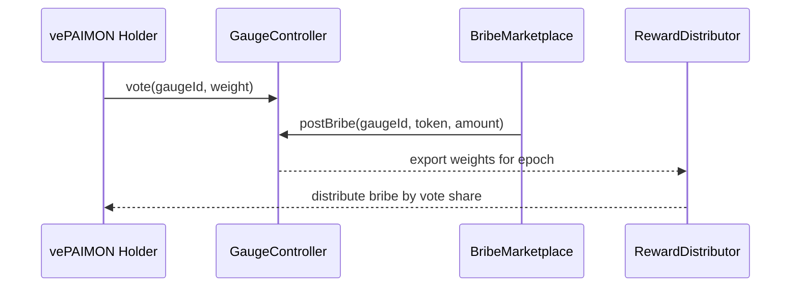

---

附注：本指南只包含系统与工程实现所需信息；不包含运营步骤、SOP 或文案。

## 13. Mermaid 图集（系统与代币经济学）

### 13.1 全局系统总览（更新版）
```mermaid
flowchart LR
  subgraph L[Launchpad]
    IC[IssuanceController]\n(USDT/USDC 募集)
    SR[SettlementRouter]\n(到期结算)
  end
  subgraph RWA[RWA & Treasury]
    RWA1[Whitelisted RWA Token/HYD]
    TR[Treasury]
    OR[Oracle\nChainlink + NAV]
  end
  subgraph ST[Stablecoin Stack]
    USDP[USDP]
    PSM[PSM USDC↔USDP]
    SRt[SavingRate]
    V[USDPVault]
  end
  subgraph GOV[DEX + ve 体系]
    AMM[AMM Pairs\nUSDP/USDC, PAIMON/USDP]
    GC[GaugeController]
    BR[BribeMarketplace]
    RD[RewardDistributor]
    BS[BoostStaking\n(PAIMON 质押)]
    VE[vePAIMON]
    ESP[esPaimon]
    PM[PAIMON]
  end
  USDC((USDC))

  USDC --> IC --> RWA1
  SR -->|maturity| TR
  RWA1 -->|deposit| V
  V -->|mint| USDP
  USDC <-->|1:1| PSM <-->|swap| USDP
  USDP --> AMM
  PM --> BS --> RD
  PM --> VE --> GC --> AMM
  BR --> GC
  RD -->|es 归属| ESP
  TR -->|USDC| PSM -->|USDP| SRt
```

### 13.2 Launchpad 生命周期
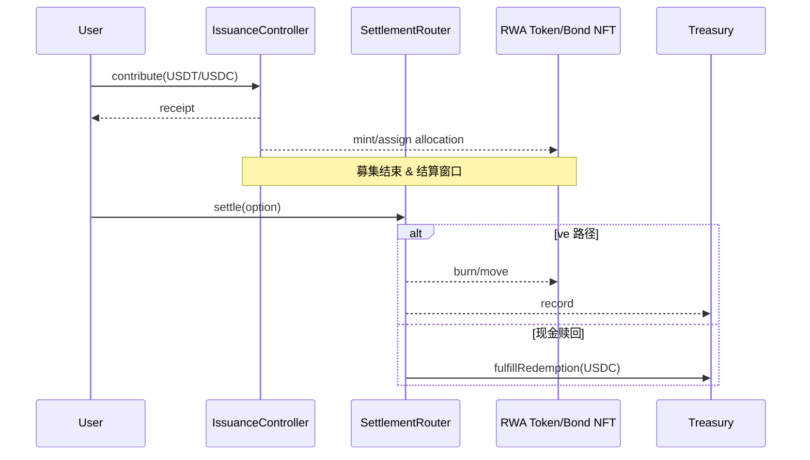

### 13.3 抵押借款与清算状态机
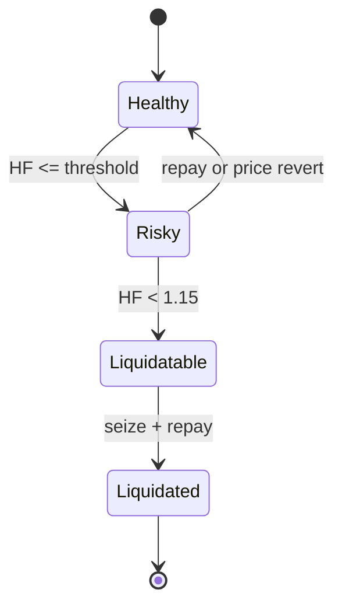

### 13.4 DEX / ve / Bribe / Boost 数据流
```mermaid
flowchart LR
  VE[vePAIMON] -->|vote| GC[GaugeController]
  BR[Bribe Pools] -->|incentivize| GC
  GC -->|weights| RD[RewardDistributor]
  BS[BoostStaking\n(PAIMON)] -->|multiplier| RD
  RD -->|vestFor| ESP[esPaimon]
  LP[AMM LPs] -->|volume/fees| AMM[DEX]
```

### 13.5 合约依赖（ClassDiagram）
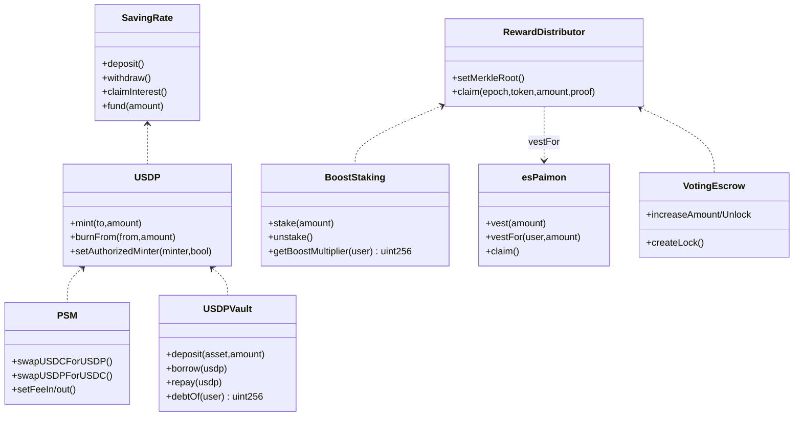

### 13.6 实体关系（ER）
```mermaid
erDiagram
  USER ||--o{ POSITION : holds
  POSITION }o--|| COLLATERAL : uses
  POSITION ||--|| VAULT : registered_in
  USER ||--o{ VESTING : has
  VESTING }o--|| ES_PAIMON : of
  USER ||--o{ LP_SHARE : provides
  LP_SHARE }o--|| AMM_POOL : in
  VEPAIMON ||--o{ VOTE : casts
  VOTE }o--|| GAUGE : targets
  BRIBE ||--o{ INCENTIVE : funds
  INCENTIVE }o--|| GAUGE : to
```

### 13.7 全量分配饼图（修订版）
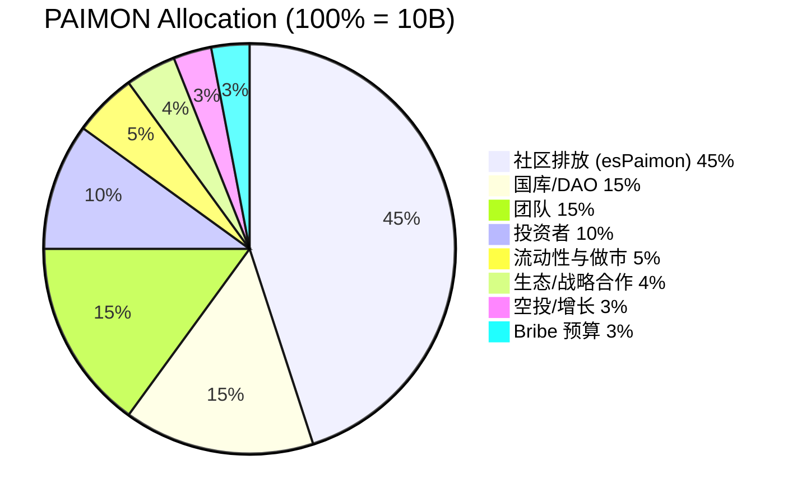

### 13.8 社区排放阶段时间线（Gantt）
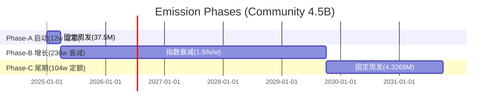

### 13.9 社区排放通道配比（各阶段）
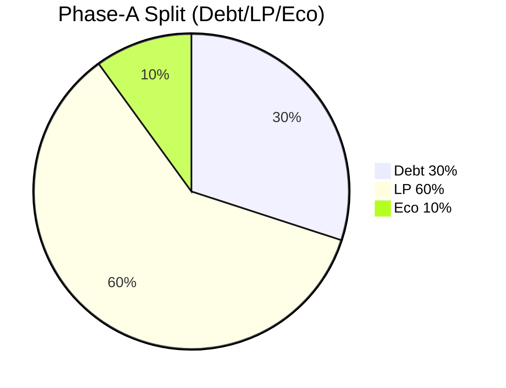
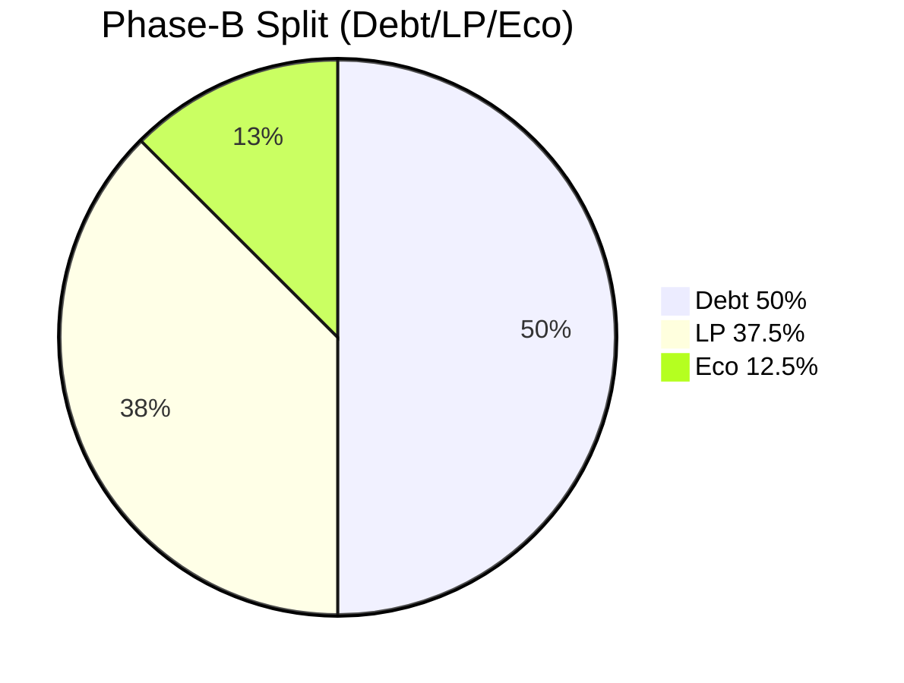
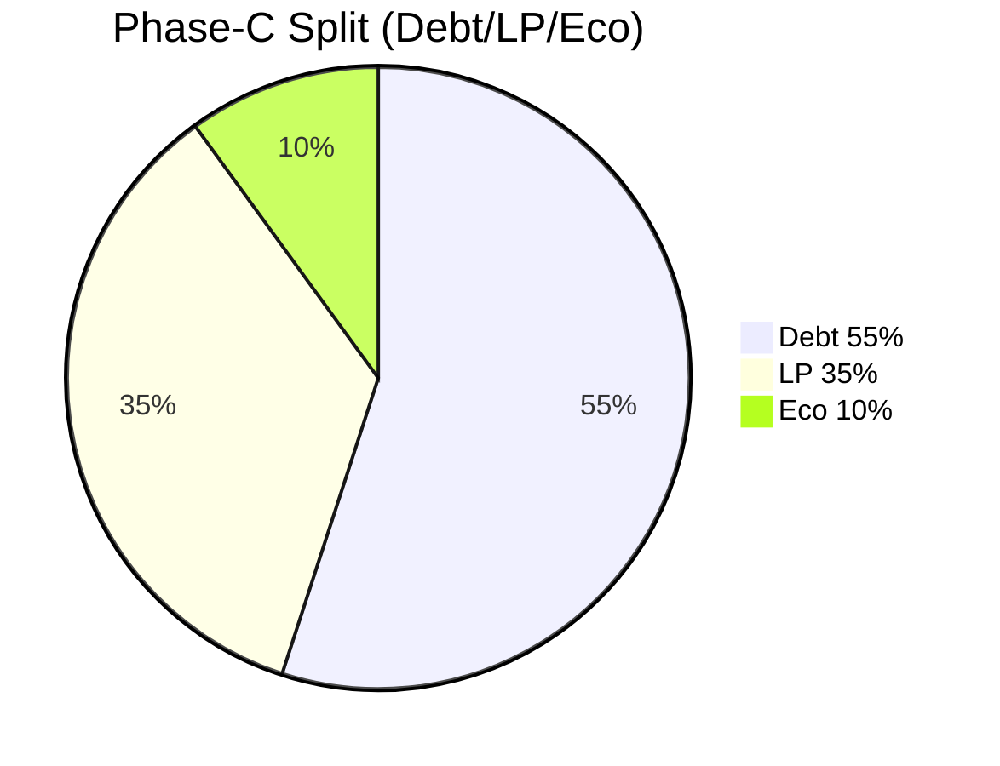

### 13.10 分发流水线（Merkle）
```mermaid
flowchart LR
  S[Snapshot TWAD/LP] --> Agg[Aggregator]
  Agg -->|Merkle Root| RD[RewardDistributor]
  RD -->|claim() + Boost| Vest[esPaimon.vestFor]
```

### 13.11 SavingRate 注资闭环


## 12. 代币经济学（规范版）

本节给出 PAIMON 全量代币经济学与排放细节（仅系统与实现层），用于合约参数化与上链约束。

### 12.1 总量与初始铸造
- `PAIMON.totalCap = 10,000,000,000`（18 decimals，已在 `core/PAIMON.sol` 中通过 ERC20Capped 固定）。
- 创世铸造仅面向“归属/金库/LP/空投/Bribe”受控地址，绝不铸造给EOA；除 LP/空投，其余均通过 Vesting/Timelock 合约托管。

### 12.2 一次性分配（TGE）与长期预算（100%）


- 社区排放（45% = 4.5B，100% 以 esPaimon 归属化发放）
  - 分期按 §12.3 三阶段排放（启动/增长/尾期），每期内再按通道切分（债务/LP/生态）。
- 国库/DAO（15% = 1.5B）：多签托管，二次治理拨付（Bribe、合作、储备）。
- 团队（15% = 1.5B）：1 年 Cliff + 36 个月线性释放（TokenVesting 合约）。
- 投资者（10% = 1.0B）：6 个月 Cliff + 18 个月线性（TokenVesting 合约）。
- 流动性与做市（5% = 0.5B）：用于 USDP/USDC、PAIMON/USDP 初始 LP 与做市账户（LP 代币锁 12 个月）。
- 生态/战略（4% = 0.4B）：12–24 个月线性（TokenVesting）。
- 空投/增长（3% = 0.3B）：Merkle 发放或合约空投（可分批），默认 100% 释放。
- Bribe 预算（3% = 0.3B）：BribeTreasury 合约线性 36 个月，ve 治理动用。

约束（合约层）：
- `PAIMON.MINTER_ROLE` 仅授予：`EmissionManager`（排放）、`VestingVaults`（归属）、`Treasury`（极小额度修正），均受多签与 Timelock 管控。
- `VestingVault`/`BribeTreasury`/`LPVestingLocker` 为不可升级的单用途合约，参数写死在构造中（受 Timelock 保护）。

### 12.3 排放曲线（社区排放 45% = 4.5B → 三阶段）
- Epoch = 7 天；三阶段排放：
  - Phase-A 启动（12 周，定额）：
    - 预算：`S_A = 0.10 × 4.5B = 450M`
    - 周排放：`E_A = S_A / 12 = 37.5M`
    - 通道切分：Debt 30% / LP 60% / Eco 10%
  - Phase-B 增长（236 周，指数衰减）：
    - 预算：`S_B = 0.80 × 4.5B = 3.6B`
    - 衰减：`DECAY_BPS = 150`（1.5%/周），`r = 1 - 0.015 = 0.985`
    - 周排放：`E_B(t) = E0_B × r^t`（t ∈ [0,235]）
    - 使 `Σ E_B(t) = S_B` → `E0_B = S_B × (1 - r) / (1 - r^236)` ≈ `55.584M`
    - 通道切分：Debt 50% / LP 37.5% / Eco 12.5%
  - Phase-C 尾期（104 周，定额）：
    - 预算：`S_C = 0.10 × 4.5B = 450M`
    - 周排放：`E_C = S_C / 104 ≈ 4.3269M`
    - 通道切分：Debt 55% / LP 35% / Eco 10%

约束：
- `Σ(S_A, S_B, S_C) = 4.5B`；任一阶段通道内 `α_debt + α_lp + α_eco = 1`；
- 任何参数变更需经 `Timelock` 与治理投票，`EmissionManager` 仅在 Epoch 结算时更新额度。

### 12.4 通道内部分配算法
- 债务挖矿（esPaimon）
  - 权重：`debtWeight_u = TWAD(debtOf(u), epochWindow)`；
  - 分配：`reward_u = E_phase(t) × α_debt_phase × debtWeight_u / Σ(debtWeight)`；
  - 发放：`RewardDistributor.claim()` 时读取 Boost 乘数并 `esPaimon.vestFor(user, actual)`。
- LP/Gauge（esPaimon/PAIMON 二选一，默认 esPaimon）
  - 池级：`poolShare_i = votes_i / Σ(votes)`（ve 投票快照）；
  - 池内：LP 份额×时间权重；
  - 发放：默认 `esPaimon.vestFor`，如需直接 PAIMON 由治理切换。
- 生态/Launchpad 绑定
  - 用于 RWA 生态池/项目对与 Launchpad 相关对（USDP/Project），按 ve 投票与白名单规则分配。

### 12.5 Boost 与权重合成
- 领取时乘数：`actual = base × multiplier / 10000`；
- `multiplier = BoostStaking.getBoostMultiplier(user)`（PAIMON 质押，1.0x–1.5x）；
- 可扩展 `IBoostSource` 聚合 `multiplier × esWeight(user)`，总上限建议 `≤ 1.8x`，避免超级线性放大。

### 12.6 归属与锁仓合约（强约束）
- `TokenVesting`：团队/投资者/生态的 Cliff+线性释放；
- `BribeTreasuryVesting`：Bribe 预算 36 个月线性；
- `LPVestingLocker`：初始 LP 头寸锁 12 个月（不可撤回，仅在期满后迁移/续锁）；
- `EmissionManager`：按 12.3 曲线每周将预算划拨给 `RewardDistributor` 与通道账户；参数 `DECAY_BPS`/`E0` 通过 `Timelock` 修改（受治理投票）。

### 12.7 初始化与上链参数（示例）
```solidity
struct EmissionParams {
  // Phase-A
  uint256 SA;           // 450_000_000e18
  uint256 EA;           // 37_500_000e18 (per week, 12 weeks)
  uint16  aDebtA;       // 3000 (30%)
  uint16  aLpA;         // 6000 (60%)
  uint16  aEcoA;        // 1000 (10%)

  // Phase-B
  uint256 SB;           // 3_600_000_000e18
  uint256 E0B;          // 55_584_000e18 (per week start)
  uint16  weeksB;       // 236
  uint16  DECAY_BPS;    // 150 (1.5% weekly)
  uint16  aDebtB;       // 5000 (50%)
  uint16  aLpB;         // 3750 (37.5%)
  uint16  aEcoB;        // 1250 (12.5%)

  // Phase-C
  uint256 SC;           // 450_000_000e18
  uint256 EC;           // 4_326_923e18 (per week, 104 weeks)
  uint16  aDebtC;       // 5500 (55%)
  uint16  aLpC;         // 3500 (35%)
  uint16  aEcoC;        // 1000 (10%)

  // Global
  uint256 EPOCH;        // 7 days
}
```

### 12.8 不变量与监控（代币层）
- `minted_total ≤ 10B`；
- `Σ(vested + distributed + treasury + lp_locks + bribe_budget) == minted_total`；
- `Σ(E(t)) over 260 weeks == 4.8B ± 0.1%`；
- `BribeTreasuryVesting.released ≤ 0.2B`；
- `LPVestingLocker.locked ≥ 初始 LP 头寸`；

### 12.9 周别排放明细（确定性规则）
- 周编号：`w ∈ [1, 352]`（A:1–12，B:13–248，C:249–352）。
- Epoch 对齐：`w = floor((block.timestamp - epochStartTime)/7 days) + 1`。
- Phase-A（w ∈ [1,12]）：
  - `E(w) = 37_500_000e18`；通道系数 `αA = {debt:0.30, lp:0.60, eco:0.10}`。
- Phase-B（w ∈ [13,248]），令 `t = w - 12`：
  - `E_B(t) = E0_B × r^(t-1)`，`E0_B = 55_584_000e18`，`r = 0.985`；
  - `αB = {debt:0.50, lp:0.375, eco:0.125}`。
- Phase-C（w ∈ [249,352]）：
  - `E(w) = 450_000_000e18 / 104 = 4_326_923.076923e18`；
  - `αC = {debt:0.55, lp:0.35, eco:0.10}`。
- 舍入与守恒（严格）：
  - 每周三通道产出按 wei 取整 `floor`；
  - 各阶段维护 `rem = budget_phase - Σ(weekly_emitted)`，在该阶段最后一周把 `rem` 加至 `eco`（或指定通道），确保阶段预算精确用尽；
  - 分通道也分别维持 remainder（可选），保证长期配比精度（推荐）。

伪代码（离线聚合器或 EmissionManager 使用）：
```solidity
uint256 constant W = 1e18; // wei
function weeklyEmission(uint256 w) returns (uint256 eDebt, uint256 eLp, uint256 eEco) {
  if (w>=1 && w<=12) {
    uint256 E = 37_500_000 * W;
    return split(E, 3000, 6000, 1000);
  } else if (w>=13 && w<=248) {
    uint256 t = w - 12; // 1..236
    // E0_B precomputed on-chain; pow can be tabulated
    uint256 E = E0_B * pow985(t-1) / W_PREC;
    return split(E, 5000, 3750, 1250);
  } else if (w>=249 && w<=352) {
    uint256 E = 4_326_923_076_923 * W / 1_000_000; // 保留 6 位小数
    return split(E, 5500, 3500, 1000);
  } else revert();
}
function split(uint256 E, uint16 bpsDebt, uint16 bpsLp, uint16 bpsEco)
  returns (uint256 eDebt, uint256 eLp, uint256 eEco)
{
  eDebt = E * bpsDebt / 10000;
  eLp   = E * bpsLp   / 10000;
  eEco  = E - eDebt - eLp; // 剩余位点归 eco（或按策略分配）
}
```

### 12.10 周别示例（单位：Million PAIMON）
- Phase-A（固定）：每周 37.500（Debt 11.250 / LP 22.500 / Eco 3.750）。
- Phase-B（指数衰减，r=0.985，首周 55.584）：

| Week | Total E(w) | Debt(50%) | LP(37.5%) | Eco(12.5%) |
|---:|---:|---:|---:|---:|
| 13 | 55.584 | 27.792 | 20.844 | 6.948 |
| 14 | 54.751 | 27.375 | 20.531 | 6.844 |
| 15 | 53.929 | 26.964 | 20.224 | 6.741 |
| 16 | 53.121 | 26.560 | 19.920 | 6.640 |
| 17 | 52.325 | 26.162 | 19.622 | 6.541 |
| 18 | 51.541 | 25.770 | 19.403 | 6.443 |
| 19 | 50.770 | 25.385 | 19.039 | 6.346 |
| 20 | 50.008 | 25.004 | 18.753 | 6.251 |

- Phase-C（固定）：每周 4.326923（Debt 2.379809 / LP 1.514423 / Eco 0.432692）。

#### 12.10.1 Phase-A（w=1..12）完整周表
| Week | Total | Debt (30%) | LP (60%) | Eco (10%) |
|---:|---:|---:|---:|---:|
| 1 | 37.500 | 11.250 | 22.500 | 3.750 |
| 2 | 37.500 | 11.250 | 22.500 | 3.750 |
| 3 | 37.500 | 11.250 | 22.500 | 3.750 |
| 4 | 37.500 | 11.250 | 22.500 | 3.750 |
| 5 | 37.500 | 11.250 | 22.500 | 3.750 |
| 6 | 37.500 | 11.250 | 22.500 | 3.750 |
| 7 | 37.500 | 11.250 | 22.500 | 3.750 |
| 8 | 37.500 | 11.250 | 22.500 | 3.750 |
| 9 | 37.500 | 11.250 | 22.500 | 3.750 |
| 10 | 37.500 | 11.250 | 22.500 | 3.750 |
| 11 | 37.500 | 11.250 | 22.500 | 3.750 |
| 12 | 37.500 | 11.250 | 22.500 | 3.750 |

#### 12.10.2 Phase-B（w=13..24）扩展示例
| Week | Total E(w) | Debt(50%) | LP(37.5%) | Eco(12.5%) |
|---:|---:|---:|---:|---:|
| 13 | 55.584 | 27.792 | 20.844 | 6.948 |
| 14 | 54.751 | 27.375 | 20.531 | 6.844 |
| 15 | 53.929 | 26.964 | 20.224 | 6.741 |
| 16 | 53.121 | 26.560 | 19.920 | 6.640 |
| 17 | 52.325 | 26.162 | 19.622 | 6.541 |
| 18 | 51.541 | 25.770 | 19.403 | 6.443 |
| 19 | 50.770 | 25.385 | 19.039 | 6.346 |
| 20 | 50.008 | 25.004 | 18.753 | 6.251 |
| 21 | 49.258 | 24.629 | 18.472 | 6.157 |
| 22 | 48.522 | 24.261 | 18.196 | 6.065 |
| 23 | 47.794 | 23.897 | 17.923 | 5.974 |
| 24 | 47.077 | 23.538 | 17.654 | 5.897 |

（注：表内为百万级近似值；链上/离线使用整数 wei，按 12.9 的舍入规则在阶段末补差确保守恒）。

#### 12.10.3 Phase-C（w=249..256）示例
| Week | Total | Debt(55%) | LP(35%) | Eco(10%) |
|---:|---:|---:|---:|---:|
| 249 | 4.326923 | 2.379808 | 1.514423 | 0.432692 |
| 250 | 4.326923 | 2.379808 | 1.514423 | 0.432692 |
| 251 | 4.326923 | 2.379808 | 1.514423 | 0.432692 |
| 252 | 4.326923 | 2.379808 | 1.514423 | 0.432692 |
| 253 | 4.326923 | 2.379808 | 1.514423 | 0.432692 |
| 254 | 4.326923 | 2.379808 | 1.514423 | 0.432692 |
| 255 | 4.326923 | 2.379808 | 1.514423 | 0.432692 |
| 256 | 4.326923 | 2.379808 | 1.514423 | 0.432692 |
