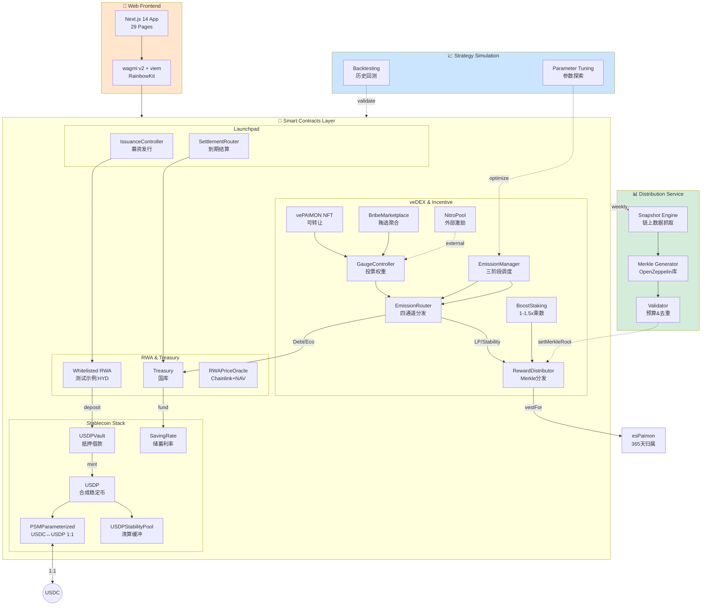
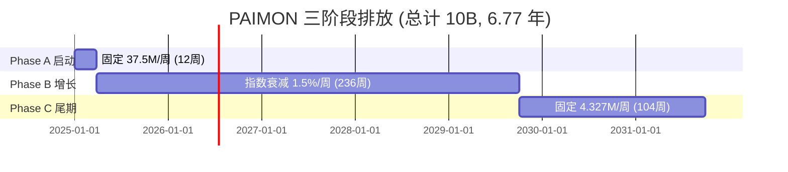

# Paimon.dex — 全栈 RWA × veDEX × CDP 协议

## 系统定位

**以"抵押借款→铸稳定币→债务挖矿"为内核，结合"veNFT投票→Gauge权重→Bribe贿选"外环，形成围绕 RWA 的可持续流动性飞轮。**

### 核心创新

| 维度 | 传统 DeFi | Paimon.dex 创新 |
|------|----------|----------------|
| **稳定币机制** | 单一超额抵押 | **Vault借款** + PSM 1:1锚定 + Stability Pool清算缓冲 |
| **流动性激励** | 固定 APR 挖矿 | **债务挖矿**(50%) + **LP Gauge投票**(37.5%) + **稳定池**(12.5%) |
| **治理模型** | 一代币一票 | **vePAIMON NFT可转让** + Bribe市场 + Nitro外部激励 |
| **排放策略** | 手动调整 | **三阶段自动调度**(固定→衰减→固定,6.77年) |
| **RWA 集成** | 无/仅抵押品 | **Launchpad合规发行** + 国库分层LTV(T1 80%/T2 70%/T3 60%) |

---

## Monorepo 结构

```
paimon 1111111/
├── paimon-rwa-contracts/         # 🔐 智能合约层 (Solidity + Foundry)
│   ├── src/common/               # 统一基础设施 (Governable、Constants、Epoch工具)
│   ├── src/core/                 # USDP、PAIMON、PSM、Vault、StabilityPool、esPaimon
│   ├── src/governance/           # EmissionManager、EmissionRouter、GaugeController、RewardDistributor
│   ├── src/incentives/           # BoostStaking、NitroPool
│   ├── src/launchpad/            # ProjectRegistry、IssuanceController
│   ├── src/treasury/             # Treasury、SavingRate
│   ├── src/dex/                  # DEXFactory、DEXPair、DEXRouter
│   ├── script/                   # 部署脚本 (DeployComplete.s.sol)
│   └── test/                     # 990 测试 (98.99% 通过率)
│
├── distribution-service/         # 📊 离线分发服务 (Node.js + TypeScript)
│   ├── src/snapshot/             # 链上快照抓取 (Debt、LP、Stability Pool)
│   ├── src/merkle/               # Merkle 树生成 (OpenZeppelin 标准)
│   ├── src/validation/           # 分发前验证 (预算守恒、重复地址检查)
│   └── scripts/                  # 自动化脚本 (CI/CD ready)
│
├── nft-paimon-frontend/          # 🎨 Web 前端 (Next.js 14 + wagmi v2)
│   ├── src/app/                  # 29 个功能页面 (App Router)
│   ├── src/components/           # 组件库 (Material-UI v5 暖色主题)
│   ├── src/hooks/                # Web3 hooks (wagmi + viem)
│   ├── src/config/               # 合约地址、ABI、网络配置
│   └── __tests__/                # 111 测试 (Jest + Playwright)
│
└── pythagora-core/               # 📈 策略仿真 (Python)
    ├── data/                     # 历史数据与场景参数
    └── workspace/                # 回测与参数探索脚本
```

---

## 架构总览



---

## 子项目详解

### 1. 🔐 智能合约层 (paimon-rwa-contracts/)

**技术栈**: Solidity 0.8.24 + Foundry + OpenZeppelin 5.x

#### 核心组件

| 合约模块 | 主要合约 | 功能 | 测试数 |
|---------|---------|------|--------|
| **稳定币层** | USDP, PSMParameterized, USDPVault, USDPStabilityPool, SavingRate | 铸币/销毁/借贷/清算/储蓄 | 102 |
| **代币层** | PAIMON, esPaimon, VotingEscrowPaimon | 治理代币/归属/veNFT | 58 |
| **排放层** | EmissionManager, EmissionRouter | 三阶段调度 + 四通道分发 | 52 |
| **治理层** | GaugeController, RewardDistributor, BribeMarketplace | 投票权重/Merkle分发/贿选 | 68 |
| **激励层** | BoostStaking, NitroPool | PAIMON质押加成/外部激励 | 36 |
| **DEX** | DEXFactory, DEXPair, DEXRouter | AMM (Uniswap V2 fork) | 67 |
| **Launchpad** | ProjectRegistry, IssuanceController | RWA项目发行 | 68 |
| **国库** | Treasury, RWAPriceOracle | RWA抵押金库/双源定价 | 39 |

**测试统计**:
- 总测试数: 990
- 通过率: 98.99% (980 通过, 10 Gas基准失败)
- 覆盖率: ~85% 行覆盖, ~90% 函数覆盖

**快速开始**:
```bash
cd paimon-rwa-contracts
forge install
forge test              # 运行全部测试
forge test -vvv         # 详细输出
forge coverage          # 覆盖率报告
```

**详细文档**: [paimon-rwa-contracts/README.md](paimon-rwa-contracts/README.md)

---

### 2. 📊 离线分发服务 (distribution-service/)

**技术栈**: Node.js 18+ + TypeScript + ethers.js v6 + OpenZeppelin Merkle

#### 核心功能

| 模块 | 功能 | 输出 |
|------|------|------|
| **Snapshot** | 抓取链上 Debt、LP、Stability Pool 数据 | `snapshot.csv` |
| **TWAD** | 时间加权平均债务计算 | `weights.csv` |
| **Merkle** | 生成 Merkle 树 + 证明 | `merkle.json` |
| **Validation** | 预算守恒 + 地址去重 + 证明完整性 | `summary.txt` |
| **Distribution** | 提交 Merkle Root 到 RewardDistributor | 链上交易 |

**工作流程**:
```bash
cd distribution-service
npm install

# 1. 生成快照和 Merkle 树
npm run snapshot <epoch> <users-file>

# 2. 验证分发数据
npm run validate ./output/merkle.json

# 3. 提交 Merkle Root 上链
npm run distribute ./output/merkle.json
```

**CI/CD 集成**:
- GitHub Actions 工作流 (`.github/workflows/weekly-distribution.yml`)
- 每周自动执行快照 + 验证 + 提交
- 失败时 Slack/Telegram 告警

**详细文档**: [distribution-service/README.md](distribution-service/README.md)

---

### 3. 🎨 Web 前端 (nft-paimon-frontend/)

**技术栈**: Next.js 14 (App Router) + TypeScript + wagmi v2 + Material-UI v5

#### 核心功能页面 (29 个)

| 分类 | 页面 | 功能 |
|------|------|------|
| **首页** | `/` | 仪表盘 + 协议总览 |
| **稳定币** | `/vault`, `/vault/borrow`, `/vault/repay` | Vault 抵押借款 + 还款 |
| | `/savings` | USDP 储蓄利率 |
| | `/stability-pool` | 稳定池存款 + 清算收益 |
| **代币** | `/convert` | esPaimon 归属转换 |
| | `/lock` | vePAIMON NFT 锁仓 |
| | `/boost` | PAIMON 质押加成 |
| **治理** | `/vote` | Gauge 投票 |
| | `/bribes` | Bribe 市场 |
| | `/nitro` | Nitro 外部激励 |
| | `/rewards` | 奖励领取 (Merkle 证明) |
| **DEX** | `/liquidity/add`, `/liquidity/remove`, `/liquidity/stake` | 流动性管理 |
| **Launchpad** | `/launchpad`, `/launchpad/[id]`, `/launchpad/[id]/vote` | RWA 项目发行 + 治理投票 |
| **预售** | `/presale/mint`, `/presale/dice`, `/presale/bonds`, `/presale/tasks` | 债券 NFT + Remint + 排行榜 |
| **国库** | `/treasury`, `/treasury/deposit`, `/treasury/positions` | RWA 存款 + 仓位查询 |
| **分析** | `/analytics` | 数据大屏 |

#### 技术特性

- ✅ **Web3**: wagmi v2 Hooks + RainbowKit 钱包连接
- ✅ **UI**: Material Design 3 + 暖色主题 (无蓝紫色)
- ✅ **i18n**: next-intl 双语支持 (EN + CN)
- ✅ **响应式**: 移动端 + 桌面端自适应
- ✅ **测试**: 111 单元测试 (Jest) + E2E 测试 (Playwright)

**快速开始**:
```bash
cd nft-paimon-frontend
npm install
cp .env.example .env.local
# 配置 NEXT_PUBLIC_WALLETCONNECT_PROJECT_ID
npm run dev  # http://localhost:4000
```

**详细文档**: [nft-paimon-frontend/README.md](nft-paimon-frontend/README.md)

---

### 4. 📈 策略仿真 (pythagora-core/)

**技术栈**: Python 3.9+

#### 功能

- 📉 **历史回测**: 验证排放曲线与经济模型
- 🎯 **参数探索**: 优化 Emission、LTV、Fee 等参数
- 📊 **场景模拟**: 极端市场条件下的协议表现

**使用**:
```bash
cd pythagora-core
python3 -m venv venv
source venv/bin/activate
pip install -r requirements.txt

# 运行回测脚本 (示例)
python workspace/emission_backtest.py
```

---

## 代币经济学

### 核心代币

| 代币 | 类型 | 总量 | 关键特性 |
|------|------|------|---------|
| **PAIMON** | ERC-20 治理代币 | 10B (硬顶) | 三阶段排放 6.77 年 |
| **esPaimon** | ERC-20 归属代币 | 无上限 | 365 天线性解锁,每周 Boost 衰减 1% |
| **vePAIMON** | ERC-721 治理 NFT | 无上限 | 锁仓 1周~4年,投票权线性衰减,**可转让** |
| **USDP** | ERC-20 合成稳定币 | 无上限 | Vault/Treasury/PSM 铸造,PSM 1:1 锚定 USDC |

> **注**：HYD 为测试/演示用 RWA 代币示例，非核心协议资产。

### 排放时间表



| 阶段 | 周期 | 每周排放 | 总排放 | 通道分配 (Debt/LP/Eco) |
|------|------|---------|-------|----------------------|
| **Phase A** | Week 1-12 | 固定 37.5M | 450M | 30% / 60% / 10% |
| **Phase B** | Week 13-248 | 衰减 55.584M→4.327M | ~8.55B | 50% / 37.5% / 12.5% |
| **Phase C** | Week 249-352 | 固定 4.327M | 450M | 55% / 35% / 10% |

---

## 开发指南

### 环境要求

| 工具 | 版本 | 用途 |
|------|------|------|
| **Foundry** | latest | 智能合约开发 |
| **Node.js** | 18+ | 分发服务 + 前端 |
| **Python** | 3.9+ | 策略仿真 |
| **Git** | 2.x | 版本控制 |

### 一键安装

```bash
# 安装 Foundry
curl -L https://foundry.paradigm.xyz | bash
foundryup

# 安装 Node.js 依赖
npm install --workspaces  # 或分别进入各目录 npm install

# 安装 Python 环境 (可选)
cd pythagora-core && python3 -m venv venv && source venv/bin/activate
```

### 开发工作流

#### 1. 智能合约开发

```bash
cd paimon-rwa-contracts

# 编译
forge build

# 测试 (TDD)
forge test --match-contract EmissionRouter  # 单个合约
forge test -vvv                              # 详细输出

# 覆盖率
forge coverage --report summary

# 部署到测试网
forge script script/DeployComplete.s.sol \
  --rpc-url $BSC_TESTNET_RPC_URL \
  --broadcast \
  --verify
```

#### 2. 前端开发

```bash
cd nft-paimon-frontend

# 开发服务器 (端口 4000)
npm run dev

# 类型检查
npm run type-check

# 测试
npm test          # Jest 单元测试
npm run test:e2e  # Playwright E2E 测试

# 构建生产版本
npm run build
npm start
```

#### 3. 分发服务开发

```bash
cd distribution-service

# 本地测试 (使用 BSC Testnet)
npm run snapshot 1 test/fixtures/users.json

# 验证输出
npm run validate ./output/merkle.json

# 单元测试
npm test
```

### 代码质量标准

**强制要求**:
- ✅ 遵循 SOLID 原则
- ✅ 函数 <50 行
- ✅ 测试覆盖率 >80%
- ✅ 所有公共函数有 NatSpec 文档
- ✅ 价值计算遵循"先乘后除"原则

**Git 工作流**:
```bash
# 分支命名
feat/task-{id}-{description}   # 新功能
fix/bug-{id}-{description}     # Bug修复
refactor/{description}          # 重构

# 提交格式 (Conventional Commits)
feat: add Nitro pool creation UI
fix: resolve precision loss in emission calculation
test: add boundary tests for StabilityPool
docs: update deployment guide for v3.3.0
```

---

## 安全特性

### 合约安全

- ✅ **OpenZeppelin 5.x**: ReentrancyGuard, SafeERC20, Pausable, AccessControl
- ✅ **Chainlink VRF v2**: 不可预测随机性 (骰子游戏)
- ✅ **双源预言机**: Chainlink + 托管方 NAV (>20% 偏差熔断)
- ✅ **Multi-sig**: 3-of-5 用于 Treasury 操作
- ✅ **Timelock**: 参数修改 48 小时延迟
- ✅ **精度优化**: 16 处 SEC-005 修复 (先乘后除)

### 审计状态

| 项目 | 状态 | 备注 |
|------|------|-----|
| **智能合约** | 准备中 | 测试通过率 98.99%, 覆盖率 ~85% |
| **前端安全** | 进行中 | XSS 防护, CSP 配置 |
| **分发服务** | 计划中 | API 密钥管理, Rate limiting |

---

## 部署信息

### 目标网络

**BSC Mainnet** (ChainID 56):
- RPC: https://bsc-dataseed.binance.org/
- Explorer: https://bscscan.com/
- Gas: ~3 Gwei

**BSC Testnet** (ChainID 97):
- RPC: https://data-seed-prebsc-1-s1.binance.org:8545/
- Explorer: https://testnet.bscscan.com/
- Faucet: https://testnet.bnbchain.org/faucet-smart
- **✅ 已部署** (2025-11-07) - **34个合约**

---

### 📋 测试网完整合约清单

#### 1️⃣ 核心代币与稳定币层 (9个合约)

| 合约名称 | 地址 | 功能说明 | BscScan |
|---------|------|---------|---------|
| **USDP** | `0x69cA4879c52A0935561F9D8165e4CB3b91f951a6` | 合成稳定币，锚定USD，由RWA抵押品和USDC储备支持 | [查看](https://testnet.bscscan.com/address/0x69cA4879c52A0935561F9D8165e4CB3b91f951a6) |
| **PAIMON** | `0x4FfBD9CC8e5E26Ec1559D754cC71a061D1820fDF` | 协议治理代币，总量10B，三阶段排放 | [查看](https://testnet.bscscan.com/address/0x4FfBD9CC8e5E26Ec1559D754cC71a061D1820fDF) |
| **esPAIMON** | `0xA848c9F841bB2deDC160DCb5108F2aac610CA02a` | 归属代币，365天线性解锁为PAIMON，奖励代币 | [查看](https://testnet.bscscan.com/address/0xA848c9F841bB2deDC160DCb5108F2aac610CA02a) |
| **HYD** | `0xbBeAE7204fab9ae9F9eF67866C0eB6274db0549c` | 测试用RWA代币（10M供应），60% LTV抵押品 | [查看](https://testnet.bscscan.com/address/0xbBeAE7204fab9ae9F9eF67866C0eB6274db0549c) |
| **PSM** | `0x46eB7627024cEd13826359a5c0aEc57c7255b330` | 1:1 USDC↔USDP互换模块，稳定币锚定机制 | [查看](https://testnet.bscscan.com/address/0x46eB7627024cEd13826359a5c0aEc57c7255b330) |
| **VotingEscrow** | `0x8CC8a97Cf7a05d5308b49CFdF24De5Fa66F696B7` | veNFT基础合约，管理锁仓和投票权 | [查看](https://testnet.bscscan.com/address/0x8CC8a97Cf7a05d5308b49CFdF24De5Fa66F696B7) |
| **VotingEscrowPaimon** | `0xdEe148Cd27a9923DE1986399a6629aB375F244e1` | vePAIMON NFT，锁定PAIMON获得治理权，可转让 | [查看](https://testnet.bscscan.com/address/0xdEe148Cd27a9923DE1986399a6629aB375F244e1) |
| **USDPVault** | `0xF98B41CD89e5434Cae982d4b7EB326D2C1222867` | RWA抵押借款Vault，存入RWA铸造USDP | [查看](https://testnet.bscscan.com/address/0xF98B41CD89e5434Cae982d4b7EB326D2C1222867) |
| **StabilityPool** | `0x4f40786fB0722A10822E3929d331c07042B68838` | 清算缓冲池，存USDP赚取清算收益 | [查看](https://testnet.bscscan.com/address/0x4f40786fB0722A10822E3929d331c07042B68838) |

#### 2️⃣ 治理与排放层 (5个合约)

| 合约名称 | 地址 | 功能说明 | BscScan |
|---------|------|---------|---------|
| **GaugeController** | `0x4fDF9e1640722455cdA32dC2cceD85AeA8a3dB1A` | Gauge投票权重控制器，veNFT投票分配流动性激励 | [查看](https://testnet.bscscan.com/address/0x4fDF9e1640722455cdA32dC2cceD85AeA8a3dB1A) |
| **RewardDistributor** | `0x94c9E4eb5F82D381e889178d322b7b36601AD11a` | Merkle奖励分发器，LP/债务/Stability奖励领取 | [查看](https://testnet.bscscan.com/address/0x94c9E4eb5F82D381e889178d322b7b36601AD11a) |
| **BribeMarketplace** | `0x748800E079eC6605D23d9803A6248613e80253B1` | Bribe贿选市场，协议购买投票权 | [查看](https://testnet.bscscan.com/address/0x748800E079eC6605D23d9803A6248613e80253B1) |
| **EmissionManager** | `0x13536aDe0a7b8Ec6B07FcFc29a6915881c50EA38` | 三阶段排放调度器，管理PAIMON释放速率 | [查看](https://testnet.bscscan.com/address/0x13536aDe0a7b8Ec6B07FcFc29a6915881c50EA38) |
| **EmissionRouter** | `0x0B6638cb031b880238DC5793aD1B3CFCE10DA852` | 四通道排放路由，分配Debt/LP/Stability/Eco奖励 | [查看](https://testnet.bscscan.com/address/0x0B6638cb031b880238DC5793aD1B3CFCE10DA852) |

#### 3️⃣ 激励层 (2个合约)

| 合约名称 | 地址 | 功能说明 | BscScan |
|---------|------|---------|---------|
| **BoostStaking** | `0x0998dA12E9A61a7957e37feE9bBdAe7DDA6Ef314` | PAIMON质押池，1-1.5x奖励加成 | [查看](https://testnet.bscscan.com/address/0x0998dA12E9A61a7957e37feE9bBdAe7DDA6Ef314) |
| **NitroPool** | `0x89f108938951CF996cD3c26556dAF525aD4d9957` | 外部激励池，协议/项目额外奖励 | [查看](https://testnet.bscscan.com/address/0x89f108938951CF996cD3c26556dAF525aD4d9957) |

#### 4️⃣ DEX 去中心化交易所 (5个合约)

| 合约名称 | 地址 | 功能说明 | BscScan |
|---------|------|---------|---------|
| **DEXFactory** | `0x1c1339F5A11f462A354D49ee03377D55B03E7f3D` | DEX工厂合约，创建交易对 | [查看](https://testnet.bscscan.com/address/0x1c1339F5A11f462A354D49ee03377D55B03E7f3D) |
| **DEXRouter** | `0x066Db99AE64B1524834a1f97aa1613e2411E13AC` | DEX路由合约，处理所有swap和流动性操作 | [查看](https://testnet.bscscan.com/address/0x066Db99AE64B1524834a1f97aa1613e2411E13AC) |
| **USDP_USDC_Pair** | `0x3B8D3c266B2BbE588188cA70525a2da456a848d2` | USDP/USDC交易对，稳定币流动性池 | [查看](https://testnet.bscscan.com/address/0x3B8D3c266B2BbE588188cA70525a2da456a848d2) |
| **PAIMON_BNB_Pair** | `0xc625Ab8646582100D48Ae4FC68c1E8B0976111fA` | PAIMON/BNB交易对，治理代币流动性池 | [查看](https://testnet.bscscan.com/address/0xc625Ab8646582100D48Ae4FC68c1E8B0976111fA) |
| **HYD_USDP_Pair** | `0x2361484f586eEf76dCbaE9e4dD37C2b3d10d9110` | HYD/USDP交易对，RWA代币流动性池 | [查看](https://testnet.bscscan.com/address/0x2361484f586eEf76dCbaE9e4dD37C2b3d10d9110) |

#### 5️⃣ 国库与预言机层 (4个合约)

| 合约名称 | 地址 | 功能说明 | BscScan |
|---------|------|---------|---------|
| **Treasury** | `0x8CA5Cd0293b9d3C8BC796083E806bc5bC381772A` | RWA国库金库，管理抵押品和USDP铸造（T1/T2/T3分层LTV） | [查看](https://testnet.bscscan.com/address/0x8CA5Cd0293b9d3C8BC796083E806bc5bC381772A) |
| **SavingRate** | `0xB89188bD9b635EC9Dd73f73C9E3bE17dB83D01B2` | USDP储蓄利率模块，存USDP赚利息 | [查看](https://testnet.bscscan.com/address/0xB89188bD9b635EC9Dd73f73C9E3bE17dB83D01B2) |
| **PriceOracle** | `0x5Ae36173EA62B33590857eD2E77580A9680d4d33` | 通用价格预言机聚合器 | [查看](https://testnet.bscscan.com/address/0x5Ae36173EA62B33590857eD2E77580A9680d4d33) |
| **RWAPriceOracle** | `0xa6dD28dfCa8448965BE9D97BBBAaf82c45CE25C7` | RWA价格预言机，Chainlink+NAV双源定价，>20%偏差熔断 | [查看](https://testnet.bscscan.com/address/0xa6dD28dfCa8448965BE9D97BBBAaf82c45CE25C7) |

#### 6️⃣ Launchpad RWA发行平台 (2个合约)

| 合约名称 | 地址 | 功能说明 | BscScan |
|---------|------|---------|---------|
| **ProjectRegistry** | `0x764a546351cc7C74f68D10b15C18b8d4D7bBB08A` | RWA项目注册表，veNFT治理投票审批 | [查看](https://testnet.bscscan.com/address/0x764a546351cc7C74f68D10b15C18b8d4D7bBB08A) |
| **IssuanceController** | `0xd7b22158801C22fFc0Ff81a1C5B000f29779530E` | RWA代币发行控制器，募资和代币分配 | [查看](https://testnet.bscscan.com/address/0xd7b22158801C22fFc0Ff81a1C5B000f29779530E) |

#### 7️⃣ Mock 测试合约 (7个合约 - 仅测试网)

| Mock合约名称 | 地址 | 功能说明 | BscScan |
|------------|------|---------|---------|
| **Mock USDC** | `0xA1112f596A73111E102b4a9c39064b2b2383EC38` | 测试用稳定币（1B供应，6位小数） | [查看](https://testnet.bscscan.com/address/0xA1112f596A73111E102b4a9c39064b2b2383EC38) |
| **Mock WBNB** | `0xe3402BAd7951c00e2B077A745C9e8B14122f05ED` | 测试用包装BNB（1万供应） | [查看](https://testnet.bscscan.com/address/0xe3402BAd7951c00e2B077A745C9e8B14122f05ED) |
| **Mock USDC Price Feed** | `0xD36eff69950c1eE2713BB1d204f875434Da28aB7` | USDC价格数据源（固定$1.00），用于PSM和Treasury | [查看](https://testnet.bscscan.com/address/0xD36eff69950c1eE2713BB1d204f875434Da28aB7) |
| **Mock BNB Price Feed** | `0x6D0a11083DCe3Fe5a2498b4B37f8edb30b29645B` | BNB价格数据源，用于DEX交易对估值 | [查看](https://testnet.bscscan.com/address/0x6D0a11083DCe3Fe5a2498b4B37f8edb30b29645B) |
| **Mock HYD Price Feed** | `0x536608101E17e4C2c7b0d5eCc4e5659a75fE1489` | RWA资产价格数据源，用于抵押品估值和LTV计算 | [查看](https://testnet.bscscan.com/address/0x536608101E17e4C2c7b0d5eCc4e5659a75fE1489) |
| **Mock Pyth** | `0x4B4a7949694c9bcb7B4731dA60C511DD73f7FBB8` | 备用价格预言机，与Chainlink双重验证防止操纵 | [查看](https://testnet.bscscan.com/address/0x4B4a7949694c9bcb7B4731dA60C511DD73f7FBB8) |
| **Mock VRF Coordinator** | `0xeAcAa0e6c5965f680fc6470745dE63E53A5D249c` | 可验证随机数生成器，用于掷骰子/抽奖（防作弊） | [查看](https://testnet.bscscan.com/address/0xeAcAa0e6c5965f680fc6470745dE63E53A5D249c) |

---

📄 **完整JSON地址清单**: [deployments/testnet/addresses.json](deployments/testnet/addresses.json)
📖 **详细部署报告**: [TESTNET_DEPLOYMENT_SUMMARY.md](TESTNET_DEPLOYMENT_SUMMARY.md)

### 部署顺序

```
1. 代币: USDP, PAIMON, esPaimon
2. DEX: DEXFactory, DEXRouter
3. 稳定币: PSMParameterized, USDPVault, USDPStabilityPool, SavingRate
4. 国库: Treasury, RWAPriceOracle
5. 治理: VotingEscrowPaimon, GaugeController
6. 排放: EmissionManager, EmissionRouter
7. 激励: BoostStaking, NitroPool, RewardDistributor, BribeMarketplace
8. 启动板: ProjectRegistry, IssuanceController
9. 预售: RWABondNFT, RemintController, SettlementRouter (+ Chainlink VRF)
10. 前端: Vercel 部署
11. 分发服务: AWS Lambda (定时任务)
```

**详细部署文档**: [paimon-rwa-contracts/script/DEPLOYMENT.md](paimon-rwa-contracts/script/DEPLOYMENT.md)

---

## 文档索引

### 核心设计文档

- [智能合约详细文档](paimon-rwa-contracts/README.md)
- [前端开发指南](nft-paimon-frontend/README.md)
- [分发服务文档](distribution-service/README.md)

### 审计资料

- [审计准备材料](paimon-rwa-contracts/audit-package/README.md)
- [系统审查报告](.ultra/docs/audit/2025-11-04-system-audit-and-optimization.md)

---

## 贡献指南

欢迎社区贡献！

**贡献流程**:
1. Fork 仓库
2. 创建特性分支 (`git checkout -b feat/amazing-feature`)
3. 编写测试 (覆盖率 >80%)
4. 提交符合 Conventional Commits 的消息
5. 推送分支 (`git push origin feat/amazing-feature`)
6. 创建 Pull Request

**代码质量要求**:
- SOLID/DRY/KISS/YAGNI 原则
- 函数 <50 行,嵌套 <3 层
- 所有公共接口有文档
- 测试先行 (TDD)

---

## 致谢

**感谢 DeFi 生态的持续创新**:
- veToken 治理模型的开创者们,为 DAO 治理提供了新范式
- CDP 稳定币协议的先驱,奠定了去中心化稳定币基础
- ve(3,3) 流动性激励机制的探索者,启发了新的代币经济学设计
- 所有为 RWA 链上化做出贡献的协议与团队

**构建工具**: Foundry, Next.js, OpenZeppelin, Chainlink, wagmi

**特别感谢**: BSC 生态对 RWA 项目的支持与技术基础设施
