# Paimon.dex — 全栈 RWA × veDEX × CDP 协议

## 系统定位

**以"抵押借款→铸稳定币→债务挖矿"为内核，结合"veNFT投票→Gauge权重→Bribe贿选"外环，形成围绕 RWA 的可持续流动性飞轮。**

### 核心创新

| 维度 | 传统 DeFi | Paimon.dex 创新 |
|------|----------|----------------|
| **稳定币机制** | 单一超额抵押 | **Vault借款** + PSM 1:1锚定 + Stability Pool清算缓冲 |
| **流动性激励** | 固定 APR 挖矿 | **债务挖矿**(50%) + **LP Gauge投票**(37.5%) + **稳定池**(12.5%) |
| **治理模型** | 一代币一票 | **vePAIMON NFT可转让** + Bribe市场 + Nitro外部激励 |
| **排放策略** | 手动调整 | **三阶段自动调度**(固定→衰减→固定,6.77年) |
| **RWA 集成** | 无/仅抵押品 | **Launchpad合规发行** + 国库分层LTV(T1 80%/T2 70%/T3 60%) |

---

## Monorepo 结构

```
paimon 1111111/
├── paimon-rwa-contracts/         # 🔐 智能合约层 (Solidity + Foundry)
│   ├── src/common/               # 统一基础设施 (Governable、Constants、Epoch工具)
│   ├── src/core/                 # USDP、HYD、PSM、Vault、StabilityPool、esPaimon
│   ├── src/governance/           # EmissionManager、EmissionRouter、GaugeController、RewardDistributor
│   ├── src/incentives/           # BoostStaking、NitroPool
│   ├── src/launchpad/            # ProjectRegistry、IssuanceController
│   ├── src/treasury/             # Treasury、SavingRate
│   ├── src/dex/                  # DEXFactory、DEXPair、DEXRouter
│   ├── script/                   # 部署脚本 (DeployComplete.s.sol)
│   └── test/                     # 990 测试 (98.99% 通过率)
│
├── distribution-service/         # 📊 离线分发服务 (Node.js + TypeScript)
│   ├── src/snapshot/             # 链上快照抓取 (Debt、LP、Stability Pool)
│   ├── src/merkle/               # Merkle 树生成 (OpenZeppelin 标准)
│   ├── src/validation/           # 分发前验证 (预算守恒、重复地址检查)
│   └── scripts/                  # 自动化脚本 (CI/CD ready)
│
├── nft-paimon-frontend/          # 🎨 Web 前端 (Next.js 14 + wagmi v2)
│   ├── src/app/                  # 29 个功能页面 (App Router)
│   ├── src/components/           # 组件库 (Material-UI v5 暖色主题)
│   ├── src/hooks/                # Web3 hooks (wagmi + viem)
│   ├── src/config/               # 合约地址、ABI、网络配置
│   └── __tests__/                # 111 测试 (Jest + Playwright)
│
└── pythagora-core/               # 📈 策略仿真 (Python)
    ├── data/                     # 历史数据与场景参数
    └── workspace/                # 回测与参数探索脚本
```

---

## 架构总览

```mermaid
flowchart TB
  subgraph Frontend[🎨 Web Frontend]
    UI[Next.js 14 App<br/>29 Pages]
    Web3[wagmi v2 + viem<br/>RainbowKit]
  end

  subgraph Contracts[🔐 Smart Contracts Layer]
    subgraph RWA[RWA & Treasury]
      RWA1[Whitelisted RWA<br/>HYD/其他]
      TR[Treasury<br/>国库]
      OR[RWAPriceOracle<br/>Chainlink+NAV]
    end

    subgraph Stable[Stablecoin Stack]
      V[USDPVault<br/>抵押借款]
      USDP[USDP<br/>合成稳定币]
      PSM[PSMParameterized<br/>USDC↔USDP 1:1]
      SRt[SavingRate<br/>储蓄利率]
      SP[USDPStabilityPool<br/>清算缓冲]
    end

    subgraph GOV[veDEX & Incentive]
      VE[vePAIMON NFT<br/>可转让]
      GC[GaugeController<br/>投票权重]
      EM[EmissionManager<br/>三阶段调度]
      ER[EmissionRouter<br/>四通道分发]
      RD[RewardDistributor<br/>Merkle分发]
      BS[BoostStaking<br/>1-1.5x乘数]
      BR[BribeMarketplace<br/>贿选聚合]
      NP[NitroPool<br/>外部激励]
    end

    subgraph Launch[Launchpad]
      IC[IssuanceController<br/>募资发行]
      SR[SettlementRouter<br/>到期结算]
    end
  end

  subgraph Service[📊 Distribution Service]
    Snap[Snapshot Engine<br/>链上数据抓取]
    Merkle[Merkle Generator<br/>OpenZeppelin库]
    Valid[Validator<br/>预算&去重]
  end

  subgraph Sim[📈 Strategy Simulation]
    Back[Backtesting<br/>历史回测]
    Param[Parameter Tuning<br/>参数探索]
  end

  UI --> Web3
  Web3 --> Contracts
  RWA1 -->|deposit| V -->|mint| USDP
  USDP --> SP
  USDP --> PSM <-->|1:1| USDC((USDC))
  TR -->|fund| SRt
  GC --> ER
  EM --> ER -->|LP/Stability| RD
  EM --> ER -->|Debt/Eco| TR
  BS --> RD
  RD -->|vestFor| ESP[esPaimon<br/>365天归属]
  VE --> GC
  BR --> GC
  NP -.->|external| GC
  IC --> RWA1
  SR --> TR

  Contracts -.->|weekly| Snap
  Snap --> Merkle --> Valid
  Valid -.->|setMerkleRoot| RD

  Param -.->|optimize| EM
  Back -.->|validate| Contracts

  style Frontend fill:#ffe6cc
  style Service fill:#d4edda
  style Sim fill:#cce5ff
```



---

## 子项目详解

### 1. 🔐 智能合约层 (paimon-rwa-contracts/)

**技术栈**: Solidity 0.8.24 + Foundry + OpenZeppelin 5.x

#### 核心组件

| 合约模块 | 主要合约 | 功能 | 测试数 |
|---------|---------|------|--------|
| **稳定币层** | USDP, PSMParameterized, USDPVault, USDPStabilityPool, SavingRate | 铸币/销毁/借贷/清算/储蓄 | 102 |
| **代币层** | PAIMON, HYD, esPaimon, VotingEscrowPaimon | 治理代币/合成资产/归属/veNFT | 58 |
| **排放层** | EmissionManager, EmissionRouter | 三阶段调度 + 四通道分发 | 52 |
| **治理层** | GaugeController, RewardDistributor, BribeMarketplace | 投票权重/Merkle分发/贿选 | 68 |
| **激励层** | BoostStaking, NitroPool | PAIMON质押加成/外部激励 | 36 |
| **DEX** | DEXFactory, DEXPair, DEXRouter | AMM (Uniswap V2 fork) | 67 |
| **Launchpad** | ProjectRegistry, IssuanceController | RWA项目发行 | 68 |
| **国库** | Treasury, RWAPriceOracle | RWA抵押金库/双源定价 | 39 |

**测试统计**:
- 总测试数: 990
- 通过率: 98.99% (980 通过, 10 Gas基准失败)
- 覆盖率: ~85% 行覆盖, ~90% 函数覆盖

**快速开始**:
```bash
cd paimon-rwa-contracts
forge install
forge test              # 运行全部测试
forge test -vvv         # 详细输出
forge coverage          # 覆盖率报告
```

**详细文档**: [paimon-rwa-contracts/README.md](paimon-rwa-contracts/README.md)

---

### 2. 📊 离线分发服务 (distribution-service/)

**技术栈**: Node.js 18+ + TypeScript + ethers.js v6 + OpenZeppelin Merkle

#### 核心功能

| 模块 | 功能 | 输出 |
|------|------|------|
| **Snapshot** | 抓取链上 Debt、LP、Stability Pool 数据 | `snapshot.csv` |
| **TWAD** | 时间加权平均债务计算 | `weights.csv` |
| **Merkle** | 生成 Merkle 树 + 证明 | `merkle.json` |
| **Validation** | 预算守恒 + 地址去重 + 证明完整性 | `summary.txt` |
| **Distribution** | 提交 Merkle Root 到 RewardDistributor | 链上交易 |

**工作流程**:
```bash
cd distribution-service
npm install

# 1. 生成快照和 Merkle 树
npm run snapshot <epoch> <users-file>

# 2. 验证分发数据
npm run validate ./output/merkle.json

# 3. 提交 Merkle Root 上链
npm run distribute ./output/merkle.json
```

**CI/CD 集成**:
- GitHub Actions 工作流 (`.github/workflows/weekly-distribution.yml`)
- 每周自动执行快照 + 验证 + 提交
- 失败时 Slack/Telegram 告警

**详细文档**: [distribution-service/README.md](distribution-service/README.md)

---

### 3. 🎨 Web 前端 (nft-paimon-frontend/)

**技术栈**: Next.js 14 (App Router) + TypeScript + wagmi v2 + Material-UI v5

#### 核心功能页面 (29 个)

| 分类 | 页面 | 功能 |
|------|------|------|
| **首页** | `/` | 仪表盘 + 协议总览 |
| **稳定币** | `/vault`, `/vault/borrow`, `/vault/repay` | Vault 抵押借款 + 还款 |
| | `/savings` | USDP 储蓄利率 |
| | `/stability-pool` | 稳定池存款 + 清算收益 |
| **代币** | `/convert` | esPaimon 归属转换 |
| | `/lock` | vePAIMON NFT 锁仓 |
| | `/boost` | PAIMON 质押加成 |
| **治理** | `/vote` | Gauge 投票 |
| | `/bribes` | Bribe 市场 |
| | `/nitro` | Nitro 外部激励 |
| | `/rewards` | 奖励领取 (Merkle 证明) |
| **DEX** | `/liquidity/add`, `/liquidity/remove`, `/liquidity/stake` | 流动性管理 |
| **Launchpad** | `/launchpad`, `/launchpad/[id]`, `/launchpad/[id]/vote` | RWA 项目发行 + 治理投票 |
| **预售** | `/presale/mint`, `/presale/dice`, `/presale/bonds`, `/presale/tasks` | 债券 NFT + Remint + 排行榜 |
| **国库** | `/treasury`, `/treasury/deposit`, `/treasury/positions` | RWA 存款 + 仓位查询 |
| **分析** | `/analytics` | 数据大屏 |

#### 技术特性

- ✅ **Web3**: wagmi v2 Hooks + RainbowKit 钱包连接
- ✅ **UI**: Material Design 3 + 暖色主题 (无蓝紫色)
- ✅ **i18n**: next-intl 双语支持 (EN + CN)
- ✅ **响应式**: 移动端 + 桌面端自适应
- ✅ **测试**: 111 单元测试 (Jest) + E2E 测试 (Playwright)

**快速开始**:
```bash
cd nft-paimon-frontend
npm install
cp .env.example .env.local
# 配置 NEXT_PUBLIC_WALLETCONNECT_PROJECT_ID
npm run dev  # http://localhost:4000
```

**详细文档**: [nft-paimon-frontend/README.md](nft-paimon-frontend/README.md)

---

### 4. 📈 策略仿真 (pythagora-core/)

**技术栈**: Python 3.9+

#### 功能

- 📉 **历史回测**: 验证排放曲线与经济模型
- 🎯 **参数探索**: 优化 Emission、LTV、Fee 等参数
- 📊 **场景模拟**: 极端市场条件下的协议表现

**使用**:
```bash
cd pythagora-core
python3 -m venv venv
source venv/bin/activate
pip install -r requirements.txt

# 运行回测脚本 (示例)
python workspace/emission_backtest.py
```

---

## 代币经济学

### 核心代币

| 代币 | 类型 | 总量 | 关键特性 |
|------|------|------|---------|
| **PAIMON** | ERC-20 治理代币 | 10B (硬顶) | 三阶段排放 6.77 年 |
| **esPaimon** | ERC-20 归属代币 | 无上限 | 365 天线性解锁,每周 Boost 衰减 1% |
| **vePAIMON** | ERC-721 治理 NFT | 无上限 | 锁仓 1周~4年,投票权线性衰减,**可转让** |
| **USDP** | ERC-20 合成稳定币 | 无上限 | Vault/Treasury/PSM 铸造,PSM 1:1 锚定 USDC |
| **HYD** | ERC-20 合成资产 | 无上限 | 低波动 RWA 合成代币,PSM 铸造/销毁 |

### 排放时间表

```mermaid
gantt
  title PAIMON 三阶段排放 (总计 10B, 6.77 年)
  dateFormat  YYYY-MM-DD
  section Phase A 启动
  固定 37.5M/周 (12周) :a1, 2025-01-01, 84d
  section Phase B 增长
  指数衰减 1.5%/周 (236周) :a2, after a1, 1652d
  section Phase C 尾期
  固定 4.327M/周 (104周) :a3, after a2, 728d
```



| 阶段 | 周期 | 每周排放 | 总排放 | 通道分配 (Debt/LP/Eco) |
|------|------|---------|-------|----------------------|
| **Phase A** | Week 1-12 | 固定 37.5M | 450M | 30% / 60% / 10% |
| **Phase B** | Week 13-248 | 衰减 55.584M→4.327M | ~8.55B | 50% / 37.5% / 12.5% |
| **Phase C** | Week 249-352 | 固定 4.327M | 450M | 55% / 35% / 10% |

---

## 开发指南

### 环境要求

| 工具 | 版本 | 用途 |
|------|------|------|
| **Foundry** | latest | 智能合约开发 |
| **Node.js** | 18+ | 分发服务 + 前端 |
| **Python** | 3.9+ | 策略仿真 |
| **Git** | 2.x | 版本控制 |

### 一键安装

```bash
# 安装 Foundry
curl -L https://foundry.paradigm.xyz | bash
foundryup

# 安装 Node.js 依赖
npm install --workspaces  # 或分别进入各目录 npm install

# 安装 Python 环境 (可选)
cd pythagora-core && python3 -m venv venv && source venv/bin/activate
```

### 开发工作流

#### 1. 智能合约开发

```bash
cd paimon-rwa-contracts

# 编译
forge build

# 测试 (TDD)
forge test --match-contract EmissionRouter  # 单个合约
forge test -vvv                              # 详细输出

# 覆盖率
forge coverage --report summary

# 部署到测试网
forge script script/DeployComplete.s.sol \
  --rpc-url $BSC_TESTNET_RPC_URL \
  --broadcast \
  --verify
```

#### 2. 前端开发

```bash
cd nft-paimon-frontend

# 开发服务器 (端口 4000)
npm run dev

# 类型检查
npm run type-check

# 测试
npm test          # Jest 单元测试
npm run test:e2e  # Playwright E2E 测试

# 构建生产版本
npm run build
npm start
```

#### 3. 分发服务开发

```bash
cd distribution-service

# 本地测试 (使用 BSC Testnet)
npm run snapshot 1 test/fixtures/users.json

# 验证输出
npm run validate ./output/merkle.json

# 单元测试
npm test
```

### 代码质量标准

**强制要求**:
- ✅ 遵循 SOLID 原则
- ✅ 函数 <50 行
- ✅ 测试覆盖率 >80%
- ✅ 所有公共函数有 NatSpec 文档
- ✅ 价值计算遵循"先乘后除"原则

**Git 工作流**:
```bash
# 分支命名
feat/task-{id}-{description}   # 新功能
fix/bug-{id}-{description}     # Bug修复
refactor/{description}          # 重构

# 提交格式 (Conventional Commits)
feat: add Nitro pool creation UI
fix: resolve precision loss in emission calculation
test: add boundary tests for StabilityPool
docs: update deployment guide for v3.3.0
```

---

## 安全特性

### 合约安全

- ✅ **OpenZeppelin 5.x**: ReentrancyGuard, SafeERC20, Pausable, AccessControl
- ✅ **Chainlink VRF v2**: 不可预测随机性 (骰子游戏)
- ✅ **双源预言机**: Chainlink + 托管方 NAV (>20% 偏差熔断)
- ✅ **Multi-sig**: 3-of-5 用于 Treasury 操作
- ✅ **Timelock**: 参数修改 48 小时延迟
- ✅ **精度优化**: 16 处 SEC-005 修复 (先乘后除)

### 审计状态

| 项目 | 状态 | 备注 |
|------|------|-----|
| **智能合约** | 准备中 | 测试通过率 98.99%, 覆盖率 ~85% |
| **前端安全** | 进行中 | XSS 防护, CSP 配置 |
| **分发服务** | 计划中 | API 密钥管理, Rate limiting |

---

## 部署信息

### 目标网络

**BSC Mainnet** (ChainID 56):
- RPC: https://bsc-dataseed.binance.org/
- Explorer: https://bscscan.com/
- Gas: ~3 Gwei

**BSC Testnet** (ChainID 97):
- RPC: https://data-seed-prebsc-1-s1.binance.org:8545/
- Explorer: https://testnet.bscscan.com/
- Faucet: https://testnet.bnbchain.org/faucet-smart

### 部署顺序

```
1. 代币: USDP, HYD, PAIMON, esPaimon
2. DEX: DEXFactory, DEXRouter
3. 稳定币: PSMParameterized, USDPVault, USDPStabilityPool, SavingRate
4. 国库: Treasury, RWAPriceOracle
5. 治理: VotingEscrowPaimon, GaugeController
6. 排放: EmissionManager, EmissionRouter
7. 激励: BoostStaking, NitroPool, RewardDistributor, BribeMarketplace
8. 启动板: ProjectRegistry, IssuanceController
9. 预售: RWABondNFT, RemintController, SettlementRouter (+ Chainlink VRF)
10. 前端: Vercel 部署
11. 分发服务: AWS Lambda (定时任务)
```

**详细部署文档**: [paimon-rwa-contracts/script/DEPLOYMENT.md](paimon-rwa-contracts/script/DEPLOYMENT.md)

---

## 文档索引

### 核心设计文档

- **[系统工程实现白皮书](.ultra/docs/usdp-camelot-lybra-system-guide.md)** - 架构 & 经济模型权威参考
- **[产品需求文档 (PRD)](.ultra/docs/prd.md)** - 功能规格与用户故事
- **[技术设计文档](.ultra/docs/tech.md)** - 数据流与接口规范

### 子项目文档

- [智能合约详细文档](paimon-rwa-contracts/README.md)
- [前端开发指南](nft-paimon-frontend/README.md)
- [分发服务文档](distribution-service/README.md)

### 审计资料

- [审计准备材料](paimon-rwa-contracts/audit-package/README.md)
- [系统审查报告](.ultra/docs/audit/2025-11-04-system-audit-and-optimization.md)

---

## 贡献指南

欢迎社区贡献！

**贡献流程**:
1. Fork 仓库
2. 创建特性分支 (`git checkout -b feat/amazing-feature`)
3. 编写测试 (覆盖率 >80%)
4. 提交符合 Conventional Commits 的消息
5. 推送分支 (`git push origin feat/amazing-feature`)
6. 创建 Pull Request

**代码质量要求**:
- SOLID/DRY/KISS/YAGNI 原则
- 函数 <50 行,嵌套 <3 层
- 所有公共接口有文档
- 测试先行 (TDD)

---

## 致谢

**感谢 DeFi 生态的持续创新**:
- veToken 治理模型的开创者们,为 DAO 治理提供了新范式
- CDP 稳定币协议的先驱,奠定了去中心化稳定币基础
- ve(3,3) 流动性激励机制的探索者,启发了新的代币经济学设计
- 所有为 RWA 链上化做出贡献的协议与团队

**构建工具**: Foundry, Next.js, OpenZeppelin, Chainlink, wagmi

**特别感谢**: BSC 生态对 RWA 项目的支持与技术基础设施
