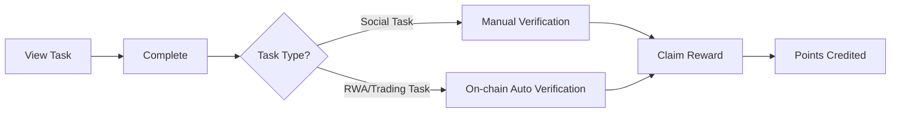

# Paimon DEX User Guide

**Welcome to Paimon DEX!**

This guide will help you quickly get started with Paimon DEX platform, from wallet connection to task completion and points redemption.

**Version**: 1.0
**Last Updated**: 2025-11-15
**Platform**: https://app.paimon.dex

---

## Table of Contents

1. [Quick Start](#quick-start)
2. [Wallet Connection](#wallet-connection)
3. [KYC Verification](#kyc-verification)
4. [Task System](#task-system)
5. [Points System](#points-system)
6. [Referral Program](#referral-program)
7. [Portfolio Management](#portfolio-management)
8. [FAQ](#faq)
9. [Troubleshooting](#troubleshooting)
10. [Support](#support)

---

## Quick Start

### 5-Minute Quick Start

1. **Connect Wallet** → Use MetaMask or WalletConnect
2. **Complete KYC** → Submit identity verification documents (optional but recommended)
3. **Complete Tasks** → Follow social media, trade, provide liquidity to earn points
4. **Earn Points** → Automatically receive point rewards upon task completion
5. **Redeem Rewards** → Use points to redeem fee discounts, NFTs, and more

### Recommended Path

**New Users (Day 1)**:
- Connect wallet
- Complete simple social tasks (Follow Twitter, Join Discord)
- Earn first 200 points

**Intermediate Users (Days 2-7)**:
- Complete KYC verification (earn 1000 points)
- Make first trade or provide liquidity
- Invite friends (500 points per friend)

**Advanced Users (Day 8+)**:
- Participate in RWA collateral mining
- Actively trade to earn volume rewards
- Use points to redeem premium benefits

---

## Wallet Connection

### Supported Wallets

Paimon DEX supports the following wallets:

| Wallet | Desktop | Mobile | Recommended |
|--------|---------|--------|-------------|
| **MetaMask** | ✅ | ✅ | ⭐⭐⭐⭐⭐ |
| **WalletConnect** | ✅ | ✅ | ⭐⭐⭐⭐⭐ |
| **Coinbase Wallet** | ✅ | ✅ | ⭐⭐⭐⭐ |
| **Trust Wallet** | ❌ | ✅ | ⭐⭐⭐ |
| **Binance Chain Wallet** | ✅ | ❌ | ⭐⭐⭐⭐ |

### MetaMask Connection Tutorial (Recommended)

#### Step 1: Install MetaMask

1. Visit [MetaMask Official Website](https://metamask.io/)
2. Click **Download** to download browser extension
3. Follow prompts to create wallet or import existing wallet
4. **Backup your seed phrase** (12 words) in a secure location

#### Step 2: Add BSC Network

MetaMask connects to Ethereum mainnet by default, manually add BSC network:

1. Open MetaMask
2. Click network dropdown at top
3. Click **Add Network** → **Add a network manually**
4. Fill in the following information:

```
Network Name: BSC Mainnet
RPC URL: https://bsc-dataseed.binance.org/
Chain ID: 56
Currency Symbol: BNB
Block Explorer: https://bscscan.com
```

5. Click **Save**

#### Step 3: Connect to Paimon DEX

1. Visit https://app.paimon.dex
2. Click **Connect Wallet** button in top right
3. Select **MetaMask**
4. Click **Next** → **Connect** in MetaMask popup
5. Sign verification message (no gas fee)
6. Connected! Your address shows in top right

### WalletConnect Connection Tutorial (Recommended for Mobile)

#### Step 1: Prepare Mobile Wallet

Ensure you have installed a WalletConnect-supported wallet app:
- MetaMask Mobile
- Trust Wallet
- Rainbow Wallet
- imToken

#### Step 2: Scan QR Code to Connect

1. Visit https://app.paimon.dex
2. Click **Connect Wallet**
3. Select **WalletConnect**
4. Scan QR code with wallet app
5. Confirm connection in wallet app
6. Sign verification message

### Security Tips ⚠️

- ✅ **Backup your seed phrase**, never share with anyone
- ✅ Only connect wallet on official website https://app.paimon.dex
- ✅ Check for 🔒 lock icon in browser address bar (HTTPS)
- ❌ Don't click suspicious links in social media/emails
- ❌ Paimon team will never ask for your seed phrase or private key
- ❌ Don't perform large transactions on public WiFi

---

## KYC Verification

### Why KYC?

**Benefits of KYC Verification**:
- ✅ **High Rewards**: Complete KYC to earn **1000 points**
- ✅ **Higher Permissions**: Unlock advanced features (large withdrawals, RWA collateral)
- ✅ **Security**: Prevent account theft
- ✅ **Compliance**: Meet regulatory requirements, protect platform and users

### KYC Process

#### Step 1: Prepare Documents

You need to prepare the following documents:

| Document Type | Requirements | Notes |
|--------------|--------------|-------|
| **ID Document** | Passport / Driver's License / National ID | Valid, clear information |
| **Front Photo** | JPG/PNG, < 5MB | Entire document in frame |
| **Back Photo** | JPG/PNG, < 5MB | Required for double-sided documents |
| **Selfie** | JPG/PNG, < 5MB | Hold document + paper with "Paimon KYC + Date" |

**Photo Requirements**:
- Good lighting, no glare
- Text clearly visible
- All four corners of document in frame
- Photos not edited or modified

#### Step 2: Submit KYC

1. Login to Paimon DEX
2. Click avatar in top right → **User Center**
3. Select **KYC Verification** in left menu
4. Click **Start Verification**
5. Fill in personal information:
   - Full name (matching document)
   - Date of birth
   - Nationality
   - Document type
6. Upload files:
   - Document front photo
   - Document back photo (if required)
   - Selfie photo
7. Check **I have read and agree to Privacy Policy**
8. Click **Submit for Review**

#### Step 3: Wait for Review

- **Review Time**: Usually 2-5 business days
- **Status Check**: User Center → KYC Verification → View Status
- **Email Notification**: Review result will be sent to your registered email

**Status Descriptions**:
- 🟡 **Pending**: Documents submitted, awaiting review
- 🟢 **Approved**: KYC verification successful, points issued
- 🔴 **Rejected**: Documents don't meet requirements, please resubmit

#### Step 4: What if Rejected?

Common rejection reasons:
1. Photo blurry or glare
2. Document expired
3. Selfie doesn't meet requirements
4. Name doesn't match document

**Solution**:
- Check rejection reason (email notification)
- Prepare new photos meeting requirements
- Resubmit (unlimited attempts)

### KYC Levels

| Level | Requirements | Permissions | Daily Withdrawal Limit |
|-------|-------------|-------------|------------------------|
| **L0** | Not verified | Basic trading | $1,000 |
| **L1** | Basic KYC | Standard permissions | $10,000 |
| **L2** | Advanced KYC + Address Proof | VIP permissions | $100,000 |

### Privacy Protection

Paimon DEX strictly protects your personal information:
- 🔒 All files encrypted storage
- 🔒 Only authorized personnel can access
- 🔒 Complies with GDPR/CCPA privacy regulations
- 🔒 Will not sell your information to third parties

**Third-party KYC Provider**: Blockpass (leading Web3 KYC provider)

---

## Task System

### Task Types

Paimon DEX offers multiple task types, complete tasks to earn points:

#### 1. Social Tasks

**Easiest, suitable for beginners!**

| Task | Point Reward | Completion Time |
|------|-------------|-----------------|
| Follow Twitter | 50 | 1 minute |
| Retweet | 30 | 1 minute |
| Join Discord | 50 | 2 minutes |
| Join Telegram | 50 | 2 minutes |
| Subscribe YouTube | 40 | 1 minute |

**How to Complete**:
1. User Center → Task Center → Social Tasks
2. Click **Connect Social Account**
3. Authorize Paimon DEX to access your social media
4. Complete required action (follow/join)
5. Click **Verify Completion** → System auto-verifies
6. Points automatically issued upon verification

⚠️ **Important Notes**:
- First-time authorization required for social accounts (one-time only)
- Wait 1-2 minutes after completing action before verifying
- Each social account can only be linked to one wallet address

### Social Account Authorization Flow

#### 1. Twitter Authorization
1. Click **Connect Twitter**
2. Redirected to Twitter authorization page
3. Click **Authorize App**
4. Automatically return to Paimon DEX, binding complete

#### 2. Discord Authorization
1. Click **Connect Discord**
2. Login to Discord account
3. Allow permissions (view server membership)
4. Binding complete

#### 3. Telegram Authorization
1. Click **Connect Telegram**
2. Login with Telegram
3. Allow access to basic information
4. Binding complete

#### 2. RWA Tasks

**Requires on-chain operations, generous rewards!**

| Task | Point Reward | Completion Criteria |
|------|-------------|---------------------|
| First RWA Deposit | 200 | Deposit any amount of RWA collateral |
| Deposit $1,000 RWA | 500 | Cumulative deposit ≥ $1,000 |
| Deposit $10,000 RWA | 2000 | Cumulative deposit ≥ $10,000 |
| Mint $500 USDP | 300 | Use RWA to mint ≥ $500 USDP |
| Mint $5,000 USDP | 1500 | Cumulative mint ≥ $5,000 USDP |

**How to Complete**:
1. Go to **Treasury** page
2. Click **Deposit RWA**
3. Select RWA asset type (T1/T2/T3)
4. Enter amount and confirm transaction
5. After on-chain confirmation, task automatically marked complete
6. Go to Task Center and click **Claim Reward**

#### 3. Trading Tasks

| Task | Point Reward | Completion Criteria |
|------|-------------|---------------------|
| First Swap | 100 | Any amount token swap |
| $1,000 Trading Volume | 300 | Cumulative volume ≥ $1,000 |
| $10,000 Trading Volume | 1500 | Cumulative volume ≥ $10,000 |
| Add Liquidity | 200 | Add liquidity to any pair |
| Stake LP | 150 | Stake LP tokens for mining |

#### 4. Recurring Tasks (Daily/Weekly)

| Task | Point Reward | Frequency |
|------|-------------|-----------|
| Daily Login | 10 | Every day |
| Daily Trade | 20 | At least 1 trade per day |
| Weekly Active | 100 | Login 5+ days per week |

### Task Completion Flow



### View Task Progress

1. Login to Paimon DEX
2. Click avatar in top right → **User Center**
3. Select **Task Center** in left menu
4. View task list:
   - ✅ **Completed**: Green checkmark, can claim reward
   - ⏳ **In Progress**: Shows progress bar (e.g., 75%)
   - 🔒 **Not Started**: Gray status

---

## Points System

### How to Earn Points

| Method | Points | Description |
|--------|--------|-------------|
| **Task Completion** | 50-2000 | Complete social/RWA/trading tasks |
| **KYC Verification** | 1000 | First-time KYC completion |
| **Daily Login** | 10 | Login to app daily |
| **Refer Friends** | 500 | Each friend who completes KYC |
| **Trading Volume** | 1 point/$1 | 1 point per $1 trading volume |
| **LP Staking** | 2 points/$1/day | 2 points per $1 TVL per day |

### Point Tiers

| Tier | Required Points | Badge | Exclusive Benefits |
|------|----------------|-------|-------------------|
| **Bronze** | 0-1,000 | 🥉 | None |
| **Silver** | 1,000-5,000 | 🥈 | 5% fee discount |
| **Gold** | 5,000-20,000 | 🥇 | 10% fee discount |
| **Platinum** | 20,000-100,000 | 💎 | 15% fee discount + priority support |
| **Diamond** | 100,000+ | 👑 | 20% fee discount + VIP access |

### View Points Balance

1. Login to Paimon DEX
2. Current points balance shown in top right
3. Click points number → View details:
   - Total earned
   - Total spent
   - Available
   - Pending
   - Current rank

### Points Leaderboard

**View**: Homepage → Leaderboard

- **Top 10**: Special badges + monthly rewards
- **Top 100**: Weekly public listing
- **Real-time Update**: Refreshes every hour

**Monthly Rewards**:
- 🥇 1st Place: 10,000 points + Limited NFT
- 🥈 2nd Place: 5,000 points
- 🥉 3rd Place: 3,000 points
- Top 10: 1,000 points each

---

## Points Redemption

### Redemption Shop

**View**: User Center → Points Redemption

#### Fee Discounts

| Item | Required Points | Validity | Description |
|------|----------------|----------|-------------|
| **5% Discount** | 5,000 | 30 days | All trading fees 95% off |
| **10% Discount** | 15,000 | 30 days | All trading fees 90% off |
| **20% Discount** | 40,000 | 30 days | All trading fees 80% off (VIP) |

#### Exclusive NFTs

| Item | Required Points | Quantity | Description |
|------|----------------|----------|-------------|
| **Bronze Badge NFT** | 10,000 | Unlimited | Community member proof |
| **Silver Badge NFT** | 30,000 | Limited 1,000 | Loyal user proof |
| **Gold Badge NFT** | 50,000 | Limited 500 | Premium user proof + governance rights |
| **Legendary NFT** | 100,000 | Limited 100 | Genesis user exclusive + premium benefits |

#### Other Rewards

| Item | Required Points | Description |
|------|----------------|-------------|
| **Priority Support** | 10,000 | 90-day VIP support access |
| **Whitelist Eligibility** | 20,000 | New project whitelist IDO access |
| **Physical Merch** | 8,000 | T-shirt/Stickers/Memorabilia |

### Redemption Process

1. User Center → Points Redemption
2. Browse product catalog
3. Select product → Click **Redeem Now**
4. Confirm points spending
5. Click **Confirm Redemption**
6. Redemption successful!

**Fee Discount**: Auto-activated, effective next trade
**NFT**: Sent to your wallet address (~1-5 minutes)
**Physical Merch**: Fill in shipping address, ships within 15 business days

---

## Referral Program

### Referral Rewards

Invite friends to use Paimon DEX, both parties earn rewards!

| Friend Action | Your Reward | Friend Reward |
|--------------|-------------|---------------|
| Register Account | 50 points | 50 points |
| Complete KYC | **500 points** | 100 points |
| First Trade | 100 points | 50 points |
| First LP Stake | 200 points | 100 points |

**Lifetime Commission**: **10%** of friend's trading fees as your referral commission (in PAIMON tokens)

### Referral Process

#### Step 1: Get Referral Link

1. Login to Paimon DEX
2. User Center → Referral Program
3. Find your exclusive referral code (e.g., `ABC123`)
4. Copy referral link: `https://app.paimon.dex?ref=ABC123`

#### Step 2: Share with Friends

**Referral Methods**:
- 💬 Send referral link directly
- 📱 Share to social media (one-click share button)
- 📧 Email invitation
- 📄 QR code poster (download and print)

#### Step 3: View Referral Earnings

**View**: User Center → Referral Program → My Referrals

| Friend Address | Registration Date | KYC Status | Trading Volume | Total Rewards |
|---------------|------------------|------------|----------------|---------------|
| 0x123... | 2025-11-10 | ✅ Verified | $5,000 | 650 points |
| 0x456... | 2025-11-12 | ⏳ Pending | $200 | 150 points |

**Total Earnings**: Number of referrals, total point rewards, total commission income

---

## Portfolio Management

### View Your Assets

**View**: User Center → Portfolio

#### Overview

| Asset Type | Quantity | Value (USD) | Allocation |
|-----------|----------|-------------|------------|
| **PAIMON** | 10,000 | $5,000 | 25% |
| **USDP** | 8,000 | $8,000 | 40% |
| **LP Tokens** | 5 pools | $6,000 | 30% |
| **RWA Collateral** | T1 + T2 | $10,000 | - |
| **Pending Rewards** | - | $500 | - |

**Total Assets**: $29,500

#### Detailed Holdings

**PAIMON Holdings**:
- Wallet Balance: 5,000 PAIMON
- Staking: 3,000 PAIMON (locked until 2026-01-15)
- Boost Staking: 2,000 PAIMON (1.35x multiplier)

**LP Holdings**:

| Pair | LP Tokens | Pool Assets | APR | Daily Earnings |
|------|----------|------------|-----|----------------|
| PAIMON/USDP | 100 | 1,000 PAIMON + 500 USDP | 28.5% | $4.32 |
| PAIMON/BNB | 50 | 500 PAIMON + 0.5 BNB | 35.2% | $3.21 |

**RWA Collateral**:

| Asset Type | Amount | LTV | Minted USDP | Health Factor |
|-----------|--------|-----|-------------|---------------|
| T1 (US Treasury) | $5,000 | 80% | 3,000 | 1.67 |
| T2 (AAA Bond) | $5,000 | 65% | 2,500 | 1.45 |

**Health Factor Guide**:
- 🟢 > 1.5: Safe
- 🟡 1.3-1.5: Normal
- 🟠 1.15-1.3: Warning (suggest adding collateral)
- 🔴 < 1.15: Danger (liquidation imminent)

---

## FAQ

### 1. Account Related

**Q1: Forgot password?**

A: Paimon DEX uses wallet signature authentication, no password required. As long as your wallet seed phrase is secure, you can login anytime.

**Q2: How to change linked wallet?**

A: Changing wallet address is not currently supported. Each wallet address corresponds to a unique account. To change, register with new wallet.

**Q3: Can one person register multiple accounts?**

A: Yes, but each wallet address can only register one account. KYC verification same identity can only verify once.

---

### 2. Trading Related

**Q4: Why did my transaction fail?**

A: Common reasons:
- Insufficient gas fee (need BNB to pay gas)
- Slippage set too low (recommend 0.5%-1%)
- Insufficient liquidity (choose higher liquidity pool)
- Network congestion (wait and retry)

**Q5: How long does transaction confirmation take?**

A: BSC network averages 3-5 seconds confirmation. If no confirmation after 1 minute, check transaction status on block explorer.

**Q6: How to reduce slippage?**

A:
1. Choose high-liquidity trading pairs
2. Split large transactions into smaller ones
3. Avoid network peak hours

---

### 3. Points Related

**Q7: Do points expire?**

A: Points **never expire**, but redeemed items like discount coupons, NFTs may have validity periods.

**Q8: Can points be transferred?**

A: No. Points are account-bound and cannot be transferred or traded.

**Q9: Task completed but no points?**

A: Possible reasons:
- Social account not authorized (for social tasks)
- On-chain transaction not confirmed (wait 1-3 minutes)
- Haven't clicked "Claim Reward" button
- Task conditions not fully met (check detailed requirements)

**Solution**:
- For social tasks: First authorize your social account in User Center
- Refresh page, check task status
- If still unresolved, contact support with transaction hash

**Q10: How to unlink social accounts?**

A: For security reasons, once linked, social accounts cannot be unlinked directly. If you need to change accounts, please contact customer support with verification proof.

---

### 4. Security Related

**Q11: My wallet was stolen, what to do?**

A:
1. **Immediately transfer assets**: Move remaining assets to new wallet
2. **Revoke approvals**: Visit https://revoke.cash to revoke all DApp approvals
3. **Contact support**: Inform us of suspicious activity
4. **Report to police**: Recommend for large amounts

**Prevention**:
- Don't click suspicious links
- Don't share seed phrase/private key
- Use hardware wallet for large amounts
- Regularly check approval list

**Q12: How to prevent phishing websites?**

A:
- ✅ Bookmark official website https://app.paimon.dex
- ✅ Check for 🔒 lock icon in URL address bar
- ✅ Only get links from official channels (Twitter/Discord)
- ❌ Don't click search engine ad links
- ❌ Don't trust links in emails/SMS

---

## Troubleshooting

### Transaction Failures

| Error Message | Cause | Solution |
|--------------|-------|----------|
| `Insufficient funds` | Insufficient gas fee | Ensure wallet has enough BNB for gas |
| `Slippage tolerance exceeded` | Slippage too low | Increase slippage tolerance to 1%-2% |
| `Execution reverted` | Contract execution failed | Check transaction parameters, contact support |

### Wallet Connection Issues

| Issue | Solution |
|-------|----------|
| MetaMask won't connect | 1. Refresh page and retry<br>2. Restart MetaMask<br>3. Clear browser cache |
| WalletConnect scan fails | 1. Check network connection<br>2. Update wallet app to latest version<br>3. Switch to MetaMask |
| No response after signing | Wait 5-10 seconds, network delay may cause slow response |

---

## Support

### Get Help

| Channel | Response Time | Use Case |
|---------|--------------|----------|
| **Discord** | Real-time | Quick questions, community chat |
| **Telegram** | Real-time | Quick questions, announcements |
| **Email** | Within 24 hours | Complex issues, complaints |
| **Ticket System** | Within 12 hours | Technical issues, account problems |

### Contact

- 📧 **Email**: support@paimon.dex
- 💬 **Discord**: https://discord.gg/paimon
- 📱 **Telegram**: https://t.me/paimon_official
- 🐦 **Twitter**: https://twitter.com/paimon_dex
- 📖 **Docs**: https://docs.paimon.dex

### Business Hours

- **Support Online**: Monday-Friday 9:00-18:00 (UTC+8)
- **Emergency Support**: 7x24 hours (critical issues only)

---

**Thank you for using Paimon DEX!**

If you have any questions or suggestions, please feel free to contact us. We are committed to providing you with the best DeFi experience!

**Paimon DEX Team**
📧 support@paimon.dex
🌐 https://paimon.dex
