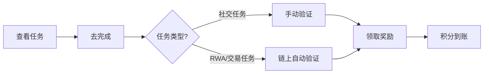

# Paimon DEX 用户指南

**欢迎使用 Paimon DEX！**

本指南将帮助您快速上手 Paimon DEX 平台，从钱包连接到任务完成、积分兑换等所有功能。

**版本**: 1.0
**最后更新**: 2025-11-15
**平台**: https://app.paimon.dex

---

## 目录

1. [快速开始](#快速开始)
2. [钱包连接](#钱包连接)
3. [KYC 认证](#kyc-认证)
4. [TaskOn 任务系统](#taskon-任务系统)
5. [积分系统](#积分系统)
6. [推荐计划](#推荐计划)
7. [投资组合管理](#投资组合管理)
8. [常见问题 (FAQ)](#常见问题-faq)
9. [故障排除](#故障排除)
10. [联系支持](#联系支持)

---

## 快速开始

### 5 分钟快速入门

1. **连接钱包** → 使用 MetaMask 或 WalletConnect 连接钱包
2. **完成 KYC** → 提交身份验证文档（可选，但推荐）
3. **完成任务** → 关注社交媒体、交易、提供流动性赚取积分
4. **赚取积分** → 完成任务自动获得积分奖励
5. **兑换奖励** → 使用积分兑换手续费折扣、NFT 等奖励

### 推荐路径

**新手用户（第 1 天）**:
- 连接钱包
- 完成简单社交任务（关注 Twitter、加入 Discord）
- 赚取首批 200 积分

**进阶用户（第 2-7 天）**:
- 完成 KYC 认证（获得 1000 积分）
- 进行首笔交易或提供流动性
- 邀请好友（每位好友 500 积分）

**高级用户（第 8+ 天）**:
- 参与 RWA 抵押挖矿
- 积极交易赚取交易量奖励
- 使用积分兑换高级权益

---

## 钱包连接

### 支持的钱包

Paimon DEX 支持以下钱包：

| 钱包 | 桌面端 | 移动端 | 推荐指数 |
|------|--------|--------|----------|
| **MetaMask** | ✅ | ✅ | ⭐⭐⭐⭐⭐ |
| **WalletConnect** | ✅ | ✅ | ⭐⭐⭐⭐⭐ |
| **Coinbase Wallet** | ✅ | ✅ | ⭐⭐⭐⭐ |
| **Trust Wallet** | ❌ | ✅ | ⭐⭐⭐ |
| **Binance Chain Wallet** | ✅ | ❌ | ⭐⭐⭐⭐ |

### MetaMask 连接教程（推荐）

#### 步骤 1：安装 MetaMask

1. 访问 [MetaMask 官网](https://metamask.io/)
2. 点击 **Download** 下载浏览器扩展
3. 按提示创建钱包或导入现有钱包
4. **务必备份助记词**（12 个单词）到安全的地方

#### 步骤 2：添加 BSC 网络

MetaMask 默认连接以太坊主网，需手动添加 BSC 网络：

1. 打开 MetaMask
2. 点击顶部网络下拉菜单
3. 点击 **Add Network** → **Add a network manually**
4. 填写以下信息：

```
网络名称：BSC Mainnet
RPC URL：https://bsc-dataseed.binance.org/
链 ID：56
货币符号：BNB
区块浏览器：https://bscscan.com
```

5. 点击 **Save**

#### 步骤 3：连接到 Paimon DEX

1. 访问 https://app.paimon.dex
2. 点击右上角 **Connect Wallet** 按钮
3. 选择 **MetaMask**
4. MetaMask 弹窗中点击 **Next** → **Connect**
5. 签名验证消息（无 Gas 费用）
6. 连接成功！您的地址显示在右上角


### WalletConnect 连接教程（移动端推荐）

#### 步骤 1：准备移动钱包

确保您已安装支持 WalletConnect 的钱包 App：
- MetaMask Mobile
- Trust Wallet
- Rainbow Wallet
- imToken

#### 步骤 2：扫码连接

1. 访问 https://app.paimon.dex
2. 点击 **Connect Wallet**
3. 选择 **WalletConnect**
4. 使用钱包 App 扫描二维码
5. 在钱包 App 中确认连接
6. 签名验证消息

### 安全提示 ⚠️

- ✅ **务必备份助记词**，不要分享给任何人
- ✅ 只在官方网站 https://app.paimon.dex 连接钱包
- ✅ 检查浏览器地址栏的 🔒 锁图标（HTTPS）
- ❌ 不要点击社交媒体/邮件中的可疑链接
- ❌ Paimon 团队永远不会要求您的助记词或私钥
- ❌ 不要在公共 WiFi 下进行大额操作

---

## KYC 认证

### 为什么需要 KYC？

**KYC（Know Your Customer）认证的好处**:
- ✅ **高额奖励**: 完成 KYC 获得 **1000 积分**
- ✅ **更高权限**: 解锁高级功能（大额提款、RWA 抵押）
- ✅ **安全保障**: 防止账户被盗用
- ✅ **合规要求**: 满足监管要求，保护平台和用户

### KYC 流程

#### 步骤 1：准备文件

您需要准备以下文件：

| 文件类型 | 要求 | 说明 |
|---------|------|------|
| **身份证件** | 护照 / 驾照 / 身份证 | 有效期内，信息清晰 |
| **正面照片** | JPG/PNG，< 5MB | 整个证件在画面内 |
| **背面照片** | JPG/PNG，< 5MB | 双面证件需提供 |
| **自拍照** | JPG/PNG，< 5MB | 手持证件 + 纸条写"Paimon KYC + 日期" |

**示例照片要求**:
- 光线充足，无反光
- 文字清晰可见
- 证件四角完整在画面内
- 照片未经 PS 或修改

#### 步骤 2：提交 KYC

1. 登录 Paimon DEX
2. 点击右上角头像 → **用户中心**
3. 左侧菜单选择 **KYC 认证**
4. 点击 **开始认证**
5. 填写个人信息：
   - 姓名（与证件一致）
   - 出生日期
   - 国籍
   - 证件类型
6. 上传文件：
   - 证件正面照
   - 证件背面照（如需要）
   - 手持自拍照
7. 勾选 **我已阅读并同意隐私政策**
8. 点击 **提交审核**


#### 步骤 3：等待审核

- **审核时间**: 通常 2-5 个工作日
- **状态查询**: 用户中心 → KYC 认证 → 查看状态
- **邮件通知**: 审核结果将发送到您的注册邮箱

**审核状态说明**:
- 🟡 **待审核**: 文件已提交，等待人工审核
- 🟢 **已通过**: KYC 认证成功，积分已发放
- 🔴 **已拒绝**: 文件不符合要求，请重新提交

#### 步骤 4：审核被拒绝怎么办？

如果 KYC 被拒绝，常见原因包括：
1. 照片模糊或反光
2. 证件已过期
3. 自拍照不符合要求
4. 姓名与证件不匹配

**解决方法**:
- 查看拒绝原因（邮件通知）
- 准备符合要求的新照片
- 重新提交（无次数限制）

### KYC 等级

| 等级 | 认证要求 | 权限 | 单日提款限额 |
|------|---------|------|-------------|
| **L0** | 未认证 | 基础交易 | $1,000 |
| **L1** | 基础 KYC | 标准权限 | $10,000 |
| **L2** | 高级 KYC + 地址证明 | VIP 权限 | $100,000 |

### 隐私保护

Paimon DEX 严格保护您的个人信息：
- 🔒 所有文件加密存储
- 🔒 仅授权人员可访问
- 🔒 符合 GDPR/CCPA 隐私法规
- 🔒 不会向第三方出售您的信息

**第三方 KYC 服务商**: Blockpass（行业领先的 Web3 KYC 提供商）

---

## 任务系统

### 任务类型

Paimon DEX 提供多种任务类型，完成任务即可赚取积分：

#### 1. 社交任务

**最简单，适合新手！**

| 任务 | 积分奖励 | 完成时间 |
|------|---------|----------|
| 关注 Twitter | 50 | 1 分钟 |
| 转发指定推文 | 30 | 1 分钟 |
| 加入 Discord | 50 | 2 分钟 |
| 加入 Telegram | 50 | 2 分钟 |

**完成方法**:
1. 用户中心 → 任务中心 → 社交任务
2. 点击 **连接社交账号**
3. 授权 Paimon DEX 访问您的社交媒体
4. 完成指定操作（关注/加入）
5. 点击 **验证完成** → 系统自动检测
6. 验证通过后积分自动发放

**⚠️ 注意事项**:
- 首次需授权社交账号（仅一次）
- 完成操作后请等待 1-2 分钟再验证
- 同一社交账号只能绑定一个钱包地址

#### 2. RWA 任务

**需要链上操作，奖励丰厚！**

| 任务 | 积分奖励 | 完成条件 |
|------|---------|----------|
| 首次存入 RWA | 200 | 存入任意金额 RWA 抵押品 |
| 存入 $1,000 RWA | 500 | 累计存入 ≥ $1,000 |
| 存入 $10,000 RWA | 2000 | 累计存入 ≥ $10,000 |
| 铸造 $500 USDP | 300 | 使用 RWA 铸造 ≥ $500 USDP |
| 铸造 $5,000 USDP | 1500 | 累计铸造 ≥ $5,000 USDP |

**完成方法**:
1. 前往 **Treasury** 页面
2. 点击 **Deposit RWA**
3. 选择 RWA 资产类型（T1/T2/T3）
4. 输入金额并确认交易
5. 链上交易确认后，任务自动标记为完成
6. 前往任务中心点击 **领取奖励**

#### 3. 交易任务

| 任务 | 积分奖励 | 完成条件 |
|------|---------|----------|
| 首次 Swap | 100 | 进行任意金额代币兑换 |
| 累计交易 $1,000 | 300 | 累计交易量 ≥ $1,000 |
| 累计交易 $10,000 | 1500 | 累计交易量 ≥ $10,000 |
| 添加流动性 | 200 | 为任意交易对添加流动性 |
| LP 质押 | 150 | 质押 LP Token 参与挖矿 |

#### 4. 持续任务（每日/每周）

| 任务 | 积分奖励 | 频率 |
|------|---------|------|
| 每日登录 | 10 | 每天 |
| 每日交易 | 20 | 每天至少 1 笔 |
| 每周活跃 | 100 | 每周登录 5 天+ |

### 任务完成流程



### 查看任务进度

1. 登录 Paimon DEX
2. 点击右上角头像 → **用户中心**
3. 左侧菜单选择 **任务中心**
4. 查看任务列表：
   - ✅ **已完成**: 绿色勾选，可领取奖励
   - ⏳ **进行中**: 显示进度条（如 75%）
   - 🔒 **未开始**: 灰色状态


### 社交账号授权流程

**首次使用社交任务前，需要授权：**

1. **Twitter 授权**:
   - 点击 **连接 Twitter**
   - 跳转到 Twitter 授权页面
   - 点击 **授权应用**
   - 自动返回 Paimon DEX，绑定完成

2. **Discord 授权**:
   - 点击 **连接 Discord**
   - 登录 Discord 账号
   - 选择允许权限（查看服务器成员身份）
   - 绑定完成

3. **Telegram 授权**:
   - 点击 **连接 Telegram**
   - 使用 Telegram 登录
   - 允许访问基本信息
   - 绑定完成

### 任务常见问题

**Q: 为什么社交任务显示"验证失败"？**

A: 常见原因：
- 未授权社交账号
- 未在 Twitter/Discord/Telegram 完成操作
- 操作后立即验证（建议等待 1-2 分钟）
- 网络延迟导致验证超时

**解决方法**:
1. 确保已授权社交账号
2. 确认已完成指定操作
3. 等待 1-2 分钟后重新验证
4. 刷新页面重试

**Q: RWA 任务显示进度不更新？**

A: 链上数据同步需要时间（约 1-3 分钟）。请等待片刻后刷新页面。

**Q: 能否重复完成同一任务？**

A: 大部分任务仅可完成一次。少数任务（如每日登录）可重复完成。

---

## 积分系统

### 积分获取方式

| 获取方式 | 积分数量 | 说明 |
|---------|---------|------|
| **任务完成** | 50-2000 | 完成社交/RWA/交易任务 |
| **KYC 认证** | 1000 | 首次完成 KYC |
| **每日登录** | 10 | 每天登录 App |
| **推荐好友** | 500 | 每邀请 1 位好友完成 KYC |
| **交易量** | 1 点/$1 | 每 $1 交易量获得 1 积分 |
| **LP 质押** | 2 点/$1/天 | 每 $1 TVL 每天获得 2 积分 |

### 积分等级

| 等级 | 所需积分 | 徽章 | 专属权益 |
|------|---------|------|---------|
| **青铜** | 0-1,000 | 🥉 | 无 |
| **白银** | 1,000-5,000 | 🥈 | 5% 手续费折扣 |
| **黄金** | 5,000-20,000 | 🥇 | 10% 手续费折扣 |
| **铂金** | 20,000-100,000 | 💎 | 15% 手续费折扣 + 优先客服 |
| **钻石** | 100,000+ | 👑 | 20% 手续费折扣 + VIP 通道 |

### 查看积分余额

1. 登录 Paimon DEX
2. 右上角显示当前积分余额
3. 点击积分数字 → 查看详细信息：
   - 总获得积分
   - 已消耗积分
   - 可用积分
   - 待领取积分
   - 当前排名


### 积分历史记录

**查看路径**: 用户中心 → 积分 → 历史记录

| 时间 | 类型 | 原因 | 积分变化 | 余额 |
|------|------|------|---------|------|
| 2025-11-15 10:30 | 获得 | 任务完成: 关注 Twitter | +50 | 1,550 |
| 2025-11-14 15:20 | 消耗 | 兑换: 5% 手续费折扣 | -5,000 | 1,500 |
| 2025-11-13 12:00 | 获得 | KYC 认证通过 | +1,000 | 6,500 |

### 积分排行榜

**查看路径**: 首页 → 排行榜

- **Top 10**: 特殊徽章 + 月度奖励
- **Top 100**: 每周公示
- **实时更新**: 每小时刷新一次

**月度奖励**:
- 🥇 第 1 名: 10,000 积分 + 限量 NFT
- 🥈 第 2 名: 5,000 积分
- 🥉 第 3 名: 3,000 积分
- Top 10: 各 1,000 积分

---

## 积分兑换

### 兑换商城

**查看路径**: 用户中心 → 积分兑换

#### 手续费折扣

| 商品 | 所需积分 | 有效期 | 说明 |
|------|---------|--------|------|
| **5% 折扣券** | 5,000 | 30 天 | 所有交易手续费 95 折 |
| **10% 折扣券** | 15,000 | 30 天 | 所有交易手续费 9 折 |
| **20% 折扣券** | 40,000 | 30 天 | 所有交易手续费 8 折（VIP） |

#### 专属 NFT

| 商品 | 所需积分 | 数量 | 说明 |
|------|---------|------|------|
| **青铜徽章 NFT** | 10,000 | 无限 | 社区成员证明 |
| **白银徽章 NFT** | 30,000 | 限 1,000 | 忠实用户证明 |
| **黄金徽章 NFT** | 50,000 | 限 500 | 高级用户证明 + 治理权 |
| **传奇限量 NFT** | 100,000 | 限 100 | 创世用户专属 + 高级权益 |

#### 其他奖励

| 商品 | 所需积分 | 说明 |
|------|---------|------|
| **优先客服** | 10,000 | 90 天 VIP 客服通道 |
| **白名单资格** | 20,000 | 新项目白名单 IDO 资格 |
| **实物周边** | 8,000 | T-shirt/贴纸/纪念品 |

### 兑换流程

1. 用户中心 → 积分兑换
2. 浏览商品目录
3. 选择商品 → 点击 **立即兑换**
4. 确认积分消耗
5. 点击 **确认兑换**
6. 兑换成功！

**手续费折扣**: 自动激活，下次交易生效
**NFT**: 发送到您的钱包地址（约 1-5 分钟）
**实物周边**: 填写收货地址，15 个工作日内发货


---

## 推荐计划

### 推荐奖励

邀请好友使用 Paimon DEX，双方都能获得奖励！

| 好友行为 | 您的奖励 | 好友奖励 |
|---------|---------|---------|
| 注册账号 | 50 积分 | 50 积分 |
| 完成 KYC | **500 积分** | 100 积分 |
| 首次交易 | 100 积分 | 50 积分 |
| 首次 LP 质押 | 200 积分 | 100 积分 |

**终身分成**: 好友交易手续费的 **10%** 作为您的推荐佣金（PAIMON 代币）

### 推荐流程

#### 步骤 1：获取推荐链接

1. 登录 Paimon DEX
2. 用户中心 → 推荐计划
3. 找到您的专属推荐码（如 `ABC123`）
4. 复制推荐链接: `https://app.paimon.dex?ref=ABC123`


#### 步骤 2：分享给好友

**推荐方式**:
- 💬 直接发送推荐链接
- 📱 分享到社交媒体（一键分享按钮）
- 📧 邮件邀请
- 📄 二维码海报（下载并打印）

#### 步骤 3：查看推荐收益

**查看路径**: 用户中心 → 推荐计划 → 我的推荐

| 好友地址 | 注册时间 | KYC 状态 | 交易量 | 累计奖励 |
|---------|---------|---------|-------|---------|
| 0x123... | 2025-11-10 | ✅ 已认证 | $5,000 | 650 积分 |
| 0x456... | 2025-11-12 | ⏳ 待认证 | $200 | 150 积分 |

**总收益**: 推荐人数、总积分奖励、总佣金收入

### 推荐等级

| 等级 | 推荐人数 | 奖励加成 | 专属权益 |
|------|---------|---------|---------|
| **初级** | 1-10 人 | 10% 佣金 | 无 |
| **中级** | 11-50 人 | **15% 佣金** | 推荐专属徽章 |
| **高级** | 51-200 人 | **20% 佣金** | 月度额外奖金 |
| **大使** | 200+ 人 | **25% 佣金** | 品牌大使称号 + 独家福利 |

### 推荐规则

- ✅ 好友必须通过您的推荐链接注册
- ✅ 每位用户只能使用一个推荐码
- ✅ 推荐奖励实时发放（链上确认后）
- ❌ 禁止自我推荐（同一设备/IP）
- ❌ 禁止批量注册虚假账户

**违规处理**: 取消推荐资格，扣除不当奖励

---

## 投资组合管理

### 查看您的资产

**查看路径**: 用户中心 → 投资组合

#### 总览

| 资产类型 | 数量 | 价值（USD） | 占比 |
|---------|------|------------|------|
| **PAIMON** | 10,000 | $5,000 | 25% |
| **USDP** | 8,000 | $8,000 | 40% |
| **LP Tokens** | 5 个池子 | $6,000 | 30% |
| **RWA 抵押品** | T1 + T2 | $10,000 | - |
| **待领取奖励** | - | $500 | - |

**总资产**: $29,500

#### 详细持仓

**PAIMON 持仓**:
- 钱包余额: 5,000 PAIMON
- Staking 质押: 3,000 PAIMON（锁定至 2026-01-15）
- Boost Staking: 2,000 PAIMON（1.35x 倍数）

**LP 持仓**:

| 交易对 | LP Token | 池中资产 | APR | 每日收益 |
|-------|----------|---------|-----|---------|
| PAIMON/USDP | 100 | 1,000 PAIMON + 500 USDP | 28.5% | $4.32 |
| PAIMON/BNB | 50 | 500 PAIMON + 0.5 BNB | 35.2% | $3.21 |

**RWA 抵押**:

| 资产类型 | 数量 | LTV | 已铸 USDP | 健康系数 |
|---------|------|-----|----------|---------|
| T1 (US Treasury) | $5,000 | 80% | 3,000 | 1.67 |
| T2 (AAA Bond) | $5,000 | 65% | 2,500 | 1.45 |

**健康系数说明**:
- 🟢 > 1.5: 安全
- 🟡 1.3-1.5: 正常
- 🟠 1.15-1.3: 警告（建议补仓）
- 🔴 < 1.15: 危险（即将清算）

### 历史收益

**查看路径**: 用户中心 → 投资组合 → 历史收益

#### 收益图表

- 📊 **折线图**: 近 30 天总资产变化
- 📈 **柱状图**: 每日收益明细
- 📉 **饼图**: 收益来源分布（LP 挖矿、交易、RWA 利息）

#### 收益明细

| 日期 | 收益类型 | 数量 | 价值（USD） |
|------|---------|------|------------|
| 2025-11-15 | LP 挖矿 | 10 PAIMON | $5.00 |
| 2025-11-15 | 交易手续费分成 | 0.5 PAIMON | $0.25 |
| 2025-11-14 | RWA 利息 | 5 USDP | $5.00 |

**本月累计**: $350
**本年累计**: $2,100

---

## 常见问题 (FAQ)

### 1. 账户相关

**Q1: 忘记密码怎么办？**

A: Paimon DEX 使用钱包签名认证，无需密码。只要您的钱包助记词安全，即可随时登录。

**Q2: 如何更换绑定钱包？**

A: 目前不支持更换钱包地址。每个钱包地址对应唯一账户。如需更换，请使用新钱包重新注册。

**Q3: 一个人可以注册多个账号吗？**

A: 可以，但每个钱包地址只能注册一个账户。KYC 认证同一身份只能认证一次。

---

### 2. 交易相关

**Q4: 为什么交易失败？**

A: 常见原因：
- Gas 费不足（需要 BNB 支付 Gas）
- 滑点设置过低（建议 0.5%-1%）
- 流动性不足（选择流动性更高的池子）
- 网络拥堵（等待片刻后重试）

**Q5: 交易确认时间多久？**

A: BSC 网络平均 3-5 秒确认。如超过 1 分钟未确认，请检查区块浏览器交易状态。

**Q6: 如何降低滑点？**

A:
1. 选择流动性高的交易对
2. 拆分大额交易为多笔小额
3. 避开网络高峰期

---

### 3. 积分相关

**Q7: 积分会过期吗？**

A: 积分**永不过期**，但兑换的折扣券、NFT 等商品可能有有效期限制。

**Q8: 积分可以转让吗？**

A: 不可以。积分与账户绑定，不支持转让或交易。

**Q9: 为什么任务完成了但没有积分？**

A: 可能原因：
- 链上交易未确认（等待 1-3 分钟）
- 未点击"领取奖励"按钮
- 任务条件未完全满足（检查详细要求）

**解决方法**: 刷新页面，检查任务状态。如仍未解决，联系客服并提供交易哈希。

---

### 4. 安全相关

**Q10: 我的钱包被盗了怎么办？**

A:
1. **立即转移资产**: 将剩余资产转移到新钱包
2. **撤销授权**: 访问 https://revoke.cash 撤销所有 DApp 授权
3. **联系客服**: 告知我们可疑活动
4. **报警**: 涉及大额资金建议报警

**预防措施**:
- 不要点击可疑链接
- 不要分享助记词/私钥
- 使用硬件钱包存储大额资产
- 定期检查授权列表

**Q11: 如何防止钓鱼网站？**

A:
- ✅ 收藏官方网站 https://app.paimon.dex
- ✅ 检查 URL 地址栏的 🔒 锁图标
- ✅ 只从官方渠道（Twitter/Discord）获取链接
- ❌ 不要点击搜索引擎广告链接
- ❌ 不要信任邮件/短信中的链接

---

### 5. 技术相关

**Q12: 支持哪些浏览器？**

A: 推荐使用：
- 🌐 Chrome（推荐）
- 🦊 Firefox
- 🧭 Brave
- ⚠️ Safari（部分功能可能受限）

**Q13: 移动端如何使用？**

A:
1. 使用 MetaMask Mobile 内置浏览器
2. 或使用 Trust Wallet 内置浏览器
3. 访问 https://app.paimon.dex

**Q14: 遇到白屏/无法加载怎么办？**

A:
1. 清除浏览器缓存
2. 禁用广告拦截插件
3. 切换到 Chrome 浏览器
4. 检查网络连接

---

## 故障排除

### 交易失败

| 错误信息 | 原因 | 解决方法 |
|---------|------|---------|
| `Insufficient funds` | Gas 费不足 | 确保钱包有足够 BNB 支付 Gas |
| `Slippage tolerance exceeded` | 滑点过低 | 增加滑点容忍度至 1%-2% |
| `Execution reverted` | 合约执行失败 | 检查交易参数，联系客服 |

### 钱包连接问题

| 问题 | 解决方法 |
|------|---------|
| MetaMask 无法连接 | 1. 刷新页面重试<br>2. 重启 MetaMask<br>3. 清除浏览器缓存 |
| WalletConnect 扫码失败 | 1. 检查网络连接<br>2. 更新钱包 App 到最新版<br>3. 切换到 MetaMask |
| 签名后无反应 | 等待 5-10 秒，网络延迟可能导致响应慢 |

### KYC 审核问题

| 问题 | 解决方法 |
|------|---------|
| 照片上传失败 | 1. 检查文件大小 < 5MB<br>2. 格式为 JPG/PNG<br>3. 网络稳定性 |
| 审核被拒绝 | 查看拒绝原因，准备符合要求的新照片重新提交 |
| 审核超时 | 通常 5 个工作日内完成，如超过请联系客服 |

---

## 联系支持

### 获取帮助

| 渠道 | 响应时间 | 适用场景 |
|------|---------|---------|
| **Discord** | 实时 | 快速问题、社区交流 |
| **Telegram** | 实时 | 快速问题、公告通知 |
| **Email** | 24 小时内 | 复杂问题、投诉建议 |
| **工单系统** | 12 小时内 | 技术故障、账户问题 |

### 联系方式

- 📧 **Email**: support@paimon.dex
- 💬 **Discord**: https://discord.gg/paimon
- 📱 **Telegram**: https://t.me/paimon_official
- 🐦 **Twitter**: https://twitter.com/paimon_dex
- 📖 **文档**: https://docs.paimon.dex

### 工作时间

- **客服在线**: 周一至周五 9:00-18:00 (UTC+8)
- **紧急支持**: 7x24 小时（仅限严重故障）

### 提交工单

1. 访问 https://support.paimon.dex
2. 点击 **提交工单**
3. 选择问题类型
4. 详细描述问题（附上截图/交易哈希）
5. 提交后将收到工单编号

**工单处理时效**:
- 🔥 紧急: 2 小时内
- ⚡ 高优先级: 6 小时内
- 📋 普通: 24 小时内

---

## 附录

### 术语表

| 术语 | 说明 |
|------|------|
| **RWA** | Real World Assets，真实世界资产 |
| **LP** | Liquidity Provider，流动性提供者 |
| **TVL** | Total Value Locked，总锁仓价值 |
| **APR** | Annual Percentage Rate，年化收益率 |
| **LTV** | Loan-to-Value，抵押率 |
| **KYC** | Know Your Customer，身份认证 |
| **Gas** | 区块链交易手续费 |
| **Slippage** | 滑点，实际成交价与预期价的差异 |

### 快捷键

| 快捷键 | 功能 |
|--------|------|
| `Ctrl + K` | 快速搜索 |
| `Ctrl + W` | 连接/断开钱包 |
| `Ctrl + T` | 打开任务中心 |
| `Ctrl + P` | 打开积分兑换 |

### 版本历史

- **v1.0** (2025-11-15): 初版发布
  - 钱包连接指南
  - KYC 认证流程
  - TaskOn 任务系统
  - 积分兑换商城
  - 推荐计划
  - FAQ

---

**感谢使用 Paimon DEX！**

如有任何问题或建议，欢迎随时联系我们。我们致力于为您提供最佳的 DeFi 体验！

**Paimon DEX Team**
📧 support@paimon.dex
🌐 https://paimon.dex
