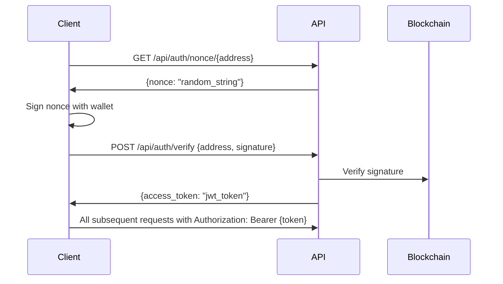

# Paimon Backend API Reference

**Base URL**: `http://localhost:8000` (Development)
**Production**: `https://api.paimon.dex`
**API Version**: v1.0
**Last Updated**: 2025-11-15

---

## Table of Contents

1. [Authentication](#authentication)
2. [Error Codes](#error-codes)
3. [Rate Limiting](#rate-limiting)
4. [Endpoints](#endpoints)
   - [Authentication](#authentication-endpoints)
   - [User Management](#user-management)
   - [KYC](#kyc-endpoints)
   - [Tasks](#tasks-endpoints)
   - [Points](#points-endpoints)
   - [Referrals](#referral-endpoints)
   - [Portfolio](#portfolio-endpoints)
   - [Leaderboard](#leaderboard-endpoints)
   - [Redemption](#redemption-endpoints)
   - [Analytics](#analytics-endpoints)
5. [WebSocket Events](#websocket-events)
6. [Postman Collection](#postman-collection)

---

## Authentication

Most endpoints require a valid JWT token obtained through the `/api/auth/nonce` → `/api/auth/verify` flow.

### Authentication Flow



### Example

```bash
# Step 1: Get nonce
curl -X GET "http://localhost:8000/api/auth/nonce/0x742d35Cc6634C0532925a3b844Bc9e7595f0bEb1"

# Response
{
  "nonce": "paimon_dex_signin_1234567890abcdef",
  "message": "Sign this message to authenticate with Paimon DEX:\n\nNonce: paimon_dex_signin_1234567890abcdef\nTimestamp: 2025-11-15T10:30:00Z"
}

# Step 2: Sign message with wallet (e.g., MetaMask)
# signature = wallet.signMessage(message)

# Step 3: Verify signature
curl -X POST "http://localhost:8000/api/auth/verify" \
  -H "Content-Type: application/json" \
  -d '{
    "wallet_address": "0x742d35Cc6634C0532925a3b844Bc9e7595f0bEb1",
    "signature": "0x..."
  }'

# Response
{
  "access_token": "eyJhbGciOiJIUzI1NiIsInR5cCI6IkpXVCJ9...",
  "token_type": "bearer",
  "expires_in": 86400
}
```

---

## Error Codes

All API errors follow this format:

```json
{
  "error": "Error Type",
  "detail": "Detailed error message",
  "status_code": 400
}
```

### Standard HTTP Status Codes

| Code | Type | Description | Example |
|------|------|-------------|---------|
| **200** | Success | Request succeeded | User data retrieved |
| **201** | Created | Resource created successfully | User registered |
| **400** | Bad Request | Invalid request parameters | Missing required field |
| **401** | Unauthorized | Authentication required or failed | Invalid JWT token |
| **403** | Forbidden | Insufficient permissions | Admin-only endpoint |
| **404** | Not Found | Resource not found | User does not exist |
| **422** | Unprocessable Entity | Validation error | Invalid Ethereum address format |
| **429** | Too Many Requests | Rate limit exceeded | Max 100 req/min |
| **500** | Internal Server Error | Server-side error | Database connection failed |
| **503** | Service Unavailable | Service temporarily down | Blockchain RPC unavailable |

### Custom Error Codes

| Code | Message | Description | Resolution |
|------|---------|-------------|------------|
| `INVALID_ADDRESS` | Invalid Ethereum address format | Address must be 42 chars, 0x-prefixed | Use valid Ethereum address |
| `NONCE_EXPIRED` | Nonce has expired | Nonce valid for 10 minutes only | Request new nonce |
| `SIGNATURE_INVALID` | Signature verification failed | Signature doesn't match address | Re-sign with correct wallet |
| `USER_NOT_FOUND` | User not found | No user with this address | Register first via /auth/verify |
| `KYC_PENDING` | KYC verification pending | KYC submitted but not approved yet | Wait for admin approval |
| `INSUFFICIENT_POINTS` | Insufficient points balance | Not enough points for redemption | Earn more points |
| `TASK_NOT_FOUND` | Task not found | Invalid task ID | Use valid task ID |
| `REWARD_ALREADY_CLAIMED` | Reward already claimed | Cannot claim twice | N/A |

---

## Rate Limiting

- **General endpoints**: 100 requests/minute per IP
- **Auth endpoints**: 20 requests/minute per IP
- **WebSocket connections**: 5 connections per user

**Headers**:
```
X-RateLimit-Limit: 100
X-RateLimit-Remaining: 95
X-RateLimit-Reset: 1700000000
```

**Rate Limit Exceeded Response** (429):
```json
{
  "error": "Rate limit exceeded",
  "detail": "Too many requests. Try again in 60 seconds.",
  "retry_after": 60
}
```

---

## Endpoints

### Authentication Endpoints

#### GET /api/auth/nonce/{address}

**Description**: Generate a nonce for wallet signature authentication.

**Parameters**:
- `address` (path, required): Ethereum wallet address

**Response** (200):
```json
{
  "nonce": "paimon_dex_signin_1234567890abcdef",
  "message": "Sign this message to authenticate with Paimon DEX:\n\nNonce: paimon_dex_signin_1234567890abcdef\nTimestamp: 2025-11-15T10:30:00Z"
}
```

**Errors**:
- `422`: Invalid address format

---

#### POST /api/auth/verify

**Description**: Verify signature and issue JWT token.

**Request Body**:
```json
{
  "wallet_address": "0x742d35Cc6634C0532925a3b844Bc9e7595f0bEb1",
  "signature": "0x1234567890abcdef..."
}
```

**Response** (200):
```json
{
  "access_token": "eyJhbGciOiJIUzI1NiIsInR5cCI6IkpXVCJ9...",
  "token_type": "bearer",
  "expires_in": 86400,
  "user": {
    "wallet_address": "0x742d35cc6634c0532925a3b844bc9e7595f0beb1",
    "username": "user123",
    "referral_code": "ABC123",
    "kyc_status": "verified"
  }
}
```

**Errors**:
- `400`: Invalid request body
- `401`: Signature verification failed
- `422`: Invalid address format

---

### User Management

#### GET /api/user/{address}

**Description**: Get user profile information.

**Authentication**: Required

**Parameters**:
- `address` (path, required): User wallet address

**Response** (200):
```json
{
  "wallet_address": "0x742d35cc6634c0532925a3b844bc9e7595f0beb1",
  "username": "alice_defi",
  "email": "alice@example.com",
  "referral_code": "ALICE123",
  "referred_by": "BOB456",
  "kyc_status": "verified",
  "kyc_level": 2,
  "created_at": "2025-01-15T10:30:00Z",
  "last_login": "2025-11-15T09:00:00Z"
}
```

**Errors**:
- `404`: User not found
- `401`: Unauthorized

---

#### PUT /api/user/{address}

**Description**: Update user profile.

**Authentication**: Required (own profile only)

**Request Body**:
```json
{
  "username": "new_username",
  "email": "newemail@example.com"
}
```

**Response** (200):
```json
{
  "wallet_address": "0x742d35cc6634c0532925a3b844bc9e7595f0beb1",
  "username": "new_username",
  "email": "newemail@example.com",
  "updated_at": "2025-11-15T10:30:00Z"
}
```

**Errors**:
- `403`: Cannot update other user's profile
- `422`: Username already taken

---

### KYC Endpoints

#### POST /api/kyc/submit

**Description**: Submit KYC verification documents.

**Authentication**: Required

**Request Body** (multipart/form-data):
```
document_type: "passport" | "drivers_license" | "national_id"
document_front: <file>
document_back: <file> (optional)
selfie: <file>
full_name: "Alice Johnson"
date_of_birth: "1990-01-15"
country: "US"
```

**Response** (201):
```json
{
  "submission_id": "kyc_12345678",
  "status": "pending",
  "submitted_at": "2025-11-15T10:30:00Z",
  "estimated_review_time": "2-5 business days"
}
```

**Errors**:
- `400`: Missing required fields
- `422`: Invalid file format (only JPG/PNG)

---

#### GET /api/kyc/status/{address}

**Description**: Check KYC verification status.

**Authentication**: Required

**Response** (200):
```json
{
  "status": "verified",
  "level": 2,
  "verified_at": "2025-01-20T14:00:00Z",
  "kyc_provider": "blockpass",
  "expires_at": "2026-01-20T14:00:00Z"
}
```

**Status Values**:
- `not_started`: No KYC submission
- `pending`: Under review
- `verified`: Approved (Level 1)
- `advanced_verified`: Advanced KYC (Level 2)
- `rejected`: Failed verification

---

### Tasks Endpoints

#### GET /api/tasks/{address}

**Description**: Get user's task progress (social + RWA tasks).

**Authentication**: Optional (public data)

**Response** (200):
```json
{
  "tasks": [
    {
      "task_id": "social_twitter_follow",
      "task_name": "Follow Paimon DEX on Twitter",
      "task_type": "social",
      "status": "completed",
      "completed_at": "2025-11-10T12:00:00Z",
      "reward_amount": 100,
      "reward_claimed": true,
      "claimed_at": "2025-11-10T12:05:00Z"
    },
    {
      "task_id": "rwa_deposit_1000",
      "task_name": "Deposit $1,000 RWA collateral",
      "task_type": "rwa",
      "status": "pending",
      "progress": {
        "current_amount_usd": 750.50,
        "target_amount_usd": 1000.00,
        "completion_percentage": 75.05
      },
      "reward_amount": 500
    }
  ],
  "statistics": {
    "total_tasks": 25,
    "completed": 18,
    "pending": 5,
    "failed": 0,
    "rewards_claimed": 1800,
    "rewards_pending": 500,
    "completion_rate": 72.00
  }
}
```

**Cache**: 5 minutes

---

#### POST /api/tasks/claim

**Description**: Claim task reward.

**Authentication**: Required

**Request Body**:
```json
{
  "task_id": "social_twitter_follow",
  "user_address": "0x742d35cc6634c0532925a3b844bc9e7595f0beb1"
}
```

**Response** (200):
```json
{
  "success": true,
  "task_id": "social_twitter_follow",
  "reward_amount": 100,
  "claimed_at": "2025-11-15T10:30:00Z",
  "new_total_points": 2100
}
```

**Errors**:
- `400`: Task not completed or already claimed
- `404`: Task not found

---

### Points Endpoints

#### GET /api/points/balance/{address}

**Description**: Get user's points balance.

**Response** (200):
```json
{
  "user_address": "0x742d35cc6634c0532925a3b844bc9e7595f0beb1",
  "total_earned": 5000,
  "total_spent": 1500,
  "available": 3500,
  "pending": 200,
  "rank": 42,
  "percentile": 85.5
}
```

---

#### GET /api/points/history/{address}

**Description**: Get points transaction history.

**Query Parameters**:
- `limit` (optional, default=50): Max results
- `offset` (optional, default=0): Pagination offset

**Response** (200):
```json
{
  "transactions": [
    {
      "id": 12345,
      "type": "earn",
      "amount": 100,
      "reason": "task_completion:social_twitter_follow",
      "timestamp": "2025-11-15T10:30:00Z",
      "balance_after": 3500
    },
    {
      "id": 12344,
      "type": "spend",
      "amount": 5000,
      "reason": "redemption:fee_discount_5",
      "timestamp": "2025-11-14T15:20:00Z",
      "balance_after": 3400
    }
  ],
  "total_count": 123,
  "has_more": true
}
```

---

### Leaderboard Endpoints

#### GET /api/leaderboard

**Description**: Get points leaderboard (top 100 users).

**Query Parameters**:
- `limit` (optional, default=100): Max results (max 500)

**Response** (200):
```json
{
  "leaderboard": [
    {
      "rank": 1,
      "user_address": "0x123...",
      "username": "whale_farmer",
      "total_points": 125000,
      "badges": ["early_adopter", "kyc_verified", "top_10"]
    },
    {
      "rank": 2,
      "user_address": "0x456...",
      "username": "degen_lord",
      "total_points": 98500,
      "badges": ["kyc_verified"]
    }
  ],
  "total_users": 15234,
  "updated_at": "2025-11-15T10:00:00Z"
}
```

**Cache**: 1 hour

---

### Redemption Endpoints

#### GET /api/redemption/catalog

**Description**: Get available redemption items.

**Response** (200):
```json
{
  "items": [
    {
      "id": "fee_discount_5",
      "name": "5% Fee Discount",
      "cost": 5000,
      "description": "5% trading fee discount for 30 days",
      "available": true,
      "icon_url": "/icons/discount_5.png"
    },
    {
      "id": "fee_discount_10",
      "name": "10% Fee Discount",
      "cost": 15000,
      "description": "10% trading fee discount for 30 days",
      "available": true,
      "icon_url": "/icons/discount_10.png"
    },
    {
      "id": "exclusive_nft",
      "name": "Exclusive NFT Badge",
      "cost": 50000,
      "description": "Limited edition Paimon NFT",
      "available": true,
      "icon_url": "/icons/nft_badge.png"
    }
  ]
}
```

---

#### POST /api/redemption

**Description**: Redeem points for rewards.

**Authentication**: Required

**Request Body**:
```json
{
  "user_address": "0x742d35cc6634c0532925a3b844bc9e7595f0beb1",
  "item": "fee_discount_5"
}
```

**Response** (200):
```json
{
  "success": true,
  "item": "fee_discount_5",
  "points_spent": 5000,
  "remaining_points": 3500,
  "redeemed_at": "2025-11-15T10:30:00Z",
  "activation_code": "DISCOUNT5-ABC123",
  "expires_at": "2025-12-15T10:30:00Z"
}
```

**Errors**:
- `400`: Insufficient points
- `400`: Invalid redemption item

---

### Analytics Endpoints

#### GET /api/analytics/user-profile/{address}

**Description**: Get AI-generated user profile analysis.

**Response** (200):
```json
{
  "user_address": "0x742d35cc6634c0532925a3b844bc9e7595f0beb1",
  "risk_score": 45.2,
  "risk_level": "medium",
  "activity_level": "high",
  "preferred_pools": ["PAIMON/USDP", "PAIMON/BNB"],
  "avg_position_size_usd": 5000.0,
  "trading_frequency": "daily",
  "total_volume_30d": 125000.0
}
```

---

#### GET /api/analytics/recommend/pools/{address}

**Description**: Get personalized pool recommendations.

**Response** (200):
```json
{
  "recommendations": [
    {
      "pool_address": "0xabc123...",
      "pool_name": "PAIMON/USDP",
      "apr": 28.5,
      "tvl_usd": 5000000.0,
      "risk_score": 30.0,
      "match_score": 85.0,
      "reason": "Low risk, high liquidity, matches your preference"
    }
  ]
}
```

---

## WebSocket Events

**Connection URL**: `ws://localhost:8000/socket.io/`

### Authentication

```javascript
import { io } from 'socket.io-client';

const socket = io('http://localhost:8000', {
  auth: {
    user_address: '0x742d35cc6634c0532925a3b844bc9e7595f0beb1'
  }
});
```

### Events

#### notification

**Description**: Real-time notifications (task completion, liquidation warnings).

**Payload**:
```json
{
  "type": "task_completed",
  "title": "Task Completed",
  "message": "Congratulations! You completed task: Follow Twitter",
  "data": {
    "task_id": "social_twitter_follow",
    "reward_amount": 100
  },
  "timestamp": "2025-11-15T10:30:00Z"
}
```

**Types**:
- `task_completed`: Task finished
- `liquidation_warning`: Health factor < 1.3
- `liquidation_critical`: Health factor < 1.15
- `reward_claimed`: Reward claimed successfully

---

## Postman Collection

Download the complete Postman Collection: [`Paimon_API.postman_collection.json`](./Paimon_API.postman_collection.json)

**Quick Import**:
1. Open Postman
2. Click **Import** → **Upload Files**
3. Select `Paimon_API.postman_collection.json`
4. Set environment variable `BASE_URL` = `http://localhost:8000`
5. Run tests!

**Environment Variables**:
```json
{
  "BASE_URL": "http://localhost:8000",
  "USER_ADDRESS": "0x742d35cc6634c0532925a3b844bc9e7595f0beb1",
  "ACCESS_TOKEN": "your_jwt_token_here"
}
```

---

## Support

- **Documentation**: https://docs.paimon.dex
- **Discord**: https://discord.gg/paimon
- **GitHub**: https://github.com/paimon-dex/backend
- **Email**: support@paimon.dex

---

**Last Updated**: 2025-11-15
**API Version**: v1.0
**License**: MIT
