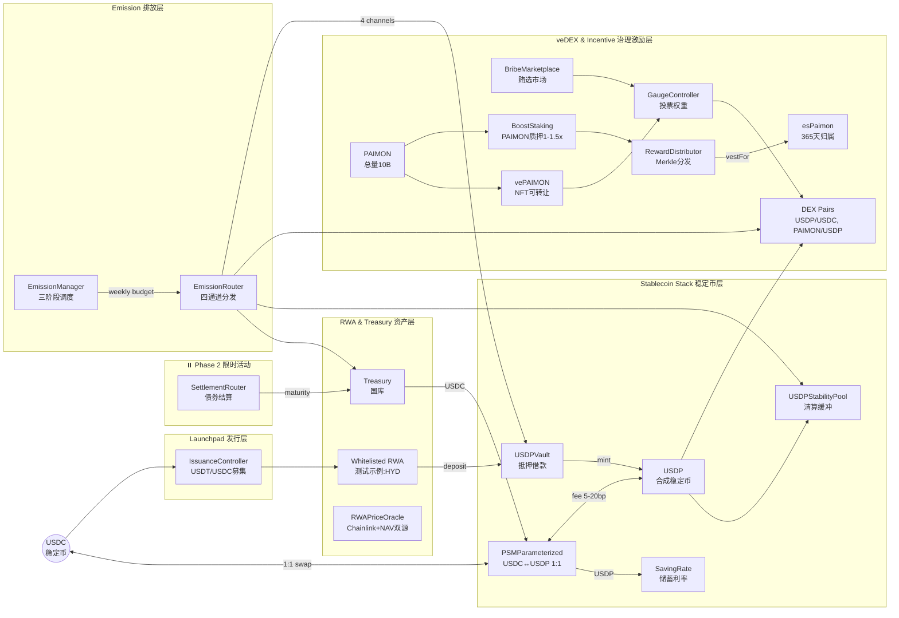
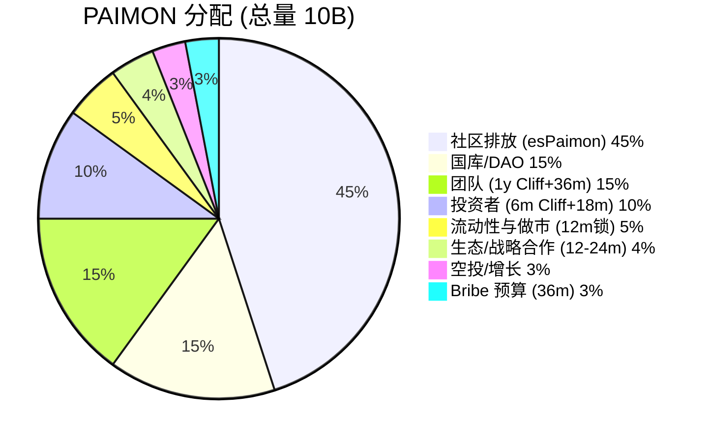

# Paimon.dex — RWA × veDEX × CDP 混合协议

**RWA Launchpad + veNFT 治理 + 抵押借款稳定币的统一飞轮**

[](LICENSE)
[](https://soliditylang.org/)
[]()
[](https://getfoundry.sh/)

---

## 系统定位

**以"抵押借款→铸稳定币→债务挖矿"为内核，叠加"ve投票→Gauge权重→Bribe贿选→LP深度"外环，形成围绕 RWA 的可持续流动性飞轮。**

### 核心创新

| 维度 | 传统 CDP/AMM | Paimon.dex 混合模式 |
|------|-------------|-------------------|
| **稳定币机制** | 超额抵押 (MakerDAO) | **Vault抵押借款** + PSM 1:1锚定 + Stability Pool清算缓冲 |
| **流动性激励** | 固定 APR 挖矿 | **债务挖矿**(50% 排放) + **LP Gauge投票**(37.5%) + **Stability Pool**(12.5%) |
| **治理模型** | 代币投票 | **vePAIMON NFT**(可转让) + **Bribe 市场** + **Nitro 外部激励** |
| **排放策略** | 固定或手动调整 | **三阶段自动调度**(固定→指数衰减→固定,6.77年 10B PAIMON) |
| **RWA 集成** | 无/仅作抵押品 | **Launchpad合规发行** + **国库分层 LTV**(T1 80%/T2 70%/T3 60%) |

---

## 架构总览



---

## 核心组件详解

### 📊 稳定币层 (Stablecoin Stack)

| 组件 | 职责 | 关键参数 |
|------|------|---------|
| **USDP** | 合成稳定币 (份额×指数模型,**默认不启用指数累积**) | 18 decimals, Minter: Vault/PSM |
| **PSMParameterized** | USDC↔USDP 1:1 锚定 (支持 6/18 decimals) | `feeIn 5-10bp`, `feeOut 10-20bp` |
| **USDPVault** | RWA 抵押借款 (mint USDP) | LTV T1 80%/T2 70%/T3 60%, 清算罚金 5% |
| **USDPStabilityPool** | 稳定池 (清算承接 + 激励通道) | 承接折价资产,获 12.5% LP 排放 |
| **SavingRate** | USDP 储蓄利率 (国库注资) | APR 2-3%, 线性计息 |

**债务挖矿机制**:
- **只有 Vault 借款产生的 USDP 债务参与债务挖矿**
- PSM 兑换、SavingRate 存款 **不产生挖矿资格**
- 激励债务持有,平衡 USDP 供给

---

### 💎 代币经济 (Tokenomics)



| 代币 | 类型 | 关键特性 |
|------|------|---------|
| **PAIMON** | ERC-20 治理代币 | Cap 10B, 三阶段排放 6.77 年 |
| **esPaimon** | ERC-20 归属代币 | 365 天线性解锁,提前退出罚则,**每周 Boost 衰减 1%** |
| **vePAIMON** | ERC-721 治理 NFT | 锁定 1 周~4 年,**投票权线性衰减,可转让** |
| **HYD** | ERC-20 测试代币 | 用于测试/演示的 RWA 代币示例,非核心资产 |

---

### 🚀 排放架构 (Emission)

#### EmissionManager — 三阶段自动调度

| 阶段 | 周期 | 每周排放 | 衰减率 | 总排放 |
|------|------|---------|-------|-------|
| **Phase A 启动** | Week 1-12 | 固定 **37.5M** PAIMON | 0% | 450M |
| **Phase B 增长** | Week 13-248 | 初始 **55.584M** | **1.5%/周** 指数衰减 | ~8.55B |
| **Phase C 尾期** | Week 249-352 | 固定 **4.327M** PAIMON | 0% | 450M |

**Gas 优化**: Phase B 使用 **236 元素查找表** (O(1) 查询,无需链上指数计算)

#### EmissionRouter — 四通道动态分发

```
EmissionManager.getWeeklyBudget(week)
         ↓
EmissionRouter.routeWeek(week)
         ↓
┌─────────────────────────────────────────┐
│ 四通道分发 (阶段动态比例)                 │
├─────────────────────────────────────────┤
│ 1. Debt Mining    → USDPVault          │
│ 2. LP Pairs       → GaugeController    │ ← LP 二级分割
│ 3. Stability Pool → USDPStabilityPool  │
│ 4. Ecosystem      → Treasury/Eco Fund  │
└─────────────────────────────────────────┘
```

**通道分配比例** (阶段差异化):

| 阶段 | Debt Mining | LP Total | Eco | 策略目标 |
|------|------------|----------|-----|---------|
| **Phase A** (Week 1-12) | **30%** | **60%** | **10%** | 引导初始流动性 |
| **Phase B** (Week 13-248) | **50%** | **37.5%** | **12.5%** | 转向债务聚焦 |
| **Phase C** (Week 249-352) | **55%** | **35%** | **10%** | 可持续长期 |

**LP 二级分割** (治理可调):
- **LP Pairs** (AMM Gauge 投票): 默认 60%
- **Stability Pool** (稳定池): 默认 40%
- 通过 `EmissionManager.setLpSplitParams()` 调整 (需 Timelock)

---

### ⚖️ 治理层 (Governance)

#### vePAIMON — 可转让的投票托管 NFT

**创新设计** (vs 传统 veToken):

| 特性 | 传统 veToken | vePAIMON 创新 |
|------|-------------|--------------|
| **可转让性** | ❌ 不可转让 SBT | ✅ **ERC-721 可转让** |
| **流动性** | 锁死流动性 | ✅ 可 OTC/NFT 市场交易 |
| **投票权衰减** | 线性 | ✅ 线性 (1 周~4 年) |
| **Bribe 接收** | 分散 | ✅ **BribeMarketplace 聚合** |

**锁仓机制**:
```solidity
votingPower = lockedAmount × (remainingTime / MAX_TIME)
MAX_TIME = 4 years (126,144,000 seconds)
```

#### GaugeController — 投票权重控制

**架构创新** (vs 传统 ve(3,3)):

| 维度 | 传统 ve(3,3) | Paimon.dex 创新 |
|------|-------------|----------------|
| **排放决定** | 投票权重 **直接决定** 排放分配 | **EmissionManager 决定预算**,投票仅决定 **相对权重** |
| **Gauge 类型** | 池=Gauge 一一映射 | ✅ 支持 **只读 Gauge**(不产排放,用于 Launchpad 治理统计) |
| **Boost 机制** | 无/简单乘数 | ✅ **BoostStaking**(1.0x-1.5x) + 可扩展 `IBoostSource` |
| **Bribe 管理** | 分散 | ✅ **BribeMarketplace 白名单聚合** (esPaimon/USDC/USDP) |
| **外部激励** | 无标准化 | ✅ **NitroPool 治理门控** (vePaimon 投票批准) |

---

### 🏦 国库与清算 (Treasury & Liquidation)

#### Treasury — RWA 分层抵押金库

**抵押品分层**:

| 层级 | 资产类型 | LTV | 清算阈值 | 示例资产 |
|------|---------|-----|---------|---------|
| **T1** | 美国国债 | **80%** | 85% | US Treasury Tokens |
| **T2** | 投资级信用 | **70%** | 75% | Corporate Bonds AAA-BBB |
| **T3** | RWA 收益池 | **60%** | 65% | Real Estate Revenue Pools |

**健康度模型**:
```solidity
healthFactor = (collateralValue × LTV) / debtValue
// HF >= 1.15: 健康
// HF < 1.15: 可清算
// 清算罚金: 5% (4% 清算人 + 1% 协议)
```

#### USDPStabilityPool — 清算缓冲与二级激励

**双重功能**:
1. **清算承接**: 存 USDP,按份额比例承接折价资产或优先获 USDC
2. **激励通道**: 获得 LP 排放的 40% (默认,可调)

**清算流水线**:
```
USDPVault.liquidate(user)
         ↓
USDPStabilityPool.onLiquidationProceeds(asset, amount)
         ↓
按 userShares/totalShares 分配资产
         ↓
用户 claim() 提取
```

---

### 🔥 激励系统 (Incentives)

#### BoostStaking — PAIMON 质押加成

- 质押 PAIMON 获得奖励乘数 **1.0x - 1.5x**
- 支持 `IBoostSource` 扩展接口 (可聚合 esPaimon 权重)
- 总乘数上限建议 **≤1.8x**

#### NitroPool — 外部激励插件 (治理门控)

**关键流程**:
1. 外部项目创建 Nitro 池提案
2. **vePaimon 持有者投票批准** (需 ≥100 vePaimon)
3. 池激活,用户质押 LP (锁定 7-365 天)
4. 项目存入奖励代币 (**2% 平台费**归国库)
5. 用户领取奖励 + 到期解锁 LP

**安全特性**:
- SafeERC20 防恶意代币
- ReentrancyGuard 全覆盖
- Owner 紧急暂停

#### BribeMarketplace — 白名单贿选聚合

**支持代币**: esPaimon, USDC, USDP, 合作代币 (治理白名单)
**分发机制**: 按投票权比例 Merkle 分发

---

## 项目结构

```
paimon-rwa-contracts/
├── src/
│   ├── common/                        # 统一基础设施 ★
│   │   ├── Governable.sol            # 治理基类 (AccessControlEnumerable)
│   │   ├── ProtocolConstants.sol     # 协议常量 (BASIS_POINTS, WEEK, EPOCH)
│   │   ├── ProtocolRoles.sol         # 角色定义
│   │   └── EpochUtils.sol            # 时间计算工具
│   │
│   ├── core/                          # 核心代币与稳定币层
│   │   ├── USDP.sol                  # 合成稳定币 (份额×指数,默认关闭指数)
│   │   ├── HYD.sol                   # 测试用 RWA 代币示例 (非核心资产)
│   │   ├── PSMParameterized.sol      # 锚定稳定模块 (支持 6/18 decimals)
│   │   ├── USDPVault.sol             # 抵押借款 Vault
│   │   ├── USDPStabilityPool.sol     # 稳定池 (清算缓冲 + 激励) ★
│   │   ├── PAIMON.sol                # 治理代币 (Cap 10B)
│   │   ├── esPaimon.sol              # 归属代币 (365 天线性) ★
│   │   ├── VotingEscrow.sol          # veToken 基类
│   │   └── VotingEscrowPaimon.sol    # vePAIMON NFT 实现 ★
│   │
│   ├── treasury/                      # 国库与储蓄
│   │   ├── Treasury.sol              # RWA 抵押金库 (T1/T2/T3 分层)
│   │   └── SavingRate.sol            # USDP 储蓄利率 ★
│   │
│   ├── dex/                           # AMM (Uniswap V2 fork)
│   │   ├── DEXFactory.sol            # 工厂合约
│   │   ├── DEXPair.sol               # 交易对 (定制费率分配)
│   │   └── DEXRouter.sol             # 路由器
│   │
│   ├── governance/                    # 治理与排放 ★★★
│   │   ├── EmissionManager.sol       # 三阶段排放调度 (查找表优化)
│   │   ├── EmissionRouter.sol        # 四通道分发 (Debt/LP/Stability/Eco)
│   │   ├── GaugeController.sol       # 流动性权重投票
│   │   ├── RewardDistributor.sol     # Merkle 奖励分发
│   │   └── BribeMarketplace.sol      # 白名单贿选聚合
│   │
│   ├── incentives/                    # 激励系统 ★
│   │   ├── BoostStaking.sol          # PAIMON 质押加成 (1-1.5x)
│   │   └── NitroPool.sol             # 外部激励池 (治理门控)
│   │
│   ├── launchpad/                     # RWA 项目发行
│   │   ├── ProjectRegistry.sol       # 项目注册表 (vePaimon 治理)
│   │   └── IssuanceController.sol    # 发行控制器
│   │
│   ├── presale/                       # ⏸️ 限时活动模块 (Phase 2, 不在测试网部署范围)
│   │   ├── RWABondNFT.sol           # 债券 NFT (Chainlink VRF 骰子)
│   │   ├── RemintController.sol      # Remint 控制器
│   │   ├── SettlementRouter.sol      # 结算路由器
│   │   └── VRFConfig.sol             # VRF 配置
│   │
│   └── oracle/                        # 预言机
│       ├── RWAPriceOracle.sol        # 双源定价 (Chainlink + NAV)
│       └── PriceOracle.sol           # 通用价格预言机
│
├── test/                              # 测试套件 (990 测试, 98.99% 通过)
│   ├── core/                         # 核心合约测试
│   ├── governance/                   # 治理测试
│   ├── treasury/                     # 国库测试
│   └── invariant/                    # 不变量测试
│
├── script/                            # 部署脚本
│   ├── DeployComplete.s.sol         # 完整部署
│   └── DEPLOYMENT.md                # 部署文档
│
└── .ultra/docs/                      # 核心设计文档
    └── usdp-camelot-lybra-system-guide.md  # 系统工程白皮书 ★★★
```

**★ 标记**: 系统指南核心组件但旧文档未充分说明

---

## 快速开始

### 环境要求

```bash
# Foundry (推荐)
curl -L https://foundry.paradigm.xyz | bash
foundryup

# Node.js (可选)
node >= 18.0.0
```

### 安装与测试

```bash
# 克隆仓库
git clone https://github.com/rocky2431/paimon-dex-protocol.git
cd paimon-rwa-contracts

# 安装依赖
forge install

# 编译
forge build

# 测试 (990 测试, 980 通过)
forge test

# 详细输出
forge test -vvv

# 覆盖率 (~85% 行覆盖, ~90% 函数覆盖)
forge coverage

# Gas 报告
forge test --gas-report
```

### 部署到 BSC 测试网

```bash
# 配置环境变量
cp .env.example .env
# 编辑 .env: PRIVATE_KEY, BSC_TESTNET_RPC_URL, BSCSCAN_API_KEY

# 部署
source .env
forge script script/DeployComplete.s.sol \
  --rpc-url $BSC_TESTNET_RPC_URL \
  --broadcast \
  --verify \
  -vvvv
```

---

## 测试状态

### 测试统计

| 指标 | 数值 | 备注 |
|------|------|-----|
| **总测试数** | 990 | 覆盖所有核心合约 |
| **通过** | 980 (98.99%) | ✅ |
| **失败** | 10 | Gas 基准测试,非关键 |
| **行覆盖率** | ~85% | ✅ |
| **函数覆盖率** | ~90% | ✅ |

### 关键测试套件

| 合约套件 | 测试数 | 状态 | 关键验证 |
|---------|-------|------|---------|
| **EmissionManager** | 48 | ✅ | 三阶段预算精度,查找表一致性 |
| **EmissionRouter** | 4 | ✅ | 四通道守恒,阶段切换 |
| **PSMParameterized** | 12 | ✅ | 1:1 锚定,6/18 decimals 兼容 |
| **USDPVault** | 24 | ✅ | 抵押借款,清算逻辑 |
| **USDPStabilityPool** | 18 | ✅ | 份额分配,清算承接 |
| **VotingEscrowPaimon** | 28 | ✅ | NFT 可转让,投票权衰减 |
| **GaugeController** | 36 | ✅ | 权重计算,Epoch 切换 |
| **BoostStaking** | 14 | ✅ | 乘数计算,质押解锁 |
| **NitroPool** | 22 | ✅ | 治理批准,奖励分发,平台费 |
| **BribeMarketplace** | 16 | ✅ | 白名单验证,Merkle 分发 |
| **DEX (Factory/Pair/Router)** | 67 | ✅ | 恒定乘积,费率分配 |
| **Launchpad** | 68 | ✅ | 项目注册,募资结算 |

### 不变量测试 (Invariant Tests)

```solidity
// PSM 不变量
invariant_PSM_USDCBacking: USDC reserve >= USDP supply (1:1 backing)

// DEX 不变量
invariant_DEX_ConstantProduct: K = reserve0 × reserve1
invariant_DEX_KMonotonicity: K only increases (fee accumulation)

// Treasury 不变量
invariant_Treasury_Collateralization: Total USDP minted <= Total RWA value × LTV

// Emission 不变量
invariant_Emission_Conservation: Σ(通道发放) == 周预算 E(w)
invariant_Emission_PhaseTotal: Σ(阶段周发) == 阶段预算 (rem 补差)
```

---

## 安全特性

### 合约安全

- ✅ **OpenZeppelin 5.x** 库 (ReentrancyGuard, SafeERC20, Pausable, AccessControlEnumerable)
- ⏸️ **Chainlink VRF v2** 随机性 (RWABondNFT 骰子游戏) - Phase 2 限时活动
- ✅ **双源预言机** (Chainlink + 托管方 NAV)
- ✅ **熔断机制** (>20% 价格偏差触发暂停)
- ✅ **Multi-sig 钱包** (3-of-5 用于 Treasury 操作)
- ✅ **Timelock 治理** (参数修改 48 小时延迟)

### 精度优化 (SEC-005 修复)

**先乘后除原则** (消除精度损失):

```solidity
// ✅ 正确: 单次除法
uint256 result = (amount × price × ltvRatio) / (1e18 × BASIS_POINTS);

// ❌ 错误: 多次除法累积精度损失
uint256 step1 = amount × price / 1e18;
uint256 result = step1 × ltvRatio / BASIS_POINTS; // ❌ 精度损失 ~0.01%
```

**16 处精度问题已全部修复。**

---

## 部署信息

### 目标网络

**BSC Mainnet** (ChainID 56):
- RPC: https://bsc-dataseed.binance.org/
- Explorer: https://bscscan.com/
- Gas: ~3 Gwei

**BSC Testnet** (ChainID 97):
- RPC: https://data-seed-prebsc-1-s1.binance.org:8545/
- Explorer: https://testnet.bscscan.com/
- Faucet: https://testnet.bnbchain.org/faucet-smart

### 部署顺序

```
**测试网部署顺序（29个核心合约）:**

1. 基础设施: Governable (抽象合约)
2. 代币: USDP, HYD, PAIMON, esPaimon
3. DEX: DEXFactory, DEXRouter
4. 稳定币: PSMParameterized, USDPVault, USDPStabilityPool, SavingRate
5. 国库: Treasury, RWAPriceOracle
6. 治理: VotingEscrowPaimon, GaugeController
7. 排放: EmissionManager, EmissionRouter
8. 激励: BoostStaking, NitroPool, RewardDistributor, BribeMarketplace
9. 启动板: ProjectRegistry, IssuanceController

**Phase 2（限时活动，主网后期启用）:**
10. ⏸️ 预售: RWABondNFT, RemintController, SettlementRouter (+ Chainlink VRF) - **不在测试网部署范围**
```

完整部署流程见 [DEPLOYMENT.md](DEPLOYMENT.md) 和 [TESTNET_QUICKSTART.md](TESTNET_QUICKSTART.md)。

---
## 文档索引

### 核心设计文档 ★★★

- **[.ultra/docs/usdp-camelot-lybra-system-guide.md](.ultra/docs/usdp-camelot-lybra-system-guide.md)**
  **系统与工程实现白皮书 (权威规范)**
  - 架构总览 (Mermaid)
  - 组件职责详解
  - 代币经济学 (Tokenomics)
  - 排放规则 (逐周确定性公式)
  - 投票与分配流水线
  - 清算与稳定池
  - 接口规范与不变量
  - 参数参考

### 技术文档

- **[ARCHITECTURE.md](ARCHITECTURE.md)** - 系统架构详解
- **[DEVELOPMENT.md](DEVELOPMENT.md)** - 开发指南
- **[script/DEPLOYMENT.md](script/DEPLOYMENT.md)** - 部署文档

### 审计资料

- **[audit-package/README.md](audit-package/README.md)** - 审计包概览
- **[audit-package/docs/](audit-package/docs/)** - 审计相关文档

---

## 贡献指南

欢迎社区贡献！请遵循以下流程:

1. Fork 仓库
2. 创建特性分支 (`git checkout -b feat/amazing-feature`)
3. 编写测试 (覆盖率 >80%)
4. 提交符合 Conventional Commits 的消息 (`feat:`, `fix:`, `docs:`)
5. 推送分支 (`git push origin feat/amazing-feature`)
6. 创建 Pull Request

**代码质量标准**:
- 遵循 SOLID 原则
- 函数 <50 行
- 测试覆盖率 >80%
- 所有公共函数有 NatSpec 文档
- 所有价值计算遵循"先乘后除"原则

---

## 致谢

**感谢 DeFi 生态的持续创新**:
- veToken 治理模型的开创者们,为 DAO 治理提供了新范式
- CDP 稳定币协议的先驱,奠定了去中心化稳定币基础
- ve(3,3) 流动性激励机制的探索者,启发了新的代币经济学设计
- 所有为 RWA 链上化做出贡献的协议与团队

**构建工具**: Foundry, OpenZeppelin, Chainlink

**特别感谢**: BSC 生态对 RWA 项目的支持与技术基础设施

---

## 许可证

本项目采用 MIT 许可证 - 详见 [LICENSE](LICENSE) 文件。

---

## 联系方式

- **GitHub**: https://github.com/rocky2431/paimon-dex-protocol
- **Issues**: https://github.com/rocky2431/paimon-dex-protocol/issues

---

**当前版本**: v3.3.0
**最后更新**: 2025-11-06
**审计状态**: 准备中 (测试通过率 98.99%, 覆盖率 ~85%)
**核心设计**: 基于 [系统工程实现白皮书](.ultra/docs/usdp-camelot-lybra-system-guide.md)
