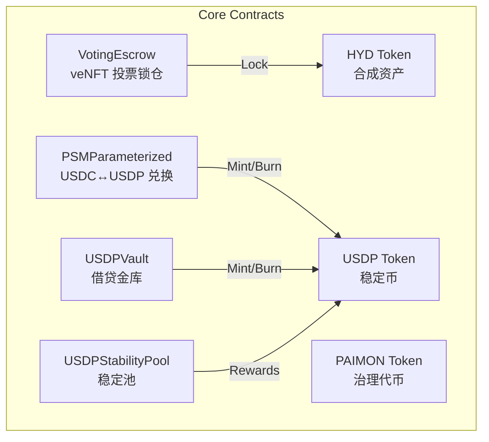
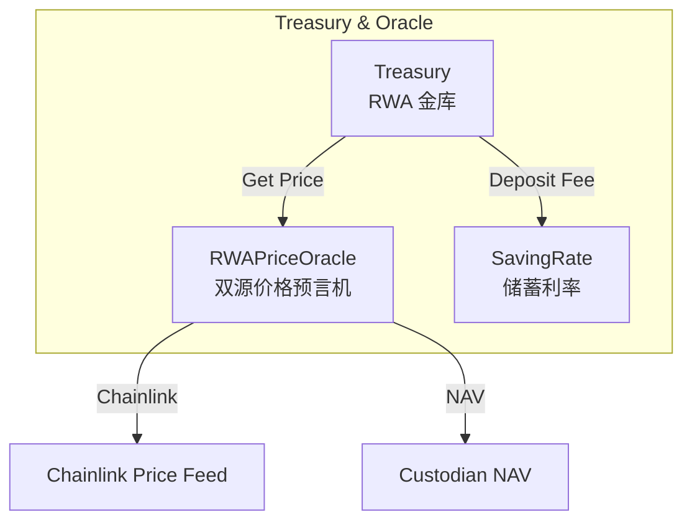
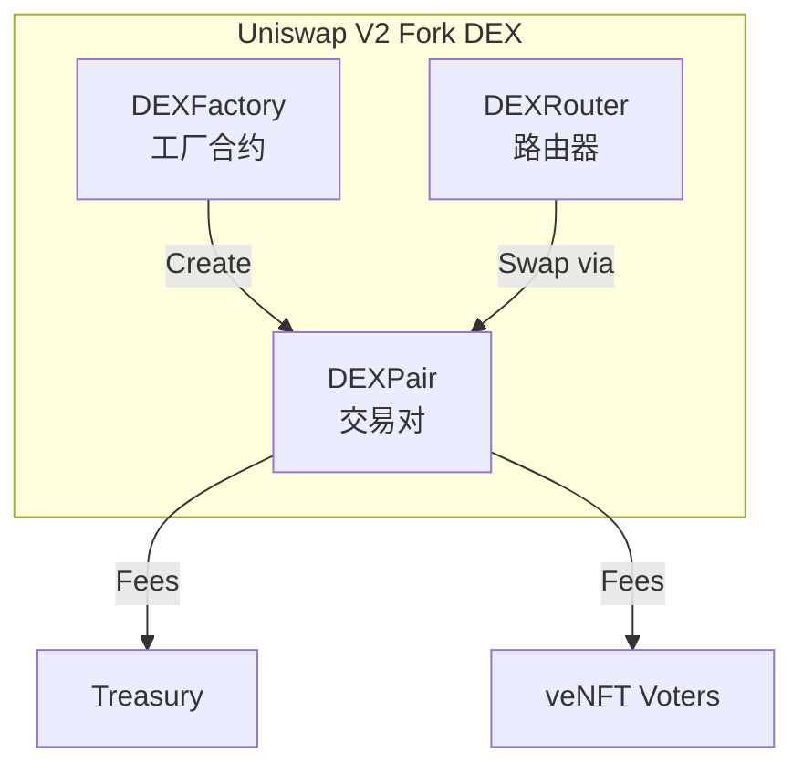
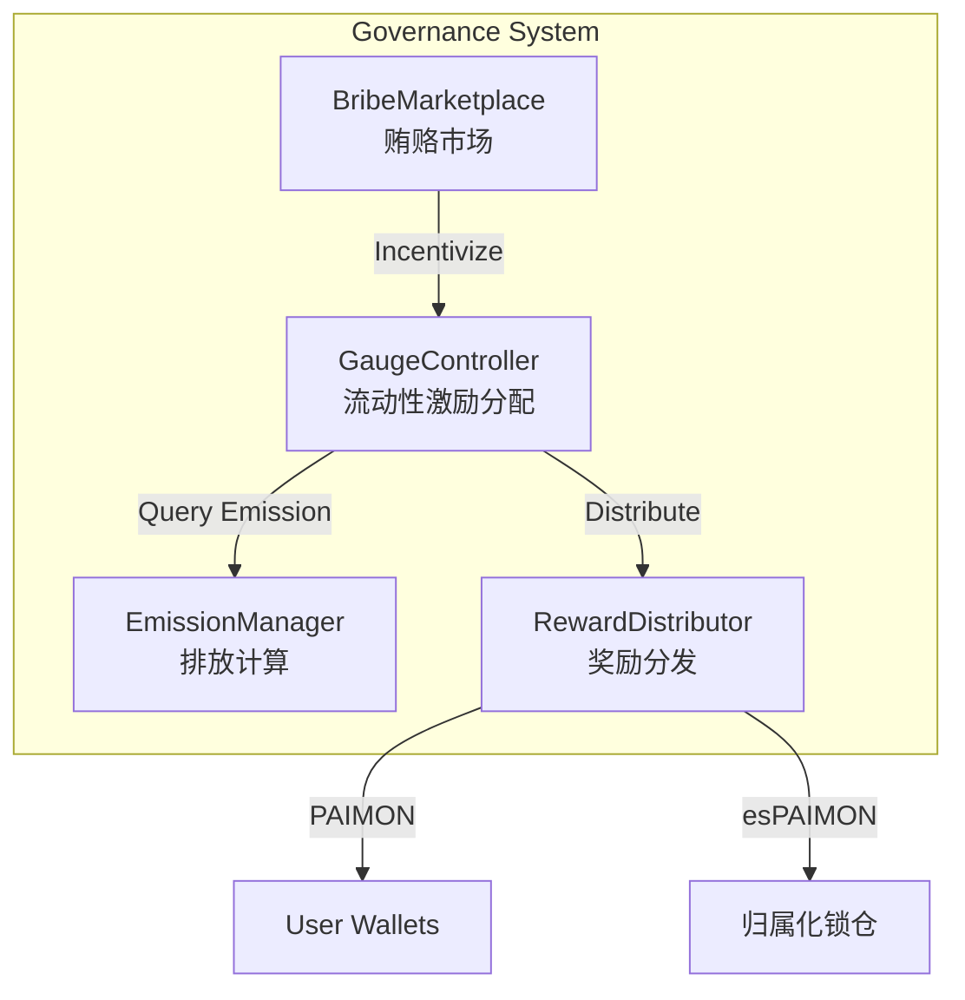
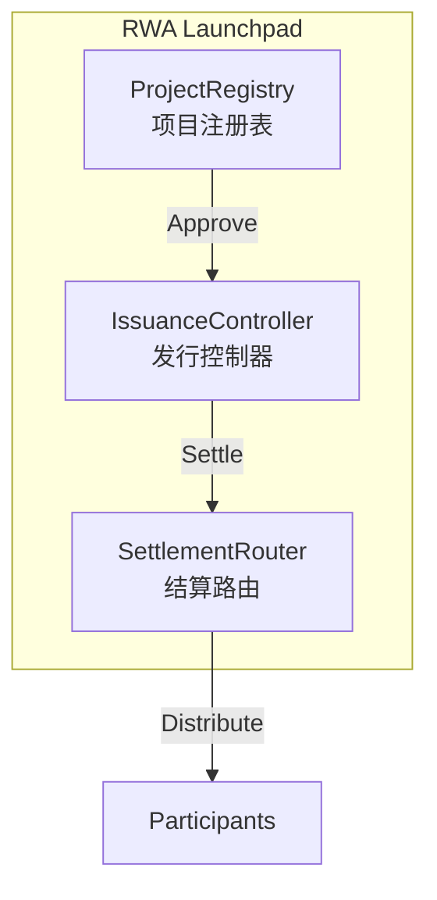
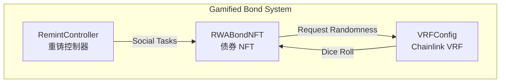

# Paimon.dex 系统架构

**版本**: v1.0
**更新**: 2025-11-04

---

## 系统概览

Paimon.dex 是一个集成 RWA 资产、ve33 DEX 和合成资产的 DeFi 协议，部署在 BSC (Binance Smart Chain)。

```
┌─────────────────────────────────────────────────────────────┐
│                    Paimon.dex 生态系统                        │
├─────────────────────────────────────────────────────────────┤
│                                                               │
│  ┌──────────────┐  ┌──────────────┐  ┌──────────────┐      │
│  │   RWA 资产    │  │   合成资产    │  │   ve33 DEX   │      │
│  │  代币化平台   │  │   (HYD/USDP)  │  │   流动性市场  │      │
│  └──────────────┘  └──────────────┘  └──────────────┘      │
│                                                               │
└─────────────────────────────────────────────────────────────┘
```

---

## 核心合约架构

### 1. 核心层 (Core Layer)



#### HYD (Synthetic Asset)
- **用途**: 由 Treasury RWA 抵押品支撑的合成资产
- **供应量**: 动态，基于 Treasury 抵押品价值
- **关键功能**:
  - ERC20 标准实现
  - Pausable (紧急暂停)
  - Ownable (权限控制)

#### USDP (Stablecoin)
- **用途**: 协议稳定币，与 USDC 1:1 锚定
- **Peg 机制**: PSM (Peg Stability Module)
- **关键功能**:
  - 通过 PSM 与 USDC 1:1 兑换
  - USDPVault 作为抵押品借出
  - StabilityPool 清算奖励

#### PAIMON (Governance Token)
- **总供应量**: 100,000,000 (1亿)
- **分发机制**:
  - Phase A (0-104周): 每周减少 2%
  - Phase B (105-260周): CSV 查表分配
  - Phase C (261周+): 固定 50,000/周尾部排放
- **用途**:
  - 锁仓为 veNFT 获得治理权
  - 流动性挖矿奖励

#### VotingEscrow (veNFT)
- **Lock 期限**: 1周 ~ 4年
- **投票权计算**: `voting_power = amount × (lock_time_remaining / MAX_LOCK_TIME)`
- **特性**:
  - Linear decay (线性衰减)
  - Non-transferable NFT (不可转移)
  - 可延长锁定期

---

### 2. Treasury 层 (Treasury Layer)



#### Treasury (RWA Vault)
- **抵押品层级**:
  - T1 (US Treasuries): 80% LTV
  - T2 (Investment-grade credit): 65% LTV
  - T3 (RWA revenue pools): 50% LTV
- **关键功能**:
  - 用户存入 RWA 资产
  - 根据 LTV 铸造 HYD
  - 7天赎回冷却期
  - 健康因子监控

#### RWAPriceOracle (Dual-Source Oracle)
- **主要来源**: Chainlink Price Feeds
- **备用来源**: Custodian NAV (净资产值)
- **Circuit Breaker**: 5% 偏差触发熔断
- **Staleness Check**: 最大 1 小时延迟

---

### 3. DEX 层 (DEX Layer)



#### DEXPair
- **手续费**: 0.25%
  - 70% → veNFT 投票者
  - 30% → Treasury
- **K 值验证**: 恒定乘积 `x × y = k`
- **Flash Swap**: 支持闪电交换

---

### 4. 治理层 (Governance Layer)



#### GaugeController
- **Epoch**: 1周 (604800 秒)
- **投票权重**: veNFT 持有者分配
- **Gauge 类型**:
  - LP Gauge (流动性池)
  - Stability Pool Gauge
  - RWA Incentive Gauge

#### EmissionManager
- **Phase A (0-104周)**: 递减排放
  - 初始: 2,000,000 PAIMON/周
  - 每周递减 2%
- **Phase B (105-260周)**: CSV 查表
- **Phase C (261周+)**: 固定尾部排放 50,000/周

#### RewardDistributor
- **功能**:
  - 分发 PAIMON 奖励
  - 支持 esPAIMON (归属化代币)
  - 线性解锁机制 (52周)

---

### 5. Launchpad 层 (Launchpad Layer)



#### ProjectRegistry
- **veNFT 治理**: 项目上架需要 veNFT 投票
- **审核流程**: 白名单机制

#### IssuanceController
- **认购方式**: USDC 购买 RWA 代币
- **额度控制**: 最小/最大认购限制
- **结算延迟**: 防止抢跑

---

### 6. Presale 层 (Presale/Bond Layer)



#### RWABondNFT
- **NFT 等级**: C (普通), B (稀有), A (史诗), S (传说)
- **重铸机制**: 消耗积分 + 掷骰子
- **Chainlink VRF v2**: 可验证随机数
- **Gas 优化**: 铸造 <250K gas

#### RemintController
- **社交任务积分**:
  - Twitter 转发/关注: +10分
  - Telegram 加入: +5分
  - Discord 验证: +5分
- **掷骰子成功率**: 基于等级和积分

---

## 数据流图

### 用户存入 RWA → 铸造 HYD

```
User Wallet
    ↓ (Deposit RWA Asset)
Treasury.depositRWA()
    ↓ (Check Oracle Price)
RWAPriceOracle.getPrice()
    ↓ (Calculate HYD based on LTV)
Treasury: mint HYD
    ↓
HYD.mint(user, amount)
    ↓
User receives HYD
```

### PSM 兑换流程 (USDC → USDP)

```
User Wallet
    ↓ (Approve + SwapUSDCForUSDP)
PSMParameterized.swapUSDCForUSDP()
    ↓ (Transfer USDC to PSM)
USDC.safeTransferFrom(user, PSM)
    ↓ (Calculate fee)
Fee = amount * feeRate (0.05%)
    ↓ (Mint USDP)
USDP.mint(user, amount - fee)
    ↓
User receives USDP
```

### veNFT 投票 → Gauge 激励分配

```
User (veNFT Holder)
    ↓ (Vote for Gauge)
GaugeController.vote(tokenId, gaugeId, weight)
    ↓ (Update weights)
GaugeController: record vote
    ↓ (Epoch End)
EmissionManager.getTotalEmission(epoch)
    ↓ (Calculate per-gauge allocation)
GaugeController.getGaugeWeights()
    ↓ (Distribute rewards)
RewardDistributor.distribute(gauge, amount)
    ↓
LP Providers receive PAIMON
```

---

## 安全机制

### 1. 重入保护 (ReentrancyGuard)
- 所有状态变更函数使用 `nonReentrant` 修饰符
- Check-Effects-Interactions 模式

### 2. 访问控制 (Access Control)
- Ownable2Step: 双步骤所有权转移
- Role-based: 多签钱包控制关键操作

### 3. 紧急暂停 (Pausable)
- Treasury, USDP, PSM, Oracle 支持暂停
- 4-of-7 多签即时暂停权限

### 4. 价格验证 (Oracle Circuit Breaker)
- Chainlink + NAV 双源验证
- 5% 偏差触发熔断
- 30 分钟恢复延迟

### 5. 精度优化 (Precision)
- 先乘后除避免精度损失
- 16 处 divide-before-multiply 已修复

### 6. SafeERC20 使用
- 所有 ERC20 操作使用 `safeTransfer` / `safeTransferFrom`
- USDT 兼容性支持

---

## 合约依赖关系

```
HYD ← Treasury ← RWAPriceOracle ← Chainlink
                     ↓
                  PSM → USDP
                     ↓
              USDPVault → StabilityPool
                     ↓
          VotingEscrow → GaugeController → EmissionManager
                                    ↓
                            RewardDistributor
```

---

## Gas 优化策略

### 1. Storage Packing
- `uint128 + uint64` 打包进单个 slot
- Event-driven history (避免存储数组)

### 2. Immutable Variables
- Oracle 地址声明为 `immutable`
- VRF 配置声明为 `immutable`

### 3. Batch Operations
- 支持批量投票
- 支持批量转账

### 4. Price Caching
- `Treasury.getTotalCollateralValue()` 缓存 Oracle 价格查询

---

## 部署顺序

```
1. HYD, PAIMON, USDP
2. DEXFactory → DEXRouter
3. PSMParameterized
4. RWAPriceOracle → Treasury
5. VotingEscrow → GaugeController
6. EmissionManager → RewardDistributor
7. RWABondNFT (+ Chainlink VRF setup)
8. ProjectRegistry → IssuanceController
9. RemintController → SettlementRouter
10. StabilityPool → USDPVault
```

---

## 外部依赖

### Chainlink
- **VRF v2**: 随机数生成 (RWABondNFT)
- **Price Feeds**: 资产价格 (RWAPriceOracle)
- **Automation**: 利率更新 (SavingRate)

### BSC 基础设施
- **Multicall3**: `0xcA11bde05977b3631167028862bE2a173976CA11`
- **USDC**: Stablecoin
- **Testnet**: ChainID 97

---

**架构版本**: 1.0
**最后更新**: 2025-11-04
**状态**: ✅ Production Ready
